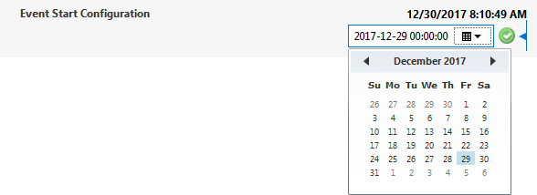

# DateTime picker

Allows the user to select a date and time.

To define a date time picker, create a write parameter of type "double" and set the number of decimals to 8. In the measurement tag, set Type to "number" and specify "datetime" on the options attribute.

```xml
<Param id="240" trending="false">
   <Name>EventStartConfiguration</Name>
   <Description>Event Start Configuration</Description>
   <Type>read</Type>
   <Interprete>
      <RawType>numeric text</RawType>
      <LengthType>next param</LengthType>
      <Type>double</Type>
      <Decimals>8</Decimals>
   </Interprete>
   <Display>
      <RTDisplay>true</RTDisplay>
      <Positions>
         <Position>
           ...
         </Position>
      </Positions>
      <Decimals>8</Decimals>
   </Display>
   <Measurement>
      <Type options="datetime">number</Type>
   </Measurement>
</Param>
<Param id="241" setter="true">
   <Name>EventStartConfiguration</Name>
   <Description>Event Start Configuration</Description>
   <Type>write</Type>
   <Interprete>
      <RawType>numeric text</RawType>
      <LengthType>next param</LengthType>
      <Type>double</Type>
      <Decimals>8</Decimals>
   </Interprete>
   <Display>
      <RTDisplay>true</RTDisplay>
      <Positions>
         <Position>
           ...
         </Position>
      </Positions>
      <Decimals>8</Decimals>
   </Display>
   <Measurement>
      <Type options="datetime">number</Type>
   </Measurement>
</Param>
```



> [!NOTE]
>
> - To limit the selection to dates, specify "date" in the options attribute.
> - The number of decimals (Interprete.Decimals and Display.Decimals) must be set to 8.

## See also

DataMiner Protocol Markup Language:

- [Protocol.Params.Param.Measurement.Type@options: datetime](xref:Protocol.Params.Param.Measurement.Type-options#options-for-measurement-type-number)
- [Protocol.Params.Param.Interprete.Decimals](xref:Protocol.Params.Param.Interprete.Decimals)
- [Protocol.Params.Param.Display.Decimals](xref:Protocol.Params.Param.Display.Decimals)
