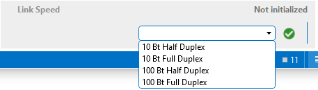

# Drop-down list

## Creating a drop-down list

A drop-down list is a control that allows the user to choose one value from a list.

To define a drop-down list, create a parameter of type "write", set type to "discreet" and provide a list of discrete values.

```xml
<Param id="3105">
  <Name>ethernetLinkMgmtSpeed</Name>
  <Description>Link Speed</Description>
  <Information>
     <Subtext>Configure the speed during auto-negotiation.</Subtext>
     <Includes>
        <Include>time</Include>
        <Include>range</Include>
        <Include>steps</Include>
        <Include>units</Include>
     </Includes>
  </Information>
  <Type>read</Type>
  <Interprete>
     <RawType>numeric text</RawType>
     <LengthType>next param</LengthType>
     <Type>double</Type>
  </Interprete>
  <Measurement>
     <Type>discreet</Type>
     <Discreets>
        <Discreet>
           <Display>All</Display>
           <Value>0</Value>
        </Discreet>
        <Discreet>
           <Display>10 Bt Half Duplex</Display>
           <Value>1</Value>
        </Discreet>
        <Discreet>
           <Display>10 Bt Full Duplex</Display>
           <Value>2</Value>
        </Discreet>
        <Discreet>
           <Display>100 Bt Half Duplex</Display>
           <Value>3</Value>
        </Discreet>
        <Discreet>
           <Display>100 Bt Full Duplex</Display>
           <Value>4</Value>
        </Discreet>
     </Discreets>
  </Measurement>
</Param>
<Param id="3135">
  <Name>ethernetLinkMgmtSpeed</Name>
  <Description>Link Speed</Description>
  <Type>write</Type>
  <Interprete>
     <RawType>numeric text</RawType>
     <LengthType>next param</LengthType>
     <Type>double</Type>
  </Interprete>
  <Measurement>
     <Type>discreet</Type>
     <Discreets>
        <Discreet>
           <Display>All</Display>
           <Value>0</Value>
        </Discreet>
        <Discreet>
           <Display>10 Bt Half Duplex</Display>
           <Value>1</Value>
        </Discreet>
        <Discreet>
           <Display>10 Bt Full Duplex</Display>
           <Value>2</Value>
        </Discreet>
        <Discreet>
           <Display>100 Bt Half Duplex</Display>
           <Value>3</Value>
        </Discreet>
        <Discreet>
           <Display>100 Bt Full Duplex</Display>
           <Value>4</Value>
        </Discreet>
     </Discreets>
  </Measurement>
</Param>
```



## Creating a drop-down list with a check box

When you add a drop-down list, it is possible to show a check box for one entry by using the state attribute and setting its value to false. Note that the corresponding read parameter should interpret this as an exceptional value.

```xml
<Param id="1032">
  <Name>OutputFormat</Name>
  <Description>Output Format</Description>
  <Type>read</Type>
  <Information>
     <Subtext>Output Format</Subtext>
     <Includes>
        <Include>time</Include>
        <Include>range</Include>
        <Include>steps</Include>
        <Include>units</Include>
     </Includes>
  </Information>
  <Interprete>
     <RawType>signed number</RawType>
     <LengthType>next param</LengthType>
     <Type>double</Type>
     <Exceptions>
        <Exception id="1" value="0">
           <Display state="disabled">Disabled</Display>
           <Value>0</Value>
        </Exception>
     </Exceptions>
  </Interprete>
  <Display>
     <RTDisplay>true</RTDisplay>
     <Positions>
        <Position>
           <Page>General</Page>
           <Row>16</Row>
           <Column>1</Column>
        </Position>
     </Positions>
  </Display>
  <Alarm>
     <Monitored>true</Monitored>
  </Alarm>
  <Measurement>
     <Type>discreet</Type>
     <Discreets>
        <Discreet>
           <Display state="disabled">None</Display>
           <Value>0</Value>
        </Discreet>
        <Discreet>
           <Display>720p</Display>
           <Value>1</Value>
        </Discreet>
        <Discreet>
           <Display>1080p</Display>
           <Value>2</Value>
        </Discreet>
     </Discreets>
  </Measurement>
</Param>
<Param id="1033">
  <Name>OutputFormat</Name>
  <Description>Output Format</Description>
  <Type>write</Type>
  <Interprete>
     <RawType>numeric text</RawType>
     <LengthType>next param</LengthType>
     <Type>double</Type>
  </Interprete>
  <Display>
     <RTDisplay>true</RTDisplay>
     <Positions>
        <Position>
           <Page>General</Page>
           <Row>16</Row>
           <Column>1</Column>
        </Position>
     </Positions>
  </Display>
  <Measurement>
     <Type>discreet</Type>
     <Discreets>
        <Discreet>
           <Display state="disabled">Disabled</Display>
           <Value>0</Value>
        </Discreet>
        <Discreet>
           <Display>720p</Display>
           <Value>1</Value>
        </Discreet>
        <Discreet>
           <Display>1080p</Display>
           <Value>2</Value>
        </Discreet>
     </Discreets>
  </Measurement>
</Param>
```


## Creating a dynamic drop-down list

When a standard drop-down list is configured, the items to choose from are statically defined in the protocol. Alternatively, you can also create a dynamic drop-down list. To do so, create a parameter that holds the dynamic entries in a parameter (by providing a semicolon-separated list of entries) and refer to this parameter using the dependencyId attribute.

```xml
<Param id="400" trending="false">
  <Name>DynamicDependencyLinkSpeed</Name>
  <Description>Link Speed</Description>
  <Information>
     <Subtext>Configure the speed during auto-negotiation.</Subtext>
     <Includes>
        <Include>time</Include>
        <Include>range</Include>
        <Include>steps</Include>
        <Include>units</Include>
     </Includes>
  </Information>
  <Type>read</Type>
  <Interprete>
     <RawType>other</RawType>
     <LengthType>next param</LengthType>
     <Type>string</Type>
  </Interprete>
  <Display>
     <RTDisplay>true</RTDisplay>
     <Positions>
        <Position>
           <Page>General</Page>
           <Row>21</Row>
           <Column>0</Column>
        </Position>
     </Positions>
  </Display>
  <Measurement>
     <Type>string</Type>
  </Measurement>
</Param>
<Param id="401" setter="true">
  <Name>DynamicDependencyLinkSpeed</Name>
  <Description>Link Speed</Description>
  <Type>write</Type>
  <Interprete>
     <RawType>other</RawType>
     <LengthType>next param</LengthType>
     <Type>string</Type>
  </Interprete>
  <Display>
     <RTDisplay>true</RTDisplay>
     <Positions>
        <Position>
           <Page>General</Page>
           <Row>21</Row>
           <Column>0</Column>
        </Position>
     </Positions>
  </Display>
  <Measurement>
     <Type>discreet</Type>
     <Discreets dependencyId="402">
     </Discreets>
  </Measurement>
</Param>
<Param id="402" trending="false">
  <Name>DynamicDependencyValuesLinkSpeed</Name>
  <Description>Dynamic Dependency Values Link Speed</Description>
  <Information>
     <Subtext></Subtext>
     <Includes>
        <Include>time</Include>
        <Include>range</Include>
        <Include>steps</Include>
        <Include>units</Include>
     </Includes>
  </Information>
  <Type>read</Type>
  <Interprete>
     <RawType>other</RawType>
     <LengthType>next param</LengthType>
     <Type>string</Type>
     <DefaultValue>10 Bt Half Duplex;10 Bt Full Duplex;100 Bt Half Duplex;100 Bt Full Duplex</DefaultValue>
  </Interprete>
  <Display>
     <RTDisplay>true</RTDisplay>
  </Display>
  <Measurement>
     <Type>string</Type>
  </Measurement>
</Param>
```

This also works for tables (from DataMiner 8 onwards (RN 5817)). It is not only possible to refer to a standalone parameter, another column of the same table can also be specified. This makes it possible to have a list of different items for every row.

> [!NOTE]
> The column that is referred to by the dependencyId attribute must be displayed in the table.

## See also

DataMiner Protocol Markup Language:

- [Protocol.Params.Param.Measurement.Type: discreet](xref:Protocol.Params.Param.Measurement.Type#discreet)
- [Protocol.Params.Param.Measurement.Discreets](xref:Protocol.Params.Param.Measurement.Discreets)
- [Protocol.Params.Param.Measurement.Discreets.Discreet@dependencyId](xref:Protocol.Params.Param.Measurement.Discreets-dependencyId)
