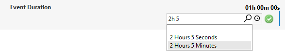

# Duration picker

Allows the user to select a duration.

```xml
<Param id="271" setter="true">
  <Name>EventDuration</Name>
  <Description>Event Duration</Description>
  <Type>write</Type>
  <Interprete>
     <RawType>numeric text</RawType>
     <LengthType>next param</LengthType>
     <Type>double</Type>
  </Interprete>
  <Display>
     <RTDisplay>true</RTDisplay>
  </Display>
   <Measurement>
      <Type options="time">number</Type>
   </Measurement>
</Param>
```



## See also

DataMiner Protocol Markup Language:

- [Protocol.Params.Param.Measurement.Type options: time](xref:Protocol.Params.Param.Measurement.Type-options#options-for-measurement-type-number)
