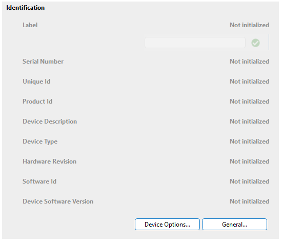

# Group box

A group box groups a number of parameters, so that you can visually indicate that these parameters belong together.

To define a group box with a title, create two parameters of type "fixed".

The first parameter defines the group box header.

- Set Type to "fixed".
- Add the title of the group to the Description tag.
- Set its Measurement Type to "title".
- Set the options of its measurement type to "begin".

 The second parameter defines the group box footer.

- Set Type to "fixed".
- To only have a line (and no title) at the bottom, leave out the Description tag (or leave it empty).
- Set Measurement Type to "title".
- Set the options of its measurement type to "end.".
- Make sure to position this parameter on a row below the last parameter displayed in the group box.

> [!NOTE]
>
> - To support the legacy System Display application, add the connect option. (`options="begin;connect"` and `options="end;connect"`).
> - When a "begin" title parameter is read, it will be matched with the first "end" title parameter that is positioned below it (in the same column on the same page). In case other "begin" title parameters are mentioned in between these "begin" and "end" title parameters, these in-between "begin" parameters will be considered in-line titles. Nested group boxes are therefore not supported.

```xml
<Param id="500">
    <Name>Title_Begin_Identification</Name>
    <Description>Identification</Description>
    <Type>fixed</Type>
    <Display>
        <RTDisplay>true</RTDisplay>
        ...
    </Display>
    <Measurement>
        <Type options="begin">title</Type>
    </Measurement>
</Param>
<Param id="501">
    <Name>Title_End_Generic</Name>
    <Type>fixed</Type>
    <Display>
        <RTDisplay>true</RTDisplay>
        ...
    </Display>
    <Measurement>
        <Type options="end">title</Type>
    </Measurement>
</Param>
```



## See also

DataMiner Protocol Markup Language:

- [Protocol.Params.Param.Measurement.Type: title](xref:Protocol.Params.Param.Measurement.Type#title)
- [Options for measurement type “title”](xref:Protocol.Params.Param.Measurement.Type-options#options-for-measurement-type-title)
