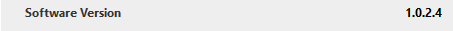
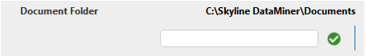
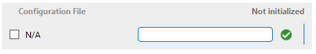

# Label

## Creating a label

A label displays the current value of a standalone parameter. The text provided in the Description tag will be displayed to inform the user of the meaning of the value. The text provided in the Subtext tag is used as the tooltip text which is shown when the user hovers over the parameter.

```xml
<Param id="102">
  <Name>SoftwareVersion</Name>
  <Description>Software Version</Description>
  <Information>
     <Subtext>Running software version.</Subtext>
  </Information>
  <Type>read</Type>
  <Interprete>
     <RawType>other</RawType>
     <LengthType>next param</LengthType>
     <Type>string</Type>
  </Interprete>
  <Measurement>
     <Type>string</Type>
  </Measurement>
</Param>
```



The way a label is visualized can be customized in many ways. For the available options, see Options for measurement type “string”.

The following example displays a numeric parameter:

```xml
<Param id="1806" trending="false">
  <Name>CPULoad</Name>
  <Description>CPU Load</Description>
  <Information>
     <Subtext>Indicates the current CPU utilization.</Subtext>
  </Information>
  <Type>read</Type>
  <Interprete>
     <RawType>numeric text</RawType>
     <LengthType>next param</LengthType>
     <Type>double</Type>
  </Interprete>
  <Alarm>
     <Monitored>true</Monitored>
  </Alarm>
  <Display>
     <RTDisplay>true</RTDisplay>
     <Units>%</Units>
     <Positions>
        <Position>
           <Page>General</Page>
           <Row>4</Row>
           <Column>1</Column>
        </Position>
     </Positions>
     <Range>
        <Low>0</Low>
        <High>100</High>
     </Range>
  </Display>
  <Measurement>
     <Type>number</Type>
  </Measurement>
</Param>
```

By default, 6 decimals are stored. In case more decimals are required to avoid rounding errors, this can be specified via the Decimals tag. See Protocol/Params/Param/Interprete/Decimals. (This is for example the case for the DateTime picker UI component, mentioned in the section Datetime picker.)

> [!NOTE]
>
> - A unit can be specified using the Units tag. See Protocol/Params/Param/Display/Units.
> - Since DataMiner version 9.0.1 (RN 1205), when the value of the parameter is a string starting with a "file", "ftp", "http", "https" or "mailto" URI scheme, the parameter value will be displayed as a clickable link.

## Creating an editable label

In order to make a label editable, create a parameter of type "write" that has the same name and description as the parameter of type "read" and specify the same position for both parameters.



```xml
<Param id="103" trending="false">
  <Name>FolderTextBox</Name>
  <Description>Document Folder</Description>
  <Information>
     <Subtext>Document folder.</Subtext>
  </Information>
  <Type>read</Type>
  <Interprete>
     <RawType>other</RawType>
     <LengthType>next param</LengthType>
     <Type>string</Type>
      <DefaultValue>C:\Skyline DataMiner\Documents</DefaultValue>
  </Interprete>
  <Measurement>
     <Type>string</Type>
  </Measurement>
</Param>
<Param id="104" trending="false">
  <Name>FolderTextBox</Name>
  <Description>Document Folder</Description>
  <Information>
     <Subtext>Document folder.</Subtext>
  </Information>
  <Type>write</Type>
  <Interprete>
     <RawType>other</RawType>
     <LengthType>next param</LengthType>
     <Type>string</Type>
  </Interprete>
  <Measurement>
     <Type>string</Type>
  </Measurement>
</Param>
```

There are multiple ways to copy a value set in the write parameter to its read counterpart:

- When using the setter="true" attribute on the write parameter, the value set on the write parameter will be copied to the corresponding read parameter.
- Using a trigger and a "copy" action, the value set on the write parameter will be copied to the corresponding read parameter.
- Trigger a QAction on the write parameter and then perform a set on the read parameter from this QAction. (This option should only be used in case additional logic is needed that can only be implemented via a QAction.)

> [!NOTE]
> In case a parameter represents a configurable device parameter, the value set in the write parameter should not be set to its read counterpart using one of the above-mentioned methods. The write parameter should initiate a set to the device and after the set is performed, the value of the parameter should be requested again from the device to obtain the new value. The methods mentioned above should only be used for protocol- or DMA-related settings.

## Creating an editable label with check box

It is possible to visualize a check box by providing a discrete entry on the write parameter:

```xml
<Param id="420">
  <Name>ConfigurationFile</Name>
  <Description>Configuration File</Description>
  <Information>
     <Subtext>Configuration file.</Subtext>
  </Information>
  <Type>read</Type>
  <Interprete>
     <RawType>other</RawType>
     <LengthType>next param</LengthType>
     <Type>string</Type>
     <Exceptions>
        <Exception id="1" value="-1">
           <Display state="disabled">N/A</Display>
           <Value>-1</Value>
        </Exception>
     </Exceptions>
  </Interprete>
  <Display>
     <RTDisplay>true</RTDisplay>
     <Positions>
        <Position>
           <Page>General</Page>
           <Row>7</Row>
           <Column>0</Column>
        </Position>
     </Positions>
  </Display>
  <Measurement>
     <Type>string</Type>
  </Measurement>
</Param>
<Param id="421">
  <Name>ConfigurationFile</Name>
  <Description>Configuration File</Description>
  <Type>write</Type>
  <Interprete>
     <RawType>other</RawType>
     <LengthType>next param</LengthType>
     <Type>string</Type>
  </Interprete>
  <Display>
     <RTDisplay>true</RTDisplay>
     <Positions>
        <Position>
           <Page>General</Page>
           <Row>7</Row>
           <Column>0</Column>
        </Position>
     </Positions>
  </Display>
  <Measurement>
     <Type>string</Type>
     <Discreets>
        <Discreet>
           <Display state="disabled">N/A</Display>
           <Value>-1</Value>
        </Discreet>
     </Discreets>
  </Measurement>
</Param>
```



## See also

DataMiner Protocol Markup Language:

- [Protocol.Params.Param.Display.Decimals](xref:Protocol.Params.Param.Display.Decimals)
- [Protocol.Params.Param.Display.Units](xref:Protocol.Params.Param.Display.Units)
