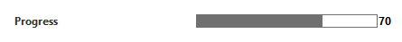

# Progress bar

A progress bar shows the progress of a lengthy operation by filling a rectangle with chunks from left to right.

To define a progress bar, set the Type of the Measurement tag to "progress" and provide a range in the Display tag.

```xml
<Param id="260" trending="false">
  <Name>Progress</Name>
  <Description/>
  <Type>read</Type>
  <Interprete>
     <RawType>numeric text</RawType>
     <LengthType>next param</LengthType>
     <Type>double</Type>
  </Interprete>
  <Display>
     <RTDisplay>true</RTDisplay>
     <Range>
        <Low>0</Low>
        <High>100</High>
     </Range>
  </Display>
   <Measurement>
      <Type>progress</Type>
   </Measurement>
</Param>
```



> [!NOTE]
> Only the Range tag in Display will create a functioning progress bar for both DataMiner Cube and the deprecated Element Display application. The Range tag of Interprete will not work for Cube or Element Display and will cause the progress bar to default to 0-100 for Element Display (giving the impression that it works in Element Display and not in Cube).

## See also

DataMiner Protocol Markup Language:

- [Protocol.Params.Param.Measurement.Type: progress](xre:Protocol.Params.Param.Measurement.Type#progress)
