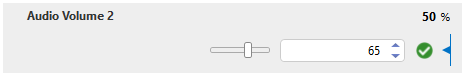
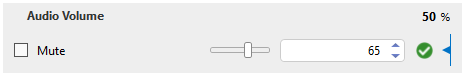
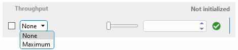

# Slider

A slider allows the user to set a value by moving an indicator.

## Creating a slider

To define a slider, provide a numeric range using the Range tag.

```xml
<Param id="160">
   <Name>Audio Volume</Name>
   <Description>Audio Volume</Description>
   <Information>
      <Subtext>Audio volume.</Subtext>
      <Includes>
         <Include>time</Include>
         <Include>range</Include>
         <Include>steps</Include>
         <Include>units</Include>
      </Includes>
   </Information>
   <Type>read</Type>
   <Interprete>
      <RawType>numeric text</RawType>
      <LengthType>next param</LengthType>
      <Type>double</Type>
   </Interprete>
   <Display>
      <RTDisplay>true</RTDisplay>
      <Positions>
         <Position>
            <Page>Audio Settings</Page>
            <Row>0</Row>
            <Column>0</Column>
         </Position>
      </Positions>
      <Range>
         <Low>0</Low>
         <High>100</High>
      </Range>
      <Units>%</Units>
   </Display>
   <Measurement>
      <Type>number</Type>
   </Measurement>
</Param>
<Param id="161">
   <Name>Audio Volume</Name>
   <Description>Audio Volume</Description>
   <Type>write</Type>
   <Interprete>
      <RawType>numeric text</RawType>
      <LengthType>next param</LengthType>
      <Type>double</Type>
   </Interprete>
   <Display>
      <RTDisplay>true</RTDisplay>
      <Positions>
         <Position>
            <Page>Audio Settings</Page>
            <Row>0</Row>
            <Column>0</Column>
         </Position>
      </Positions>
      <Range>
         <Low>0</Low>
         <High>100</High>
      </Range>
      <Steps>5</Steps>
      <Units>%</Units>
   </Display>
   <Measurement>
      <Type>number</Type>
   </Measurement>
</Param>
```



> [!NOTE]
> The example above also illustrates the usage of a unit (via the Units tag) and a step size (via the Steps tag).

## Creating a slider with a check box

The following example illustrates how you can create a slider with a check box.

```xml
<Param id="170">
   <Name>Audio Volume</Name>
   <Description>Audio Volume</Description>
   <Information>
      <Subtext>Audio volume.</Subtext>
      <Includes>
         <Include>time</Include>
         <Include>range</Include>
         <Include>steps</Include>
         <Include>units</Include>
      </Includes>
   </Information>
   <Type>read</Type>
   <Interprete>
      <RawType>numeric text</RawType>
      <LengthType>next param</LengthType>
      <Type>double</Type>
     <Exceptions>
        <Exception id="1" value="0">
           <Display state="disabled">Muted</Display>
           <Value>0</Value>
        </Exception>
     </Exceptions>
   </Interprete>
   <Display>
      <RTDisplay>true</RTDisplay>
      <Positions>
         <Position>
            <Page>Audio Settings</Page>
            <Row>0</Row>
            <Column>0</Column>
         </Position>
      </Positions>
      <Range>
         <Low>0</Low>
         <High>100</High>
      </Range>
      <Units>%</Units>
   </Display>
   <Measurement>
      <Type>number</Type>
   </Measurement>
</Param>
<Param id="171" setter="true">
   <Name>Audio Volume</Name>
   <Description>Audio Volume</Description>
  <Information>
     <Subtext>Audio volume.</Subtext>
     <Includes>
        <Include>time</Include>
        <Include>range</Include>
        <Include>steps</Include>
        <Include>units</Include>
     </Includes>
  </Information>
   <Type>write</Type>
   <Interprete>
      <RawType>numeric text</RawType>
      <LengthType>next param</LengthType>
      <Type>double</Type>
   </Interprete>
   <Display>
      <RTDisplay>true</RTDisplay>
      <Positions>
         <Position>
            <Page>Audio Settings</Page>
            <Row>0</Row>
            <Column>0</Column>
         </Position>
      </Positions>
      <Range>
         <Low>0</Low>
         <High>100</High>
      </Range>
      <Steps>5</Steps>
      <Units>%</Units>
   </Display>
   <Measurement>
      <Type>number</Type>
     <Discreets>
        <Discreet>
           <Display>Mute</Display>
           <Value>0</Value>
        </Discreet>
     </Discreets>
   </Measurement>
</Param>
```



## Creating a slider with a drop-down List

If you provide multiple discrete entries with state "disabled", a drop-down list is shown, as illustrated in the following example:

```xml
<Param id="174">
   <Name>throughput</Name>
   <Description>Throughput</Description>
   <Information>
      <Subtext>Throughput.</Subtext>
      <Includes>
         <Include>time</Include>
         <Include>range</Include>
         <Include>steps</Include>
         <Include>units</Include>
      </Includes>
   </Information>
   <Type>read</Type>
   <Interprete>
      <RawType>numeric text</RawType>
      <LengthType>next param</LengthType>
      <Type>double</Type>
      <Exceptions>
         <Exception id="1" value="0">
            <Display state="disabled">None</Display>
            <Value>0</Value>
         </Exception>
         <Exception id="2" value="100">
            <Display state="disabled">Maximum</Display>
            <Value>100</Value>
           </Exception>
      </Exceptions>
   </Interprete>
   <Display>
      <RTDisplay>true</RTDisplay>
      <Range>
         <Low>0</Low>
         <High>100</High>
      </Range>
      <Units>%</Units>
   </Display>
   <Measurement>
      <Type>number</Type>
   </Measurement>
</Param>
<Param id="175">
   <Name>throughput</Name>
   <Description>Throughput</Description>
   <Information>
      <Subtext>Throughput.</Subtext>
      <Includes>
         <Include>time</Include>
         <Include>range</Include>
         <Include>steps</Include>
         <Include>units</Include>
      </Includes>
   </Information>
   <Type>write</Type>
   <Interprete>
      <RawType>numeric text</RawType>
      <LengthType>next param</LengthType>
      <Type>double</Type>
   </Interprete>
   <Display>
      <RTDisplay>true</RTDisplay>
      <Range>
         <Low>0</Low>
         <High>100</High>
      </Range>
      <Steps>5</Steps>
      <Units>%</Units>
   </Display>
   <Measurement>
      <Type>number</Type>
      <Discreets dependencyId="176">
         <Discreet>
            <Display state="disabled">None</Display>
            <Value>0</Value>
         </Discreet>
         <Discreet>
            <Display state="disabled">Maximum</Display>
            <Value>100</Value>
         </Discreet>
      </Discreets>
   </Measurement>
</Param>
```



## See also

DataMiner Protocol Markup Language:

- [Protocol.Params.Param.Measurement.Type: number](xref:Protocol.Params.Param.Measurement.Type#number)
- [Protocol.Params.Param.Display.Range](xref:Protocol.Params.Param.Display.Range)
- [Protocol.Params.Param.Display.Steps](xref:Protocol.Params.Param.Display.Steps)
- [Protocol.Params.Param.Display.Units](xref:Protocol.Params.Param.Display.Units)
