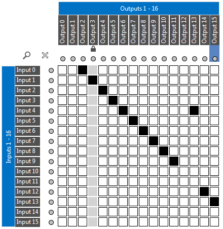

# Table-based matrix

A matrix is a special type of parameter typically used to represent routers and switches. From DataMiner 10.3.1/10.4.0 onwards (RN 34645, 34661, 34839, 34879, and 34933), this can be configured based on two tables containing the inputs and outputs.

For this purpose, three parameters must be configured in the protocol:

- A [table parameter for the inputs of the matrix](xref:UIComponentsTableMatrixInputsTableParameter).
- A [table parameter for the outputs of the matrix](xref:UIComponentsTableMatrixOutputsTableParameter).
- A [dummy parameter](xref:UIComponentsTableMatrixParameter), which contains the matrix mappings and determines where the matrix control is displayed.

To manipulate the inputs and outputs, you can use the [Matrix Helper](xref:UIComponentsTableMatrixHelper).

> [!NOTE]
> If a matrix control is configured like this, the severity colors of the crosspoints depend on the alarm monitoring configured for the outputs tables in the alarm template. This is not configured with the matrix alarm level editor like for classic matrix controls. The crosspoint severity color will be the highest severity color for all monitored column parameters of the outputs table for the relevant row.

> [!TIP]
> For information on how to configure the standard matrix supported prior to DataMiner 10.3.1/10.4.0, see [Standard matrix](xref:UIComponentsMatrix)

## See also

DataMiner Protocol Markup Language:

- [Protocol.Params.Param.Type: matrix](xref:Protocol.Params.Param.Type#matrix)
- [Protocol.Params.Param.Matrix](xref:Protocol.Params.Param.Matrix)
- [Protocol.Params.Param.Measurement.Type: matrix](xref:Protocol.Params.Param.Measurement.Type#matrix)
