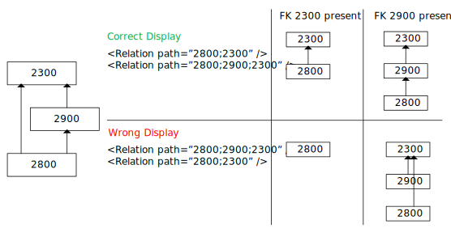

# Relations

A foreign key needs to be described in the path attribute of the Relations.Relation tag. In the following example, the relation path can be read as "table 4000 has a foreign key to table 3000, table 3000 to table 2000."

```xml
<Relation path="2000;3000;4000" />
```

In an EPM (formerly known as CPE) element, the order of the relations is taken into account to build the topology. Consider the following example where three tables are defined: 2800, 2900 and 2300. Table 2800 is either connected to table 2300 or table 2900. When selecting a row of table 2800, we want to see either table 2800 directly linked to table 2300, or table 2800 linked to table 2900 and then linked to table 2300.

When the relations are defined in the order below, this is displayed correctly. The EPM element is passing a key. If this is an FK to 2300, then the first relation is used; if this is an FK through 2900, then the second relation is used.

```xml
<Relation path="2800;2300" />
<Relation path="2800;2900;2300" />
```

However, when the relations are defined in the opposite order as shown below, this is not displayed correctly. The EPM element is passing a key that is an FK to 2300, so the first relation will be used because this is a relation between table 2800 and table 2300 and the manager will try to go through table 2900, but in the first case the link to 2900 is empty, so no block 2300 will be drawn.

```xml
<Relation path="2800;2900;2300" />
<Relation path="2800;2300" />
```

If the EPM element is passing a key as FK to 2900, then the first relation is also used and somehow it also uses this to display a direct link between 2800 and 2300, so an extra arrow is placed on top.

To summarize: when a table can be skipped in the topology, first specify the shortest relation, and then the longer relation(s).



> [!NOTE]
>
> - It is advised to use "numeric text" content for the keys when you want to link tables with each other. Strings may cause problems.
> - An example protocol "SLC SDF Relations" is available in the [Protocol Development Guide Companion Files](https://community.dataminer.services/documentation/protocol-development-guide-companion-files/).
