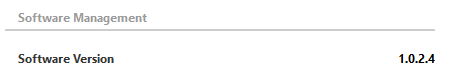

# Title

Allows you to display a title in the UI.

To define a title, create a parameter of type "fixed". In the Measurement tag, set Type to "title". To add a line below the title, use the options attribute.

```xml
<Param id="280" trending="false">
  <Name>TitleSoftwareManagement</Name>
  <Description>TitleSoftwareManagement</Description>
  <Type>fixed</Type>
   <Measurement>
      <Type options="begin">title</Type>
   </Measurement>
</Param>
```



## See also

DataMiner Protocol Markup Language:

- [Protocol.Params.Param.Measurement.Type: title](xref:Protocol.Params.Param.Measurement.Type#title)
- [Options for measurement type “title”](xref:Protocol.Params.Param.Measurement.Type-options#options-for-measurement-type-title)
