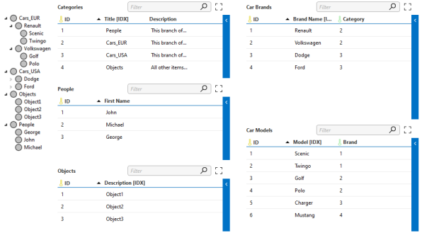

# Advanced hierarchy

It is possible to choose a different hierarchy path based on the cell value of the parent row. In order to use the advanced structure, the path attribute must be omitted or empty.



```xml
<TreeControl parameterId="10" readOnly="false">
  <Hierarchy>
    <Table id="1000" />
    <Table id="2000" parent="1000" condition="1002:People" />
    <Table id="3000" parent="1000" condition="1002:Cars_EUR" />
    <Table id="3000" parent="1000" condition="1002:Cars_USA" />
    <Table id="4000" parent="3000" />
    <Table id="5000" parent="1000" />
  </Hierarchy>
  <ReadonlyColumns />
  <OverrideDisplayColumns />
  <OverrideIconColumns />
</TreeControl>
```
