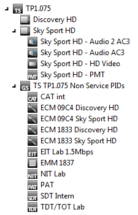
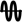
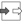
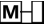
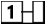
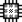
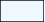
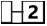
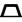
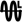

# Icons

Custom icons can be used for the nodes in a tree control to enhance the visual experience:



A global icon set can be found in C:\Skyline DataMiner\Protocols\Icons.xml. All protocols can link to icons from this file.

By default, the icon in the tree items will be chosen according to this priority:

1. The `<Icon>...</Icon>` defined on the table parameter.
1. The `<Icon ref="...">` defined on the table parameter (referencing an icon in C:\Skyline DataMiner\Protocols\Icons.xml).
1. A default icon if no `<Icon>` is defined on the table parameter.

By specifying a column in OverrideIconColumns (under the TreeControl tag), you can apply a custom icon based on a cell value in that row. The column must be a parameter of type “discreet” and all discrete values must have an iconRef attribute referring to an icon. If the iconRef attribute is empty or invalid, or the value is “Not Initialized”, a default icon will be displayed.

```xml
<Discreets>
  <Discreet iconRef="audio">
    <Value>0</Value>
    <Display>Off</Display>
  </Discreet>
  <Discreet iconRef="video">
    <Value>1</Value>
    <Display>Right</Display>
  </Discreet>
</Discreets>
```

|Icon|Icon Key|Description|
|--- |--- |--- |
||ANALYZERCARDS|Analyzer card.|
||APPLICATION|Application.|
||arrowDown|Arrow pointing down|
||arrowUp|Arrow pointing up|
||ASIPort|ASI port.|
||ATSC|ATSC.|
||Backup|Backup (See also “Main”).|
||Carrier|Carrier.|
||CAT|Conditional Access Table, contains EMM PID.|
||DATA|Data PID.|
||DATACAROUSEL|Data carousel.|
||Device|Device.|
||DirectConnection|Direct connection.|
||DVBSCard|DVBS card.|
||ECM|Contains encrypted key for EMM.|
||EIT|Event Information Table.|
||EMM|Encrypted Message.|
||FixedInput|Fixed input.|
||FixedOutput|Fixed output.|
||GBEPort|GBE port.|
||General|General|
||GeneralInput|General input.|
||GeneralPID|General PID.|
||GeneralService|General service.|
||GeneralTransportStream|Obsolete: Use GT instead.|
||GT|General transport stream|
||IDP-NOK|IDP not OK. Available from DataMiner 9.6.11 onwards.|
||IDP-OK|IDP OK. Available from DataMiner 9.6.11 onwards.|
||IDP-Running|IDP running. Available from DataMiner 9.6.11 onwards.|
||IDP-Unknown|IDP unknown. Available from DataMiner 9.6.11 onwards.|
||Input|Input.|
||InputAndOutput|Input and output.|
||InputTransportStream|Input transport stream.|
||LED-Blue|Blue LED. Available from DataMiner 10.1.2 onwards (RN 28566).|
||LED-Cyan|Cyan LED. Available from DataMiner 10.1.2 onwards (RN 28566).|
||LED-Lime|Lime green LED. Available from DataMiner 10.1.2 onwards (RN 28566).|
||LED-Red|Red LED. Available from DataMiner 10.1.2 onwards (RN 28566).|
||LED-Silver|Silver LED. Available from DataMiner 10.1.2 onwards (RN 28566).|
||LED-Yellow|Yellow LED. Available from DataMiner 10.1.2 onwards (RN 28566).|
||Main|Main (See also “Backup”)|
||Matrix|Matrix.|
||MIP|MIP.|
||MPE|MPE.|
||MPEG2_AUDIO|Audio PID.|
||MPEG2_VIDEO|Video PID.|
||New-Item|New item. Available from DataMiner 10.0.13 (RN 28060) onwards.|
||NIT|Network Information Table: Info about muxes and TS, private stream info, e.g. Teletext.|
||OBJECTCAROUSEL|Object carousel.|
||Output|Output.|
||OutputTransportStream|Output Transport Stream.|
||PAT|Program Association Table: All programs available in TS.|
||PCR|Program Clock Reference.|
||PD|PD.|
||PES|Packetized elementary stream.|
||PMT|Program Map Table: Info about program.|
||Primary|Primary (See also “Secondary”)|
||Processor|Processor.|
||RADIO|Service of type Radio.|
||RECT-\[ColorName\]|Filled rectangle, where \[ColorName\] is a color name (e.g. RECT-AliceBlue). For a full list of the available color names, refer to https://docs.microsoft.com/en-us/dotnet/api/system.windows.media.colors?view=netframework-4.8. Available from DataMiner 9.6.11 onwards.|
||RST|RST.|
||Satellite|Satellite.|
||SDT|Service Description Table.|
||Secondary|Secondary (See also “Primary”)|
||SI|SI.|
||StorageCellEmpty|Empty storage cell.|
||StorageCellFull|Full storage cell.|
||StorageTape|Storage tape.|
||SUBTITLE|Subtitle.|
||TDT|Time and date Table.|
||TELETEXT|Teletext PID.|
||Transponder|Transponder.|
||TransponderLeased|Leased transponder.|
||Trash|Trash can. Available from DataMiner 10.0.13 (RN 28060) onwards.|
||TV|Service of type Television.|
||Unknown|Unknown.|
||VSAT|VSAT.|

```xml
<Param id="1000" trending="false">
  <Name>PIDTable</Name>
  <Description>PID Table</Description>
  <Type>array</Type>
  <ArrayOptions index="0">
    <ColumnOption idx="0" pid="1001" type="custom" options=";"/>
    <ColumnOption idx="1" pid="1002" type="custom" options=";"/>
  </ArrayOptions>
  <Display>
    <RTDisplay>true</RTDisplay>
  </Display>
  <Icon ref="GeneralPID" />
  <Measurement>
    <Type>discreet</Type>
    <Discreets>
      <Discreet iconRef="CAT">
        <Display>CAT</Display>
        <Value>1</Value>
      </Discreet>
      <Discreet iconRef="DATA">
        <Display>DATA</Display>
        <Value>2</Value>
      </Discreet>
      <Discreet iconRef="ECM">
        <Display>ECM</Display>
        <Value>3</Value>
      </Discreet>
    </Discreets>
  </Measurement>
</Param>
```

Now, in the tree control, we need to define the parameter ID of the column containing the iconRef.

```xml
<TreeControls>
  <TreeControl parameterId="5000" readOnly="true">
     ...
    <OverrideIconColumns>1002</OverrideIconColumns>
  </TreeControl>
</TreeControls>
```
