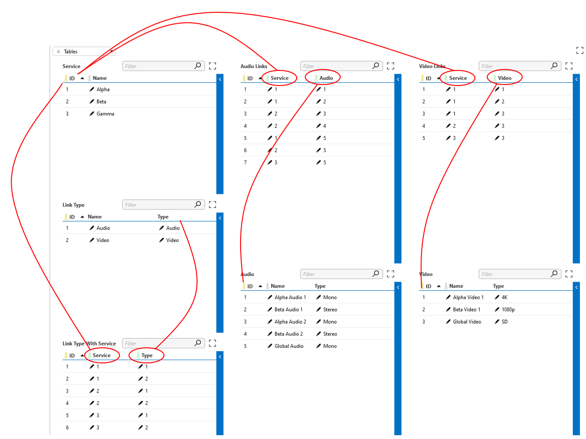
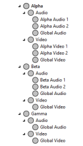

# M:N relations

The following example shows how an M-to-N relation can be modeled for use in a tree control.

Suppose we want to create a tree control that lists all services and the audio and video streams that are part of the services. A service can consist of multiple audio and video streams and an audio (or video) stream can belong to multiple services. This is a so-called many-to-many (M:N) relation. This can be implemented as follows:

1. Create three tables:

    - Services (ID 1000): Contains the services

      ```xml
        <Param id="1000" trending="false">
          <Name>services</Name>
          <Description>Services</Description>
          <Type>array</Type>
          <ArrayOptions index="0" options=";naming=/1002">
            <ColumnOption idx="0" pid="1001" type="autoincrement" options="" />
            <ColumnOption idx="1" pid="1002" type="retrieved" options=";save" />
          </ArrayOptions>
          <Display>
            <RTDisplay>true</RTDisplay>
          </Display>
        </Param>
      ```

    - Audio (ID 4000): Contains the audio streams

       ```xml
        <Param id="4000" trending="false">
          <Name>audio</Name>
          <Description>Audio</Description>
          <Type>array</Type>
          <ArrayOptions index="0" displayColumn="1">
            <ColumnOption idx="0" pid="4001" type="autoincrement" options="" />
            <ColumnOption idx="1" pid="4002" type="retrieved" options=";save" />
            <ColumnOption idx="2" pid="4003" type="retrieved" options=";save" />
          </ArrayOptions>
          <Display>
            <RTDisplay>true</RTDisplay>
          </Display>
        </Param>
      ```

    - Video (ID 6000): Contains the video streams

        ```xml
        <Param id="6000" trending="false">
          <Name>video</Name>
          <Description>Video</Description>
          <Type>array</Type> 
          <ArrayOptions index="0" options=";naming=/6002">
            <ColumnOption idx="0" pid="6001" type="autoincrement" options="" />
            <ColumnOption idx="1" pid="6002" type="retrieved" options=";save" />
            <ColumnOption idx="2" pid="6003" type="retrieved" options=";save" />
          </ArrayOptions>
          <Display>
            <RTDisplay>true</RTDisplay>
          </Display>
        </Param>
        ```

1. Next, create the following two tables:

    - Audio Links (ID: 3000): Links the audio streams to the services they are part of.

        ```xml
        <Param id="3000" trending="false">
          <Name>audioLinks</Name>
          <Description>Audio Links</Description>
          <Type>array</Type> 
          <ArrayOptions index="0">
            <ColumnOption idx="0" pid="3001" type="autoincrement" options="" />
            <ColumnOption idx="1" pid="3002" type="retrieved" options=";foreignKey=1000" />
            <ColumnOption idx="2" pid="3003" type="retrieved" options=";foreignKey=4000" />
          </ArrayOptions>
          <Display>
            <RTDisplay>true</RTDisplay>
          </Display>
        </Param>
        ```

    - Video Links (ID: 5000): Links the video streams to the services they are part of.

       ```xml
        <Param id="5000" trending="false">
          <Name>videoLinks</Name>
          <Description>Video Links</Description>
          <Type>array</Type> 
          <ArrayOptions index="0">
            <ColumnOption idx="0" pid="5001" type="autoincrement" options="" />
            <ColumnOption idx="1" pid="5002" type="retrieved" options=";foreignKey=1000" />
            <ColumnOption idx="2" pid="5003" type="retrieved" options=";foreignKey=6000" />
          </ArrayOptions>
          <Display>
            <RTDisplay>true</RTDisplay>
          </Display>
        </Param>       
        ```

1. Finally, create two additional intermediate tables, which are required for the tree control.

   - Link Type (ID: 2000): Contains the different child node options for the services (Audio/Video).

      ```xml
        <Param id="2000" trending="false">
          <Name>linkType</Name>
          <Description>Link Type</Description>
          <Type>array</Type> 
          <ArrayOptions index="0">
            <ColumnOption idx="0" pid="2001" type="autoincrement" options=";save" />
            <ColumnOption idx="1" pid="2002" type="retrieved" options=";save" />
            <ColumnOption idx="2" pid="2003" type="retrieved" options=";save" />
          </ArrayOptions>
          <Display>
            <RTDisplay>true</RTDisplay>
          </Display>
        </Param>
      ```

   - Link Type With Service (ID: 7000): Links the services with the correct link type.

      ```xml
      <Param id="7000" trending="false">
         <Name>tblLink_TypeWithService</Name>
         <Description>Link Type With Service</Description>
         <Type>array</Type>
         <ArrayOptions index="0" displayColumn="0">
            <ColumnOption idx="0" pid="7001" type="autoincrement" options=""/>
            <ColumnOption idx="1" pid="7002" type="retrieved" options=";foreignKey=1000"/>
            <ColumnOption idx="2" pid="7003" type="retrieved" options=";foreignKey=2000"/>
         </ArrayOptions>
         <Display>
            <RTDisplay>true</RTDisplay>
         </Display>
      </Param>
      ```

1. Define the following relations:

    ```xml
    <Relations>
      <Relation path="1000;3000;4000" options="includeInAlarms:topology1"/>
      <Relation path="1000;5000;6000" options="includeInAlarms:topology2"/>
      <Relation path="1000;7000;2000" options="includeInAlarms:topology3"/>
   </Relations>
    ```

    The table hierarchy of the tree control is then defined as follows:

    ```xml
    <TreeControls>
      <TreeControl parameterId="5" readOnly="false">
        <Hierarchy>
          <Table id="1000"/>
          <Table id="2000" parent="1000"/>
          <Table id="4000" parent="2000" condition="2003:audio;filter:fk=1001"/>
          <Table id="6000" parent="2000" condition="2003:video;filter:fk=1001"/>
        </Hierarchy>
        <ReadonlyColumns>2003</ReadonlyColumns>
        <OverrideDisplayColumns>2002</OverrideDisplayColumns>
      </TreeControl>
    </TreeControls>
    ```

    The line `<Table id="4000" parent="2000" condition="2003:audio;filter:fk=1001"/>` specifies that nodes from table 4000 must be put under the node(s) of table 2000 if

    - column 2003 is "audio" ("2003:audio"), and
    - the row has an m:n relationship with the ancestor node from table 1000 ("filter:fk=1001")

    When `"filter:fk=1001"` is specified, only rows that have a foreign key to the parent node from 1000 will be added.

    > [!NOTE]
    > Feature introduced in DataMiner 8.5.1 (RN 7863).

    The resulting tree control looks like this:

    

    
