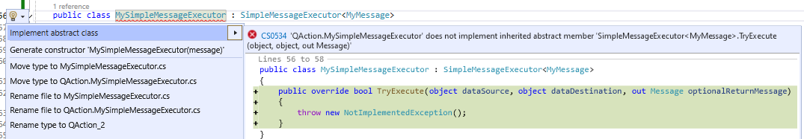

# Customizations

## Custom serializer

The InterAppCall library uses a special serializer that was deliberately tweaked, adjusted and heavily tested to work with almost any possible scenario. However, it also supports developers writing their own serializers and using those.

Any factory method that creates an InterApp call or Message, and any method to send the InterApp or message has an overload that takes a class implementing the `Skyline.DataMiner.Core.InterAppCalls.Common.Serializing.ISerializer` interface.

This interface requires one method to serialize and one method to deserialize. You can create your own logic to do this and provide this to your methods and it will override the internal serializer with your own logic.

## Creating a simple executor

Where the API describes the different messages and their content, the executor will define how it should handle an incoming message.

The executor is never shared between connectors or Automation scripts. You create it at the destination of a message and it is unique to that connector. It will hold all the methods that can access the content of the message and do something with it.

You create it by making a new class that inherits from the `SimpleMessageExecutor<T>`, where T is a class from your messages defined in the API.

```csharp
public class MyMessageExecutor : SimpleMessageExecutor<MyMessage>
```

The Visual Studio IDE will then assist you in correctly implementing your simple executor.



The simple executor has a single method (`TryExecute`) that will by default be called when a message is executed.

Default execute code (happens in background):

```csharp
return simpleMessageExecutor.TryExecute(dataSource, dataDestination, out optionalReturnMessage);
```

The `TryExecute` methods have object arguments. This will mostly be `SLProtocol` or `IEngine`. These can also be used for a custom class with data, a database object, etc so you as a developer have more flexibility.

```csharp
public override bool TryExecute(object dataSource, object dataDestination, out Message optionalReturnMessage)
{
    SLProtocol protocolSource = (SLProtocol)dataSource;
    bool allowed = GetPermission(protocolSource);
    if (!allowed)
    {
        optionalReturnMessage = null;
        return false;
    }

    ...

    optionalReturnMessage = new MyResponse();

    return true;
}
```

> [!NOTE]
> A return message does not necessarily need to be something to send to an external destination. A message could also be part of an internal API used to move data between classes, methods, or QActions within your own connector. This can also be returned.

## Disable message broker

When using InterAppCalls on a DataMiner version 10.3.12 or higher, the message broker will be used instead of SLNet subscriptions for the responses. This results in a big improvement on scalability and performance.

If this change in behaviour is not wanted, you can override it so that your calls are still using SLNet subscriptions for the reply methods by setting the *allowBroker* argument in the Send method.

See more info on the [release note](xref:Skyline_DataMiner_Core_InterAppCalls_Range_1.0#new-feature---enhanced-efficiency-on-interapp-reply-calls).
