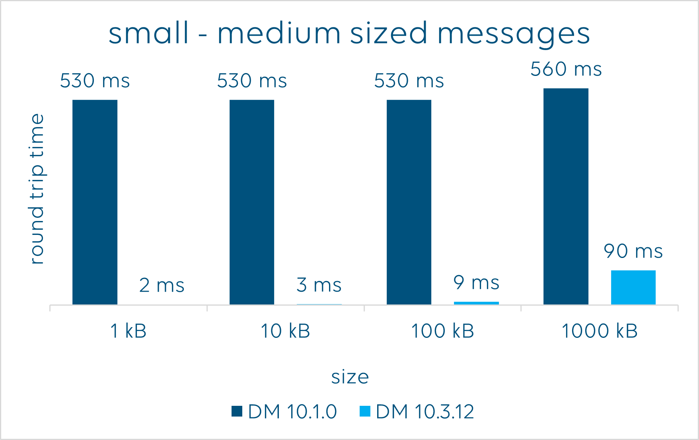
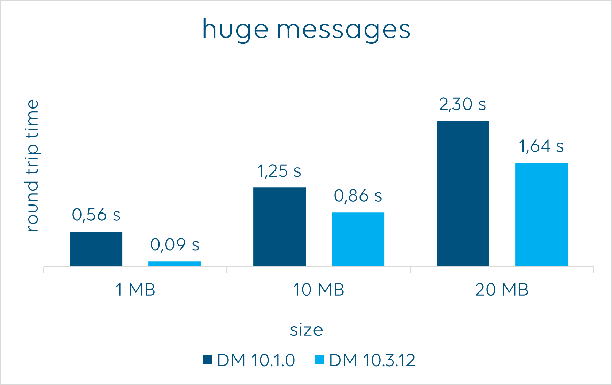

# InterApp

InterApp, available through the NuGet package [Skyline.DataMiner.Core.InterAppCalls.Common](https://www.nuget.org/packages/Skyline.DataMiner.Core.InterAppCalls.Common), provides a C# message and response architecture that can be used:

- From element to element and back.
- From Automation script to element and back.
- From application on the same server to element and back.

Its main features are:

- The ability to send a message to an element.
- The ability to wait for a return message.
- The ability to send many messages in a bulk call.
- A user-friendly and flexible way to define any class you want as a message.
- The ability to balance maintainability versus messaging speed as needed for your project.

Its main purpose is for use within large projects where inter-element or inter-automation communication is required, where you can adjust source and destination code to create and parse the messages.

## Requirements

### DataMiner requirements

- The InterApp classes require DataMiner 10.1.0 or higher to function correctly.
- To take advantage of significant efficieny increases, use DataMiner 10.3.12 or higher.

## Metrics

When returning messages, a significant efficiency increase has been introduced that starts working when you are using DataMiner 10.3.12 or higher.

## Release notes

- [Range 1.0](xref:Skyline_DataMiner_Core_InterAppCalls_Range_1.0)
