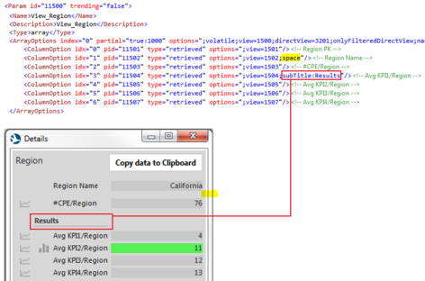

# Options overview

## CPEDummyColumn

EPM (formerly known as CPE) tables often contain dummy items, i.e. virtual items that merely act as a link between two actual items. Using this option, it is possible to hide these dummy items in EPM diagrams and EPM filters.

To be able to mark items as dummy items in a particular EPM table, add an extra column of type "double", and specify the "CPEDummyColumn" option in its column definition, as illustrated in the following example:

```xml
<ArrayOptions index="0" displayColumn="1">
  ...
   <ColumnOption idx="9" pid="1616" type="retrieved" options=";save;disableHeaderSum;
CPEDummyColumn"/>
  ...
</ArrayOptions>
```

To mark an item as a dummy item in that table in DataMiner Cube, go to the row that represents the item, and add "1" in the column defined as "CPEDummyColumn".

> [!NOTE]
>
> - Items marked as dummy items will not be displayed in EPM diagrams or EPM filters, unless they are selected from a direct filter.
>
> - Parents of a dummy item will be linked to its children, and children of a dummy item will be linked to its parents.
> - There can only be one dummy item per topology level. For example, a street cannot have two parents "Dummy1" and "Dummy2". These two dummy items must be combined into one.

*Feature introduced in DataMiner 9.6.4 (RN 19658).*

## delete

By default, when a row is removed, the word "Deleted" will appear in the state column. If you specify the delete option, the row will also be deleted from the dynamic table itself (only valid if type is "state").

## delta

Specifies that the column with the specified index should contain the delta of consecutive values of this column or the delta between this column and another column.

This works as follows:

Option 1:

  ```xml
  <ColumnOption idx="3" pid="30804" type="retrieved" value="" options=";delta=4"/>
  <ColumnOption idx="4" pid="30805" type="retrieved" value="" options=""/>
  ```

  Every time parameter 30804 changes, the delta value is written in the column with index 4 (0-based).

  If the value is 100 and changes to 102, column 4 will contain value 2 (from 102-100).

Option 2:

  ```xml
  <ColumnOption idx="0" pid="30801" type="retrieved" value="" options=""/>
  <ColumnOption idx="1" pid="30802" type="retrieved" value="" options=";foreignKey=20800"/>
  <ColumnOption idx="2" pid="30803" type="retrieved" value="" options=""/>
  <ColumnOption idx="3" pid="30804" type="retrieved" value="" options=";delta=4:20802"/>
  <ColumnOption idx="4" pid="30805" type="retrieved" value="" options=""/>
  ```

Each time parameter 30804 changes, the delta value with a reference value is written in the column with index 4 (0-based).

In the example above, there is a foreign key to table 20800. Parameter 20802 is a column of this table and contains the reference value. In case the value of parameter 20802 is 100 (and the foreign key link is correct) and the value of parameter 30804 is 102, then column 4 will contain value 2.

## displayIcon

If you specify this option, you indicate that the column contains icons instead of values.

### Associating icons with table column values

When defining the table columns, add the displayIcon option to the columns that have to display icons instead of values.

Example:

```xml
<ArrayOptions index="0" displayColumn="1">
  ...
  <ColumnOption idx="5" pid="120" type="custom" value="" options=";save;displayIcon"/>
  ...
```

When defining a discreet parameter of which the values have to be displayed as icons, make sure that every value of that parameter is associated with a particular icon.

Example:

```xml
<Param id="120" trending="false">
  ...
  <Measurement>
     <Type>discreet</Type>
     <Discreets>
        ...
        <Discreet iconRef="InputTransportStream">
           <Display>Input TS</Display>
           <Value>Input TS</Value>
        </Discreet>
        ...
     </Discreets>
  </Measurement>
</Param>
```xml

> [!NOTE]
> All icon references mentioned in a protocol have to refer to icons listed in the icons.xml file, located in the C:\Skyline DataMiner\Protocols folder.

## displayElementAlarm

If you specify this option, you specify that the column has to indicate the alarm state of the element that is referred to by a particular row.

The value of the cell should be the ID of the element in the format "DMA ID/element ID"(e.g. "169/22").

*Feature introduced in DataMiner 9.5.2 (RN 14718).*

## displayServiceAlarm

If you specify this option, you specify that the column has to indicate the alarm state of the service that is referred to by a particular row.

The value of the cell should be the ID of the service in the format "DMA ID/service ID"(e.g. "169/22").

Example:


```xml
<ArrayOptions index="0" displayColumn="1">
   ...
   <ColumnOption idx="5" pid="120" type="custom" value="" options=";save;displayServiceAlarm"/>
</ArrayOptions>
```

*Feature introduced in DataMiner 9.5.2 (RN 14718).*

## displayViewAlarm

If you specify this option, you specify that the column has to indicate the alarm state of the view that is referred to by a particular row.

### Visualization of view alarm states

In a protocol, you can configure that a table column has to indicate the alarm state of the view that is referred to by a particular row.

When defining the table columns, add the displayViewAlarm option to the column that has to indicate the alarm state of the view.

Example:

```xml
<ArrayOptions index="0" displayColumn="1">
  ...

  <ColumnOption idx="5" pid="120" type="custom" value="" options=";save;displayViewAlarm"/>
```

Result: If the value in the displayViewAlarm column is a valid view ID, then that ID will be replaced by a view icon showing the view’s current alarm color. If the value is not a valid view ID, then the cell will be empty.

## enableHeaderAvg

Enables displaying the average value of all rows in the column header of a numeric and monitored column.

## enableHeaderMax

Enables displaying the maximum value of all rows in the column header of a numeric and monitored column.

## enableHeaderMin

Enables displaying the minimum value of all rows in the column header of a numeric and monitored column.

## disableHeaderSum / enableHeaderSum

This will either disable or enable the sum of all rows in the column header of a numeric and monitored column. As enableHeaderSum is the default option, this default can be disabled by specifying disableHeaderSum.

> [!NOTE]
> In case you have a column parameter that uses the option "datetime" and Monitoring is set to "true", disable the header sum calculation by using the disableHeaderSum option.

## disableHeatmap / enableHeatmap

This will either disable or enable the heatmap in all rows in the column header of a numeric and monitored column.

> [!NOTE]
> The six options above are features introduced in DataMiner 8.5.0 (RN 7692).

## disableHistogram / enableHistogram

This will either disable or enable the histogram of all rows in the column header of a numeric and monitored column.

When the disableHistogram option is used in an EPM (formerly known as CPE) user interface, the button to show the real-time histogram will not be visible.

*Feature introduced in DataMiner 8.5.1 (RN 8589).*

## dynamicData

When dynamic positioning is used, it is possible to dynamically set the interfaces of each dynamically positioned element.

1. In the protocol, go to the definition of the table that contains the positioning data, and add an extra column named e.g. "InterfaceData" next to the XPos and YPos columns. In the ColumnOptions tag of this additional column, add the "dynamicData" option.
1. In the subshapes that represent the interfaces in Visio, add a shape data field of type Interface, and set its value to [Dynamic:InterfaceName].

  Example: [Dynamic:input1]

1. In DataMiner Cube, open the element, go to the table that contains the positioning data, and add the necessary interface data in the InterfaceData column using the following syntax:

  InterfaceName=4;InterfaceName=34;

  Example: input1=5;input2=8;output1=5

*Feature introduced in DataMiner 8.5.3 (RN 9318).*

> [!NOTE]
>
> - From DataMiner 9.0.3 (RN 12886) onwards, this option can also be used for child shapes that are automatically generated based on table data. That way, automatically generated child shapes can be linked to a specified element, and can have their interfaces set dynamically.
> - For more information, refer to [Dynamic table filter syntax](xref:Dynamic_table_filter_syntax).

## element

If you specify this option, the DataMiner ID and Element ID of the Dynamic Virtual Element created for each row in the table will automatically be stored in this column.

> [!NOTE]
> This column will only be filled in if DVE element creation is enabled. See [Toggling DVE creation](xref:AdvancedDVEsTogglingCreation).

## foreignKey

A special kind of indexColumn, i.e. the parameter ID of the table containing the primary keys referred to in this column.

## groupby

The index of the column by which will be grouped (only valid if type is "autoincrement").

## hidden

Use this option to configure a column in which you can indicate whether or not a DVE element should be hidden.

Columns marked with the hidden option can have one of two values:

- True = The DVE element will be hidden.
- False = The DVE element will be shown (default value).

By default, the associated column parameter is saved.

*Feature introduced in DataMiner 8.5.1 (RN 8195).*

## HideKPI

Use this option to keep values from being displayed in the KPI window in an EPM (formerly known as CPE) element.

For example, if a protocol contains coordinates to enable dynamic positioning, use HideKPI to keep these coordinates from being displayed in the KPI window:

```xml
<ColumnOption idx="7" pid="11409" type="retrieved" options=";view=1409;xpos;HideKPI"/>
<ColumnOption idx="8" pid="11410" type="retrieved" options=";view=1410;ypos;HideKPI"/>
```

## hideSummaryColumn

(Service Overview Manager) This option allows you to hide the colored squares in the left-hand pane showing the aggregated service statuses.

Example:

```xml
<Param template="auto" id="12400" trending="false">
  <Name>Service</Name>
  <Description>Service</Description>
  <Type>array</Type>
  <ArrayOptions index="0" options=";naming=\12402;autoAdd">
     <!-- id -->
     <ColumnOption idx="0" pid="12401" type="autoincrement" value="" options=";HideSummaryColumn"/>
     ...
```

*Feature introduced in DataMiner 8.0.6.3 (RN6647).*

## indexColumn

This option indicates that this column should be indexed. This allows you to quickly get the primary keys of the rows that have a specific value.

> [!CAUTION]
> Using this option affects memory usage!
>
> When this option is used, the SLProtocol process will maintain an index for this column. The SLProtocol process will update the index for every update to the column data (e.g., through a FillArray, AddRow, etc. call). It is therefore strongly advised to only use this option for columns that do not change frequently.

#### Requesting index values from index columns

In a QAction, you can use the SLProtocol.GetKeysForIndex method to retrieve the primary keys of the rows that have the specified value for the specified column that has been marked as an indexColumn or a foreignKey. See indexColumn.

See also:

- SLProtocol.[GetKeysForIndex](xref:Skyline.DataMiner.Scripting.SLProtocol#Skyline_DataMiner_Scripting_SLProtocol_GetKeysForIndex_System_Int32_System_String_) method
- [NT_GET_KEYS_FOR_INDEX (196)](xref:NT_GET_KEYS_FOR_INDEX)
- [NT_GET_KEYS_FOR_INDEX_CASED (411)](xref:NT_GET_KEYS_FOR_INDEX_CASED)

In case the column data will get updated frequently and you do not need to obtain the primary keys for a specific value often, an alternative is to not use the indexColumn. Instead you can retrieve the primary key column and the data column in a QAction and perform the filtering. This can be done using the GetKeysForValue snippet:

```csharp
/// <summary>
/// Gets the key (or another column) of the rows which have a specified value in a specified column.
/// </summary>
/// <param name="protocol">Link with SLProtocol process.</param>
/// <param name="tablePid">Parameter ID of the table.</param>
/// <param name="returnedColumnIdx">IDX of the column to be returned.</param>
/// <param name="filterColumnIdx">IDX of the column to be used to check if the row contains the specified value.</param>
/// <param name="filterValue">Value to be used to check if the rows should be returned.</param>
/// <returns>The values of the column specified in <paramref name="returnedColumnIdx"/> for the rows that matches.</returns>
public static IEnumerable<string> GetKeysForValue(this SLProtocol protocol, int tablePid, uint returnedColumnIdx, uint filterColumnIdx, string filterValue)
{
   object[] getColumns = (object[])protocol.NotifyProtocol((int)SLNetMessages.NotifyType.NT_GET_TABLE_COLUMNS, tablePid, new uint[] { returnedColumnIdx, filterColumnIdx });

  if (getColumns != null && getColumns.Length > 1)
  {
      object[] getKeys = (object[])getColumns[0];
      object[] getValues = (object[])getColumns[1];
 
     if (getKeys != null && getValues != null)
     {
         int rowCount = getKeys.Length;

        if (rowCount == getValues.Length)
        {
           for (int i = 0; i < rowCount; i++)
           {
               string getValue = Convert.ToString(getValues[i], CultureInfo.InvariantCulture);

              if (getValue.Equals(filterValue))
              {
                  yield return Convert.ToString(getKeys[i]);
              }
           }
        }
     }
  }
}
```

## KPIHideWrite

Use this option for EPM (formerly known as CPE) elements to disable write parameters in the KPI window.

*Feature introduced in DataMiner 8.0.6 (RN 5828).*

## linkElement

If you use this option, the value of this column will be used as a link to an element. In Visio, this is used for dynamic positioning.

> [!NOTE]
>
> - The value of the column must be of type string and can contain the element name or DmaID/ElementID.
> - From DataMiner 9.0.3 (RN 12886) onwards, this option can also be used for child shapes that are automatically generated based on table data. That way, automatically generated child shapes can be linked to a specified element and can have their interfaces set dynamically.
> - For more information, refer to [Positioning shapes dynamically](xref:Positioning_shapes_dynamically).

## rowTextColoring

If you specify this option, you indicate that the value in this column will control the row color.

See also the rowTextColor option of the Discreet tag: `rowTextColor=#RRGGBB`.

## save

Specify this option if you want the column to be saved.

> [!NOTE]
> From DataMiner 9.5.5 (RN 16743) onwards, all parameters used to create the display key are saved by default (except for volatile tables).

## separator

The interpretation of the separator value depends on the content of the type attribute

- If type is “concatenation”: separator between column values.

  By default, the columns are concatenated without a separator.
- If type is “autoincrement”: separator between column values when multiple columns make up the index (see [groupby](xref:ColumnOptionOptionsOverview#groupby)).

  Example: “1.2” (separator is a dot)

  By default, a dot (.) is used.

## SelectionSetVar

Use this option to link the column to a Visio session variable.

If you do so, selecting a table row in a Visio parameter control will trigger a set of session variable set operations on selection. Deselecting a row will clear the session variables.

*Feature introduced in DataMiner 8.0.6 (RN 6591).*

Example:

```xml
<Param id="101" trending="false">
  <Name>ipAddrEntry</Name>
  <Description>ipAddrEntry</Description>
  <Type>ARRAY</Type>
  <ArrayOptions index="0" displayColumn="1">
     <ColumnOption idx="0" pid="111" type="custom" value="" options=";SelectionSetVar:Name"/>
     <ColumnOption idx="1" pid="112" type="custom" value="" options=";save;SelectionSetVar:Description"/>
     <ColumnOption idx="2" pid="114" type="custom" value="" options=";save;SelectionSetVar:Number"/>
     <ColumnOption idx="3" pid="122" type="custom" value="" options=";save;displayViewAlarm;SelectionSetVar:Viewstate"/>
     <ColumnOption idx="4" pid="116" type="custom" value="" options=";save;SelectionSetVar:Value"/>
     <ColumnOption idx="5" pid="118" type="custom" value="" options=";save;SelectionSetVar:Discreet1"/>
     <ColumnOption idx="6" pid="120" type="custom" value="" options=";save;displayIcon;SelectionSetVar:Ibt"/>
     <ColumnOption idx="7" pid="124" type="custom" value="" options=";save;rowTextColoring;SelectionSetVar:RowTextColor"/>
     <ColumnOption idx="8" pid="126" type="custom" value="" options=";save"/>
  </ArrayOptions>
</Param>
```

## SelectionSetCardVar

Use this option to link the column to a Visio session variable, limited to the current card.

For more information, see [SelectionSetVar](xref:ColumnOptionOptionsOverview#selectionsetvar).

*Feature introduced in DataMiner 8.5.1 (RN 7912).*

## SelectionSetPageVar

Use this option to link the column to a Visio session variable, limited to the current page.

For more information, see [SelectionSetVar](xref:ColumnOptionOptionsOverview#selectionsetvar).

*Feature introduced in DataMiner 8.5.1 (RN 7912).*

## SelectionSetWorkspaceVar

Use this option to link the column to a Visio session variable, limited to the current workspace.

For more information, see [SelectionSetVar](xref:ColumnOptionOptionsOverview#selectionsetvar).

*Feature introduced in DataMiner v9.5.0 [CU6]/9.5.9 (RN 17705).*

## SetOnTable

Use this option to enable sets on the directView.

See also [directView](xref:Protocol.Params.Param.ArrayOptions-options#directview).

## severity

(DVE) If you specify this option, the column will contain the overall element severity of the DVE element that exports the rows.

*Feature introduced in DataMiner 8.0.0 (RN 5726).*

## SeverityColumn

(Service Overview Manager) Use this option to define a severity column. The alarm severity of the value in this column will be displayed as a square in the Overview tab of the DataMiner Cube card.

*Feature introduced in DataMiner 8.0.2 (RN 5965).*

## SeverityColumnIndex

(Service Overview Manager) Use this option to define the position of the severities displayed in the Overview tab of the DataMiner Cube card.

Example:

```xml
<ColumnOption idx="16" pid="533" type="retrieved" value="" options=";severity" />
<Param id="533" export="true">
  <Name>Table1Severity</Name>
  <Description>Table1Severity</Description>
  <Type>read</Type>
  <Interprete>
     <RawType>unsigned number</RawType>
     <LengthType>fixed</LengthType>
     <Length>4</Length>
     <Type>double</Type>
  </Interprete>
  <Display>
     <RTDisplay>true</RTDisplay>
     <Positions>
        <Position>
           <Page>General</Page>
           <Row>14</Row>
           <Column>0</Column>
        </Position>
     </Positions>
  </Display>
  <Measurement>
     <Type>Discreet</Type>
     <Discreets>
        <Discreet>
           <Display>Not monitored</Display>
           <Value>0</Value>
        </Discreet>
        <Discreet>
           <Display>Normal</Display>
           <Value>1</Value>
        </Discreet>
        <Discreet>
           <Display>Warning</Display>
           <Value>2</Value>
        </Discreet>
        <Discreet>
           <Display>Minor</Display>
           <Value>3</Value>
        </Discreet>
        <Discreet>
           <Display>Major</Display>
           <Value>4</Value>
        </Discreet>
        <Discreet>
           <Display>Critical</Display>
           <Value>5</Value>
        </Discreet>
        <Discreet>
           <Display>Timeout</Display>
           <Value>7</Value>
        </Discreet>
        <Discreet>
           <Display>Masked</Display>
           <Value>9</Value>
        </Discreet>
        <Discreet>
           <Display>Error</Display>
           <Value>10</Value>
        </Discreet>
     </Discreets>
  </Measurement>
</Param>
```

*Feature introduced in DataMiner 8.0.2 (RN 5965).*

## showReadAsKPI

This option allows you to hide read parameters, so that only write parameters are shown.

From DataMiner 8.5.4.3 (RN 9381) onwards, either a colon or an equals sign can be used.

Examples:

```xml
showReadAsKPI:false
showReadAsKPI=false
```

## space

Adds a blank space after the parameter in the KPI window.

## subTitle

This option allows you to add a subtitle to the KPI window (RN 2663). This option placed the subtitle before the parameter.

For example:



## volatile

Specify this option if you do NOT want the column(s) to be saved. This means that automatically saved columns like Primary Key, Foreign Key, … are no longer stored, and assuming that the columnOption 'save' was used on a specific column, this is not stored either.

> [!CAUTION]
> Be careful about where you use this option, as it cannot be used on every table. For information on the limitations, see [Volatile tables](xref:AdvancedDataMinerDataPersistencePersistingTables#volatile-tables).

## View

When DVE elements are created from this table, the element will be placed in the view specified in this column.

The column marked with this option can contain any of the following:

- view ID
- view name
- multiple view IDs, separated by semicolon (“;”)
- multiple view names, separated by semicolon (”;”)
- mixed view ID(s) and view name(s), separated by semicolon (“;”)

See also [Dynamic Virtual Elements](xref:AdvancedDVEs)

## view=

Configures a (direct) view column.

The following syntax is supported:

- view=columnPid
  - columnPid: The ID of the column parameter of which the values will be shown in this column of this view table.
- view=baseTableFKColumn;columnPid 
  - baseTableFKColumn: The ID of the column of the base table containing foreign keys to the table that holds the column that should be included in this view table.
  - columnPid: The ID of the column parameter of which the values will be shown in this column of this view table.
- view=linkedPid:elementKeyColumnPid:remoteDataTablePid:remoteDataColumnIdx 
  - linkedPid: The column that is the starting point of the path to follow to reach the column that contains the remote element ID, mentioned in elementKeyColumnPid. Providing a value for this placeholder is supported from DataMiner 10.1.2 (RN 28448) onwards.
  - elementKeyColumnPid: Table column that contains the DMA ID/element ID keys of the remote elements.
  - remoteDataTablePid: PID of the table in the remote element.
  - remoteDataColumnIdx: Zero-based index of the column in the remote element data table.

This option can be configured in three different ways, as shown in the table below. In the examples below, table 11000 is a (direct) view on table 1000.

|Type of filtering|Example|Description|
|--- |--- |--- |
|Local filtering|view=:1004:1000:1|The elementkeycolumnpid refers to another column of the same table. Each row will be requested from the element referred to by the DMAID/EID found in parameter 1004.|
|Foreign key filtering|view=1003:1105:1000:2|The elementkeycolumnpid refers to a column of the table linked by the foreign key found in parameter 1003. Each row will be requested from the element referred to by the DMAID/EID found in parameter 1105, which is linked via the foreign key in parameter 1003.|
|No filtering|view=:1401:1000:1|The elementkeycolumnpid refers to a column of another table, which is not linked to the local table (no linkedPid is provided). Each row will be requested from the elements referred to by the DMAID/EID items found in column 1401. Note: If the remote elements contain duplicate keys, this can cause data to be overwritten.|

See also: [View tables](xref:AdvancedViewTables)

## viewImpact

By specifying this option in a particular table column definition, you can configure a "view impact" column containing IDs of views that have to be put in alarm whenever there is an alarm on a cell in another column of that same table.

The column must be of type string. Multiple view IDs have to be separated by semicolons.

*Feature introduced in DataMiner 9.6.2 (RN 19798).*

Example:

```xml
<ColumnOption idx="2" pid="104" type="custom" options=";save;viewImpact"/>
```

From DataMiner 9.6.5 (RN 21401) onwards, this option is also supported for EPM (formerly known as CPE) tables.

- The highest alarm among all rows that affect a particular view will be copied to the DirectViewImpactsLevel property of the ViewStateEventMessage class.
- The bubble-up level will be copied to the DirectViewImpactsBubbleupLevel property of the ViewStateEventMessage class.
