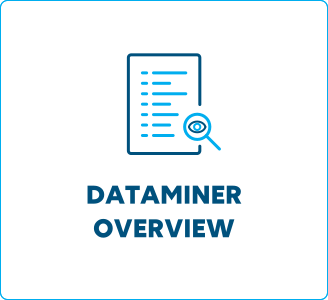
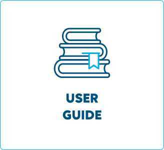
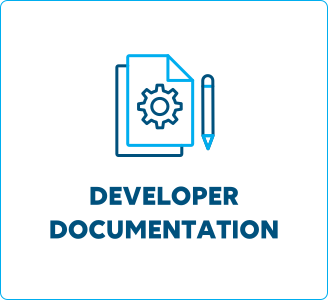
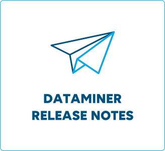

# docs.dataminer.services

Welcome to the home of DataMiner documentation!

This is where you'll find all essential information on how to use DataMiner and develop your DataMiner System (including connectors, Visual Overview, Automation, etc.).

Can't find what you need here? Go to our [DataMiner Community website](https://community.dataminer.services/) for questions, use cases, additional resources, etc.

> [!TIP]
> Want to contribute? Go to [Contributing to the DataMiner docs](xref:contributing) for more info.

 &nbsp;  &nbsp;  &nbsp; 
