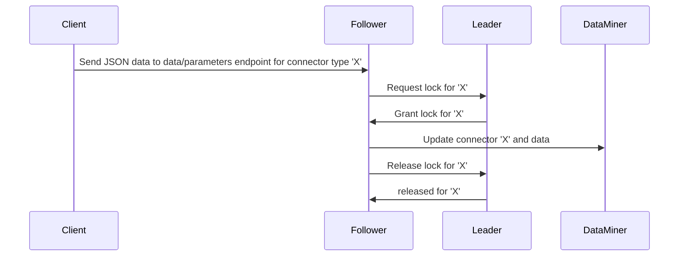

# Data API change log

> [!IMPORTANT]
> At present, the Data API feature is only available in preview, if the soft-launch option *DataAPI* is enabled. For more information, see [Getting started with the Data Sources module](xref:Data_Sources_Setup).

### ? October 2025 - Fix - DataAPI 1.4.1 - Issue with deadlock and memory leak in Node Identification mechanism [ID 44026]

It could occur that DataAPI would deadlock while processing incoming NATS messages. This caused message accumulation, eventually leading to a memory leak.

The locking mechanism has been improved to ensure proper entry and exit, preventing deadlocks and eliminating the associated memory leak.

### ? October 2025 - Fix - DataAPI 1.4.1 - Issue with fetching of auto-generated elements and connectors at startup [ID 44000]

It could occur that DataAPI would crash at startup if an exception was thrown during the NATS communication. 

Now the startup procedure is made more robust to properly handle the NATS/MessageBroker exceptions.

### 3 October 2025 - New feature - DataAPI 1.4.0 - Added support for history sets [ID 43666]

Data API has been extended to allow users to specify a date and time for history sets, with an **optional header** called **historySet**.

- When the header is specified, **all parameters** in the request body have the attribute **historySet** set to **true** in the protocol.xml.
- When the header is not specified, nothing will be modified (i.e. if historySet was set to true or false for a parameter, this will remain unchanged).

The time specified in such requests must follow the format `yyyy-MM-ddTHH:mm:ssZ` (ISO 8601). If a different format is used, the request will be rejected. Any requests to perform a history set in the future will also be rejected.

> [!IMPORTANT]
> This feature requires **DataMiner 10.4.0 [CU21]/10.5.0 [CU9]/10.5.12 or higher**. With lower DataMiner versions, it is not yet supported, and any requests that specify the historySet header will be rejected.

Example of a request:

```bash
curl -X 'PUT' \
  'http://localhost:34567/api/data/parameters' \
  -H 'accept: application/json' \
  -H 'identifier: test' \
  -H 'type: test' \
  -H 'historySet: 2025-09-04T08:30:00Z' \
  -H 'Content-Type: application/json' \
  -d '{"data": {"param1": 123 }}'
```

### 3 October 2025 - Fix - DataAPI 1.4.0 - Unable to run installer on DaaS system [ID 43713]

It could occur that a DaaS system or a system with a CD drive configured could not be upgraded or downgraded to a different version of DataAPI, because the DataAPI installer considered this a valid drive to copy files to.

Now the installer will by default use the C: drive to copy the files, and it will only look into other drives in case this drive is not available.

### 3 October 2025 - Fix - DataAPI 1.4.0 - Issue in peer and leader logic could cause DataAPI startup to fail [ID 43657]

It could occur that the DataAPI DxM failed to start, with a fatal error indicating that a background service had thrown an unhandled exception while electing a leader. This will now be prevented.

### 3 October 2025 - Enhancement - DataAPI 1.4.0 - Trending no longer enabled by default for string parameters [ID 43462]

Trending for string parameters is no longer enabled by default in the trend template. However, you can still manually enable trending for them if necessary.

### 5 August 2025 - Enhancement - DataAPI 1.3.0 - Improved DxM-DataMiner communication for better timeout handling [ID 43441]

The communication between the DataAPI DxM and DataMiner has been improved to better handle timeouts. Previously, data consisting of multiple commands could be pushed in a single message, but when communication timed out this could cause DataAPI to be out of sync with DataMiner, potentially leading to data being overridden or deleted. Now the original message is split in two, so that important information can be cached at an earlier stage, avoiding problems caused by timeouts in a later stage.

### 5 August 2025 - Enhancement - DataAPI 1.3.0 - Data now pushed directly to SLProtocol to improve performance [ID 41569]

To improve performance and reduce the load on the SLNet process, DataAPI will now push data directly to the SLProtocol process. It will only communicate with SLNet over NATS to create or update the auto-generated connector and to create new elements. Requests for setting parameters are now sent directly to SLProtocol, where support has been added to communicate over NATS.

### 9 January 2025 - Fix - DataAPI 1.2.7 - Parameter ID incorrectly reset when adding new parameters [ID 41886]

When new parameters were added, it could occur that their parameter ID reverted to the default starting value instead of the expected incremental IDs, because maxParamId was reset to the default initial parameter ID. This issue has been resolved.

### 11 December 2024 - Enhancement - DataAPI 1.2.6 - Validation added on parameter type for existing connector [ID 41684]

New validation has been added to verify the parameter type before modifying an existing connector to ensure types have not been changed (e.g. pushing string data to a numeric parameter). In case a wrong parameter type is identified, an error message is logged and the request is rejected.

### 10 December 2024 - Fix - DataAPI 1.2.6 - Unexpected parameters outside range error [ID 41683]

When the first payload sent was an empty structure (e.g. `{ "Table 0": [] }`), followed by a second payload with data (e.g. `{ "Table 0": [{ "Added Column 0": 891662541, "id": "Row 0" }] }`), it could occur that the Data API failed with the error "There are parameters outside of the allowed range of '10000000' to '10999999'". This problem has been resolved.

### 4 December 2024 - Enhancement - DataAPI 1.2.6 - Connector manipulation now thread-safe [ID 41637]

The manipulation of a connector is now thread-safe, allowing concurrent requests to read and change the same connector.

### 22 November 2024 - New feature - DataAPI 1.2.5 - Sync deleted connectors [ID 40090]

DataAPI now removes a connector from its local cache when the connector is deleted in DataMiner.

### 14 November 2024 - Fix - DataAPI 1.2.4 - MessageBroker updated [ID 41381]

DataAPI has been updated to use the latest MessageBroker NuGet version.

### 14 November 2024 - Fix - DataAPI 1.2.4 - Soft-launch verification incompatible with DataMiner 10.5.x and higher [ID 41286]

Previously, the soft-launch verification, which checks whether Data API is running on a compatible DataMiner version, verified only 10.4.x versions. Now 10.5.x versions and higher will be included in the check.

### 14 November 2024 - Fix - DataAPI 1.2.4 - Telemetry data not collected when TraceParent header was specified in request [ID 40512]

If the TraceParent header was specified in a request, it could occur that the telemetry data was not collected. To prevent this, the AlwaysOnSampler option has been added to the open telemetry setup.

### 14 November 2024 - Enhancement - DataAPI 1.2.4 - SLLogCollector config file deployed with installation of Data API DxM [ID 41003]

Up until recently, SLLogCollector was configured by default (with the *Collector-xml* configuration file) to collect the log files of the DataAPI DxM, even when the DxM was not installed. This default configuration has been removed from DataMiner (see [General Feature Release 10.4.12](xref:General_Feature_Release_10.4.12#sllogcollector-will-no-longer-be-configured-by-default-to-collect-the-log-files-of-the-dataapi-dxm-id-41003)), and the Data API installer will instead create the log configuration file upon installation.

### 14 November 2024 - Enhancement - DataAPI 1.2.4 - PDB files removed from installer [ID 40901]

To improve security, the DataAPI installer has been updated so that it will no longer install PDB files.

### 14 November 2024 - Enhancement - DataAPI 1.2.4 - Improved handling of missing columns when parsing request [ID 40222]

If a request contains missing columns, DataAPI will no longer fail to handle the request or encounter unexpected behavior. Previously, sending a request with `{"table": [{"param1": 4}, {"param2": 3}]}` would result in a table with one single row, instead of two rows. Now, sending `{"table": [{"param1": 4}, {"param2": 3}]}` generates the same result as `{"table": [{"Id": 1, "param1": 4}, {"Id": 2, "param2": 3}]}`.

### 12 September 2024 - Fix - DataAPI 1.2.3 - Auto-increment column duplicated when ID column was specified in new request [ID 40187]

When DataAPI generates a table, it uses the *ID* column from the request as the index. If the request does not include an *ID* column, DataAPI creates an *Idx* column with auto-incremented values. However, up to now, when the *ID* column was added in later requests, it could occur that two *Idx* columns were created.

### 12 September 2024 - Enhancement - DataAPI 1.2.3 - Prevent the configuration of units or decimals on table parameters [ID 40152]

The config endpoint will now return an error when it receives a request to configure the units or decimals of a table parameter.

### 30 July 2024 - Enhancement - DataAPI 1.2.2 - Dual instance for debugging [ID 40192]

The ability to debug two running instances of the DxM to test inter-DxM communication has been added.

### 30 July 2024 - Fix - DataAPI 1.2.2 - Case-insensitive handling of push and config requests [ID 40100]

Previously, when data was sent to *DataAPI*, the field names in the request body were modified according to title case rules during connector setup. If subsequent requests did not use the same casing, this could lead to mismatches, causing the request to fail. This update ensures that the request fields are now case-insensitive.

### 1 July 2024 - Enhancement - DataAPI 1.2.1 - Extra protections added to not use parameter IDs outside allowed ranges [ID 39860]

Protections have been added in the DataAPI DxM so that no IDs can be used outside of the allowed range (10M to 11M).

When reading faulty connectors from DataMiner, the DxM will sanitize its in-memory representation to not have those disallowed parameters, and it will publish a fixed version.

### 1 July 2024 - Fix - DataAPI 1.2.1 - Error when NATS is not available at startup [ID 39827]

When the DataAPI DxM started up before NATS was completely started, this could cause a critical error to be thrown during the initialization.

Protection has been added to prevent this error, and a more robust recovery mechanism has been implemented to keep trying to initialize until NATS is fully up and running.

### 1 July 2024 - Enhancement - DataAPI 1.2.1 - Upgrade NuGet dependencies with known vulnerabilities [ID 39760]

The ​Data API now uses updated NuGet package versions, which address known vulnerabilities.

### 29 April 2024 - Enhancement - DataAPI 1.2.0 - Improved performance when creating new connectors [ID 39401]

The ​Data API now uses an updated version of the [Skyline.DataMiner.CICD.Models.Protocol](https://www.nuget.org/packages/Skyline.DataMiner.CICD.Models.Protocol) NuGet package, which improves performance when creating a new connector with many standalone parameters.

### 29 April 2024 - Enhancement - DataAPI 1.2.0 - Removed copyright from auto-generated connectors [ID 39400]

The auto-generated connectors generated by the Data API no longer contain the copyright message. Instead, these just contain the following line, where the timestamp indicates the UTC timestamp of when the connector was generated:

```csharp
<!--This protocol is auto-generated by the DataMiner Data API at 2024-04-12T05:43:30.823Z.-->
```

### 29 April 2024 - Fix - DataAPI 1.2.0 - All active elements updated with same identifier [ID 39352]

Multiple elements can use the same auto-generated connector (e.g. specifying the same type but using different identifiers in data/parameters REST calls results in the creation of multiple elements using the same auto-generated connector). An issue has now been fixed so that you can push data to an active element that runs a specific auto-generated connector even if other elements that run the same auto-generated connector are in stopped state. Prior to this fix, as soon as there was a stopped element that used the same auto-generated connector, the call failed.

### 29 April 2024 - New feature - DataAPI 1.2.0 - Added support for horizontal scalability of the DataAPI DxM [ID 39146]

The Data API now supports horizontal scalability: Multiple DataAPI DxMs can be installed, which will form a cluster of nodes where one node is elected as the leader and the remaining nodes are followers. Each node will broadcast a heartbeat message (every 2s), which contains the ID (GUID) of the node and an indication of whether it is the leader.

During startup of a node, the node will wait for 6 seconds before determining whether the node should be the leader. After the initial startup period, the node will determine whether it should be the leader based on the heartbeat messages received from the other nodes. A node will elect itself as leader if its node ID is larger than that of any of its peers.

Before the leader announces itself as leader to the other nodes (via the heartbeat message), it will retrieve all auto-generated connectors from DataMiner and keep these in memory locally.

The leader knows about all auto-generated connectors, and it will coordinate all updates to these auto-generated connectors by granting a lock to any node that wishes to perform an update on an auto-generated connector.

The following sequence diagram shows the flow when, for example, a follower node receives JSON data that would result in an update of a connector.



When the follower sends a request to acquire a lock to the leader, it sends along a checksum of the version the follower has in its local cache.
When the leader is able to grant the lock (i.e. the lock is currently not taken), it will check if the checksum that was provided by the follower matches the checksum of the connector the leader currently has in memory. If it matches, the follower has the latest version in its cache. Otherwise, the follower has an outdated version, and the leader will send along the latest version (together with its checksum) to the follower.

Now the follower will process the JSON data, which will result in an updated connector. The follower calculates the checksum and sends the updated connector to DataMiner. It then sends a request to the leader to release the lock. This message includes the updated connector and checksum so that the leader can update its local in-memory cache to this latest version.

Remarks:

- A lock is only requested in case the received JSON data would result in an update of the connector. This is done by performing an optimistic update. This means that a follower node will process the incoming JSON data on the /data/parameters endpoint with the version that it currently has in its local memory. If the result does not indicate an update of the connector, then no lock is requested and only the parameter value updates are sent to DataMiner. If, however, the parsing results in an update of the connector, a lock is requested.
- Once a lock is granted for a connector, no other nodes can update that connector. Also, if a node determines that an update is required on a specific connector, a lock is applied within the node itself to prevent other threads in the node from trying to update the same connector simultaneously.
- Because a hashing is applied on the generated connector (i.e. XML), it is important that all nodes run the same version of the DxM. Otherwise, if the generated XML is different from one version compared to another, there might be redundant updates of caches.

#### Lock cleanup

Suppose a follower requests a lock for a specific connector and then the follower crashes. In this situation, the follower will not be able to release the lock.

To avoid the lock from being held indefinitely, the leader will clean up locks that have not been released after a longer period of time. If it detects a lock that has not been released for a longer period of time, the leader will release the lock and retrieve the content of that connector again from DataMiner.

#### Leader re-election

In case the leader goes down, followers will not be able anymore to requests locks. Therefore, each node will verify if a new leader needs to be elected. This is done by keeping track of the received heartbeat messages of all nodes. A timestamp is kept for each node indicating the last received time of a heartbeat message of a node.

During re-election, only nodes for which a heartbeat message was received that is more recent than a certain period of time will be taken into account.

If another node becomes the leader, that node will announce itself as leader. The follower nodes will clean their local in-memory cache.

#### 1 April 2024 - New feature - DataAPI 1.1.3 - New configuration endpoint for units and decimals [ID 39016]

A new endpoint `<host address>/api/config` has been added, allowing users to configure units and decimals.

Example:

```json
{
    "decimals": {
        "Devices": [
            {
                "Connected devices": [
                    {
                        "Temperature": 2
                    }
                ]
            }
        ],
        "Ping": 2
    },
    "units": {
        "Devices": [
            {
                "Connected devices": [
                    {
                        "Temperature": "degC"
                    }
                ]
            }
        ],
        "Ping": "ms"
    }
}
```

> [!NOTE]
>
> - The *config* endpoint can only be used when an auto-generated connector exists that is identified by the mandatory **type** HTTP header field.
> - The parameters specified in the request must also exist.
> - The length of units is restricted to 30 characters to optimize display.
> - Because of the constraints of double precision in .NET, the number of digits is limited to 15. For example, when there are 5 digits before the decimal point, only 10 useful decimals can be shown.

#### 1 April 2024 - Enhancement - DataAPI 1.1.3 - OpenTelemetry support added [ID 39129]

*DataAPI* now supports OpenTelemetry.

#### 27 March 2024 - Fix - DataAPI 1.1.2 - Foreign key columns removed from trended parameters [ID 39196]

*DataAPI* no longer enables trending for foreign key columns.

#### 27 March 2024 - Enhancement - DataAPI 1.1.2 - Protocol namespace added in auto-generated connectors [ID 39198]

*DataAPI* now adds the protocol namespace `http://www.skyline.be/protocol` when a new connector is generated.

#### 15 March 2024 - New feature - DataAPI 1.1.1 - Cloud Node ID used to identify DxM instance and report DxM status [ID 39051]

The Cloud Node ID is now used to uniquely identify each DxM instance in a cluster and report back DxM health stats for remote monitoring of systems connected to dataminer.services.

In addition, the Node ID is now also used as an identifier when registering with APIGateway.

#### 14 March 2024 - Enhancement - DataAPI 1.1.0 - Upgrade to .NET 8 [ID 39022]

Data API has now been upgraded to use .NET 8 instead of .NET 6. This means .NET 8 Runtime now has to be installed in order to run Data API.

#### 14 March 2024 - Enhancement - DataAPI 1.0.2 - Improved installer robustness [ID 38981]

The Data API installer has been updated to mitigate a Windows DLL redirection vulnerability and to improve its robustness.

#### 02 March 2024 - Fix - DataAPI 1.0.1 - DataMiner icon added to application [ID 38839]

A DataMiner icon has been added to the DxM, which will now be used as the application icon in Task Manager.

#### 31 January 2024 - New feature - DataAPI 1.0.0 - New DataAPI module [ID 36542] [ID 36588] [ID 36575] [ID 37055] [ID 37337] [ID 37648] [ID 37796] [ID 37817] [ID 37837] [ID 37898] [ID 38088] [ID 38159] [ID 38570]

A new Data API module is now available as a DxM (DataMiner Extension Module).

It provides an HTTP API with the purpose of ingesting data into DataMiner. Within the HTTP body of the request, a JSON-formatted structure with key-value pairs can be provided. Data API will then, according to the provided JSON data, dynamically generate connectors with the corresponding standalone parameters, table, and columns.

##### Client Libraries [ID 36542]

Client libraries are now generated for the Data API HTTP web API. At present, C# and Python are supported. Other languages can use the HTTP API calls.

##### API Gateway module registration [ID 36575] [ID 37055] [ID 38570]

Data API will now register itself with API Gateway allowing for an overview of all node instances.

##### Decimals calculation for numeric parameters [ID 37337]

Data API will now calculate an appropriate number of decimals to use with numeric parameters based on the precision of the value provided upon creation of the parameter.

##### Auto-generated connector parameters [ID 37648] [ID 37837]

Parameters generated by Data API will use IDs within the range of 10 million (inclusive) to 11 million (exclusive).

They will be all be saved and trending will be enabled for them by default. Additionally, a trend template will be created and updated as new parameters are added.

##### Limit the size of API request [ID 37817]

A limitation has been implemented so that requests for Data API must remain under 1 MB in size. Larger requests will be rejected and will not be parsed.
