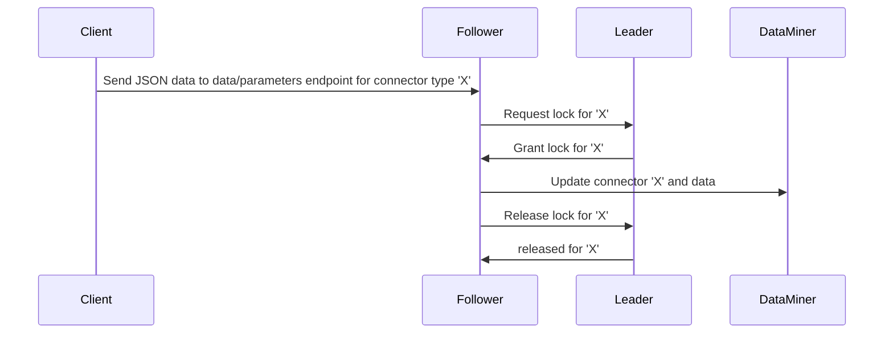

# Data API change log

> [!IMPORTANT]
> At present, the Data API feature is only available in preview, if the soft-launch option *DataAPI* is enabled. For more information, see [Getting started with the Data Sources module](xref:Data_Sources_Setup).

### 29 April - Enhancement - DataAPI 1.2.0 - Improved performance when creating new connectors [ID_39401]

The ​Data API now uses an updated version of the [Skyline.DataMiner.CICD.Models.Protocol](https://www.nuget.org/packages/Skyline.DataMiner.CICD.Models.Protocol) NuGet package, which improves performance when creating a new connector with many standalone parameters.

### 29 April - Enhancement - DataAPI 1.2.0 - Removed copyright from auto-generated connectors [ID_39400]

The auto-generated connectors generated by the Data API no longer contain the copyright message. Instead, these just contain the following line, where the timestamp indicates the UTC timestamp of when the connector was generated:

```csharp
<!--This protocol is auto-generated by the DataMiner Data API at 2024-04-12T05:43:30.823Z.-->
```

### 29 April - Fix - DataAPI 1.2.0 - All active elements updated with same identifier [ID_39352]

Multiple elements can use the same auto-generated connector (e.g. specifying the same type but using different identifiers in data/parameters REST calls results in the creation of multiple elements using the same auto-generated connector). An issue has now been fixed so that you can push data to an active element that runs a specific auto-generated connector even if other elements that run the same auto-generated connector are in stopped state. Prior to this fix, as soon as there was a stopped element that used the same auto-generated connector, the call failed.

### 29 April - New feature - DataAPI 1.2.0 - Added support for horizontal scalability of the DataAPI DxM [ID_39146]

The Data API now supports horizontal scalability: Multiple DataAPI DxMs can be installed, which will form a cluster of nodes where one node is elected as the leader and the remaining nodes are followers. Each node will broadcast a heartbeat message (every 2s), which contains the ID (GUID) of the node and an indication of whether it is the leader.

During startup of a node, the node will wait for 6 seconds before determining whether the node should be the leader. After the initial startup period, the node will determine whether it should be the leader based on the heartbeat messages received from the other nodes. A node will elect itself as leader if its node ID is larger than that of any of its peers.

Before the leader announces itself as leader to the other nodes (via the heartbeat message), it will retrieve all auto-generated connectors from DataMiner and keep these in memory locally.

The leader knows about all auto-generated connectors, and it will coordinate all updates to these auto-generated connectors by granting a lock to any node that wishes to perform an update on an auto-generated connector.

The following sequence diagram shows the flow when, for example, a follower node receives JSON data that would result in an update of a connector.



When the follower sends a request to acquire a lock to the leader, it sends along a checksum of the version the follower has in its local cache.
When the leader is able to grant the lock (i.e. the lock is currently not taken), it will check if the checksum that was provided by the follower matches the checksum of the connector the leader currently has in memory. If it matches, the follower has the latest version in its cache. Otherwise, the follower has an outdated version, and the leader will send along the latest version (together with its checksum) to the follower.

Now the follower will process the JSON data, which will result in an updated connector. The follower calculates the checksum and sends the updated connector to DataMiner. It then sends a request to the leader to release the lock. This message includes the updated connector and checksum so that the leader can update its local in-memory cache to this latest version.

Remarks:

- A lock is only requested in case the received JSON data would result in an update of the connector. This is done by performing an optimistic update. This means that a follower node will process the incoming JSON data on the /data/parameters endpoint with the version that it currently has in its local memory. If the result does not indicate an update of the connector, then no lock is requested and only the parameter value updates are sent to DataMiner. If, however, the parsing results in an update of the connector, a lock is requested.
- Once a lock is granted for a connector, no other nodes can update that connector. Also, if a node determines that an update is required on a specific connector, a lock is applied within the node itself to prevent other threads in the node from trying to update the same connector simultaneously.
- Because a hashing is applied on the generated connector (i.e. XML), it is important that all nodes run the same version of the DxM. Otherwise, if the generated XML is different from one version compared to another, there might be redundant updates of caches.

#### Lock cleanup

Suppose a follower requests a lock for a specific connector and then the follower crashes. In this situation, the follower will not be able to release the lock.

To avoid the lock from being held indefinitely, the leader will clean up locks that have not been released after a longer period of time. If it detects a lock that has not been released for a longer period of time, the leader will release the lock and retrieve the content of that connector again from DataMiner.

#### Leader re-election

In case the leader goes down, followers will not be able anymore to requests locks. Therefore, each node will verify if a new leader needs to be elected. This is done by keeping track of the received heartbeat messages of all nodes. A timestamp is kept for each node indicating the last received time of a heartbeat message of a node.

During re-election, only nodes for which a heartbeat message was received that is more recent than a certain period of time will be taken into account.

If another node becomes the leader, that node will announce itself as leader. The follower nodes will clean their local in-memory cache.

#### 1 April 2024 - New feature - DataAPI 1.1.3 - New configuration endpoint for units and decimals [ID_39016]

A new endpoint `<host address>/api/config` has been added, allowing users to configure units and decimals.

Example:

```json
{
    "decimals": {
        "Devices": [
            {
                "Connected devices": [
                    {
                        "Temperature": 2
                    }
                ]
            }
        ],
        "Ping": 2
    },
    "units": {
        "Devices": [
            {
                "Connected devices": [
                    {
                        "Temperature": "degC"
                    }
                ]
            }
        ],
        "Ping": "ms"
    }
}
```

> [!NOTE]
>
> - The *config* endpoint can only be used when an auto-generated connector exists, and the parameters specified in the request also exist.
> - The length of units is restricted to 30 characters to optimize display.
> - Because of the constraints of double precision in .NET, the number of digits is limited to 15. For example, when there are 5 digits before the decimal point, only 10 useful decimals can be shown.

#### 1 April 2024 - Enhancement - DataAPI 1.1.3 - OpenTelemetry support added [ID_39129]

*DataAPI* now supports OpenTelemetry.

#### 27 March 2024 - Fix - DataAPI 1.1.2 - Foreign key columns removed from trended parameters [ID_39196]

*DataAPI* no longer enables trending for foreign key columns.

#### 27 March 2024 - Enhancement - DataAPI 1.1.2 - Protocol namespace added in auto-generated connectors [ID_39198]

*DataAPI* now adds the protocol namespace `http://www.skyline.be/protocol` when a new connector is generated.

#### 15 March 2024 - New feature - DataAPI 1.1.1 - Cloud Node ID used to identify DxM instance and report DxM status [ID_39051]

The Cloud Node ID is now used to uniquely identify each DxM instance in a cluster and report back DxM health stats for remote monitoring of systems connected to dataminer.services.

In addition, the Node ID is now also used as an identifier when registering with APIGateway.

#### 14 March 2024 - Enhancement - DataAPI 1.1.0 - Upgrade to .NET 8 [ID_39022]

Data API has now been upgraded to use .NET 8 instead of .NET 6. This means .NET 8 Runtime now has to be installed in order to run Data API.

#### 14 March 2024 - Enhancement - DataAPI 1.0.2 - Improved installer robustness [ID_38981]

The Data API installer has been updated to mitigate a Windows DLL redirection vulnerability and to improve its robustness.

#### 02 March 2024 - Fix - DataAPI 1.0.1 - DataMiner icon added to application [ID_38839]

A DataMiner icon has been added to the DxM, which will now be used as the application icon in Task Manager.

#### 31 January 2024 - New feature - DataAPI 1.0.0 - New DataAPI module [ID_36542] [ID_36588] [ID_36575] [ID_37055] [ID_37337] [ID_37648] [ID_37796] [ID_37817] [ID_37837] [ID_37898] [ID_38088] [ID_38159] [ID_38570]

A new Data API module is now available as a DxM (DataMiner Extension Module).

It provides an HTTP API with the purpose of ingesting data into DataMiner. Within the HTTP body of the request, a JSON-formatted structure with key-value pairs can be provided. Data API will then, according to the provided JSON data, dynamically generate connectors with the corresponding standalone parameters, table, and columns.

##### Client Libraries [ID_36542]

Client libraries are now generated for the Data API HTTP web API. At present, C# and Python are supported. Other languages can use the HTTP API calls.

##### API Gateway module registration [ID_36575] [ID_37055] [ID_38570]

Data API will now register itself with API Gateway allowing for an overview of all node instances.

##### Decimals calculation for numeric parameters [ID_37337]

Data API will now calculate an appropriate number of decimals to use with numeric parameters based on the precision of the value provided upon creation of the parameter.

##### Auto-generated connector parameters [ID_37648] [ID_37837]

Parameters generated by Data API will use IDs within the range of 10 million (inclusive) to 11 million (exclusive).

They will be all be saved and trending will be enabled for them by default. Additionally, a trend template will be created and updated as new parameters are added.

##### Limit the size of API request [ID_37817]

A limitation has been implemented so that requests for Data API must remain under 1 MB in size. Larger requests will be rejected and will not be parsed.
