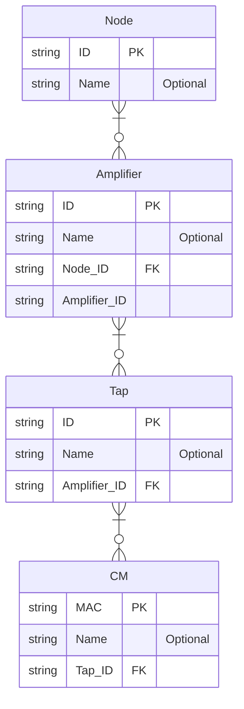

# Passives integration

The EPM Integrated DOCSIS solution supports the integration with passive devices. This is equipment deployed in the field that connects the headend (where the CMTS/CCAP devices are located) with the subscribers. Currently, the following passive devices are supported:

- Fiber nodes
- Amplifiers
- Taps

The following Entity Relationship Diagram (ERD) defines the relationship between these passive components:

From the above diagram, the following can be inferred:

- There are two types of relationships available in the diagram: *one to many* and *zero to many*. For example, a node can be connected to zero or multiple amplifiers, but only one amplifier can be connected to a node.

- The third column available for each entity indicates if the attribute is a primary key (PK) or a foreign key (FK).

> [!NOTE]
> Not all the attributes supported by the EPM Integrated DOCSIS solution are listed in the diagram. The mandatory attributes and one optional attribute *Name* have been included for clarity.

Below, you can find an example of the information expected per entity (in this case, per passive device):

- Node

  | ID   | Name   |
  |------|--------|
  | 1001 | Node A |
  | 1002 | Node B |

- Amplifier

  | ID   | Name        | Node ID |
  |------|-------------|---------|
  | 2001 | Amplifier A | 1001    |
  | 2002 | Amplifier B | 1001    |

- Tap

  | ID   | Name  | Amplifier ID |
  |------|-------|--------------|
  | 3001 | Tap A | 2001         |
  | 3002 | Tap B | 2001         |

- CM (Cable Modem)

  | ID           | Name | Amplifier ID |
  |--------------|------|--------------|
  | 001122334455 | CM A | 3001         |
  | AABBCCDDEEFF | CM B | 3001         |
