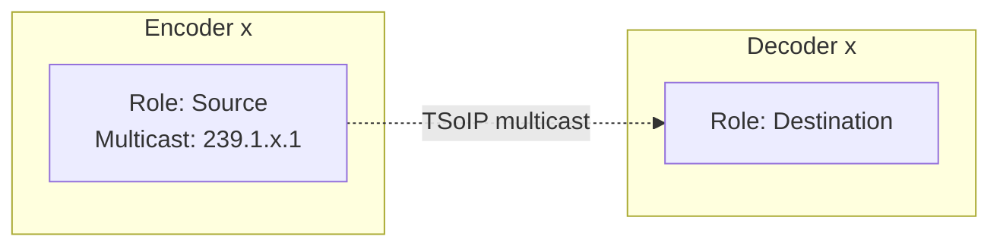

# Provision endpoints and virtual signal groups for an IP matrix solution

In this tutorial, you will learn how to provision endpoints and virtual signal groups (VSGs) for an **IP Matrix** solution.
These endpoints and VSGs will be used to visualize and manage the connections in the MediaOps.LIVE solution.

With an IP matrix solution, we refer to a setup where a set of devices generate streams with a fixed multicast (TSoIP).
These multicast IPs are then routed to a set of receivers by dynamically configuring the multicast IPs on the receivers.

> [!NOTE]
> In this tutorial we will create the endpoints and virtual signal groups manually using the Virtual Signal Groups low-code app.
> Other ways to create endpoints and VSGs are through an automation script using the MediaOps.LIVE API or by using the CSV import functionality.
> There are other tutorials available that explain these methods (see tutorials for Generic Matrix).

Expected duration: 30 minutes

## Prerequisites

- [MediaOps Live](https://catalog.dataminer.services/details/213031b9-af0b-488c-be20-934912b967c0) installed on the DMA.

In this tutorial, we will use the [Generic Dynamic Table](https://catalog.dataminer.services/details/73b79bb5-0fb2-41ee-ae5f-c6b6020f909e) connector to simulate the IP matrix functionality.

- 4 elements that represent encoders (sources):
  - Name: `Encoder x` (x: 1 ... 4)
  - Each element has one row (IP Out) with multicast IP 239.1.x.1
- 4 elements that represent decoders (destinations):
  - Name: `Decoder x` (x: 1 ... 4)
  - Each element has one row (IP In). Multicast IP will be configured dynamically.

> [!TIP]
> Above steps can be automatically executed by installing the [Tutorial - SLC-AS-MediaOps.LIVE - IP Matrix](https://catalog.dataminer.services/details/02f6e3be-4244-4eee-97da-6919958377ef) package.
> This package will install the `Generic Dynamic Table` connector, create the required elements and create the table rows.

## Overview

- [Step 1: Create level and transport type](#step-1-create-level-and-transport-type)
- [Step 2: Create endpoints](#step-2-create-endpoints)
- [Step 3: Create virtual signal groups](#step-3-create-virtual-signal-groups)

## Step 1: Create level and transport type

First, you need to create a level and transport type in MediaOps.LIVE.
In this tutorial we will use the 'Video' level and 'TSoIP' transport type.
You can skip this step if the level and transport type already exist.

To do this, follow these steps:

1. Open the `Virtual Signal Groups` low-code app in your web browser and log in with your credentials.
1. Navigate to the `Levels` tab, and press the `Transport Types` button in the header bar.
1. If the `TSoIP` transport type does not exist, create it by clicking the `New` button.
    - Name: `TSoIP`
1. Add the following fields to the `TSoIP` transport type:
    - Source IP
    - Multicast IP
    - Port
1. Go back to the `Levels` tab.
1. Check if a level named `Video` already exists. If it does not exist, create it by clicking the `New` button.
    - Name: `Video`
    - Number: `0` (or the next available number)
    - Transport Type: `TSoIP`

## Step 2: Create endpoints

Next, you need to create endpoints for the inputs and outputs of the encoders and decoders.
Let's start with the encoders. Each encoder element has one output (IP Out) that will be used as a source endpoint.
The endpoint should contain the multicast IP address that is configured in the element.
This multicast IP will be used later to configure the destination when creating a connection.

To do this, follow these steps:

1. Navigate to the `Endpoints` tab in the `Virtual Signal Groups` app.
1. Click the `New` button to create a new endpoint. A popup window will appear.
1. Fill in the following details:

    - Name: `Encoder 1` (needs to be unique)
    - Role: `Source`
    - Element: Select the `Encoder 1` element from the dropdown
    - Identifier: Can be left empty since there is only one endpoint for this element
    - Control Element: leave empty
    - Control Element Identifier: leave empty
    - Transport Type: `TSoIP`

1. In the `TSoIP` section, fill in the multicast details:

    - Source IP: `10.0.0.1` (can be any valid IP address, not important for this tutorial)
    - Multicast IP: `239.1.1.1`. This is the multicast IP configured in the element. The third octet should match the encoder number (1-4).
    - Port: `5000` (can be any valid port, not important for this tutorial)

1. Click `Save` to create the endpoint.
1. Repeat these steps to create endpoints for `Encoder 2`, `Encoder 3` and `Encoder 4`.

Now you should see that the (source) endpoints have been created linked to the correct elements.
Next, we will create the endpoints for the decoders.

1. Click the `New` button to create a new endpoint. A popup window will appear.
1. Fill in the following details:

    - Name: `Decoder 1` (needs to be unique)
    - Role: `Destination`
    - Element: Select the `Decoder 1` element from the dropdown
    - Identifier: Can be left empty since there is only one endpoint for this element
    - Control Element: leave empty
    - Control Element Identifier: leave empty
    - Transport Type: `TSoIP`

1. This time you don't need to provide details for the `TSoIP` section since this is a destination endpoint.
1. Click `Save` to create the endpoint.
1. Repeat these steps to create endpoints for `Decoder 2`, `Decoder 3` and `Decoder 4`.

Now you should see that the (destination) endpoints have been created linked to the correct elements.

## Step 3: Create virtual signal groups

Finally, you need to create virtual signal groups (VSGs). VSGs are logical groupings that allow creating connections between multiple endpoints at the same time.
In this case we will create a VSG for each endpoint that we created in the previous step.
The endpoints will be assigned to the VSG on the Video level, but this can be adjusted based on your needs.

To do this, follow these steps:

1. Navigate to the `Virtual Signal Groups` tab in the `Virtual Signal Groups` app.
1. Click the `New` button to create a new VSG. A popup window will appear.
1. Fill in the following details:

    - Name: `Encoder 1` (needs to be unique)
    - Description: a meaningful description (optional)
    - Role: `Source`

1. Click `Save` to create the VSG.

Now you should see that the VSG has been created. Next, you need to assign an endpoint to the VSG.

1. Click on the edit endpoints icon on the row of the VSG you just created. A side panel will open.
2. In the table at the top, select the `Video` level.
3. In the table at the bottom, select the endpoint you created in the previous step (e.g. `Encoder 1`).
4. Press the `Assign` button to assign the endpoint to the VSG.
5. You should now see that the endpoint is assigned on the Video level.

Repeat these steps to create more VSGs for inputs and outputs as needed.
Use role `Source` for the encoders and role `Destination` for the decoders.

## Up next

In this tutorial, you learned how to manually create endpoints and virtual signal groups for an IP matrix solution using the Virtual Signal Groups low-code app.
You can now create a connection handler by following the steps in the [Create a connection handler script for IP Matrix](xref:Tutorial_MediaOpsLive_IPMatrix_ConnectionHandlerScript) tutorial.
Once you have created the connection handler script, you can create connections between the encoders and decoders using the Control Surface low-code app.
