# MediaOps Job States

A job can have one of the following states:

Draft

The Draft state allows to create a provisionary job without actually booking any of the resources or triggering cost & billing calculations. When a new job is created from scratch or based on a workflow in the Scheduling app, it will be created in Draft state.

Tentative

When a job moves into a Tentative state, the resources assigned in the job will be reserved to prevent other jobs to select the same resources.

Confirmed

Once a job is confirmed it indicates that the job will occur and therefor all resources that are (or where) assigned to the job from this stage will be considered for billing. 

Running

When a confirmed job starts, and only when it has been confirmed, it will go to the running state. This indicates the job is live.

Completed

When a running job stops it will go to the Completed state. This indicates that the job has ended. In this stage it is still possible to make adjustments to the C&B information.

Ready for invoice

Ready for invoice means that all changes are final and therefor it is no longer allowed to make any changes to the job.

Invoiced

Invoiced is the final state of a job, but it does not mean that all jobs will reach this state.

Canceled

When a job is no longer needed it can be moved to a canceled state.

Error

Job in error will be displayed with this color but will underlaying still have any of the above states which will be visible from the edit panel.

```mermaid
graph LR
    A[🖉 🗑 Draft] --> B[🖉 Tentative]
    B --> C[🖉 Confirmed]
    C --> D[🖉 Running]
    D --> E[🖉 Completed]
    E --> F[Ready for Invoice]
    F --> G[🗑 Invoiced]
    C --> H[🗑 Canceled]
    B --> H[🗑 Canceled]
    H --> F[Ready for Invoice]

    style A fill:#9140D9,stroke:#000,stroke-width:2px,color:#ffffff
    style B fill:#F7EC15,stroke:#000,stroke-width:2px,color:#000000
    style C fill:#348D42,stroke:#000,stroke-width:2px,color:#ffffff
    style D fill:#4CEF8E,stroke:#000,stroke-width:2px,color:#000000
    style E fill:#4A41E6,stroke:#000,stroke-width:2px,color:#ffffff
    style F fill:#36F0F3,stroke:#000,stroke-width:2px,color:#000000
    style G fill:#529495,stroke:#000,stroke-width:2px,color:#ffffff
    style H fill:#FC7D76,stroke:#000,stroke-width:2px,color:#000000
```

