# MediaOps workflow States

A workflow can have one of the following states:

| State | Description |
| -- | -- |
| 
Draft
 | When a workflow is created, it starts off in the draft state. This allows you to build and edit the workflow without making it visible in the Scheduling app. |
| 
Complete
 | This state indicates that a workflows is ready to be used. All workflows in the complete state will be available from Scheduling to be used as a starting point for new jobs. |

Here is an overview of how these different states are connected:

```mermaid
graph LR
    A[🖉 🗑 Draft] --> B[🖉 🗑 Complete]

    style A fill:#9140D9,stroke:#000,stroke-width:2px,color:#ffffff
    style B fill:#4CEF8E,stroke:#000,stroke-width:2px,color:#0F0101
```

