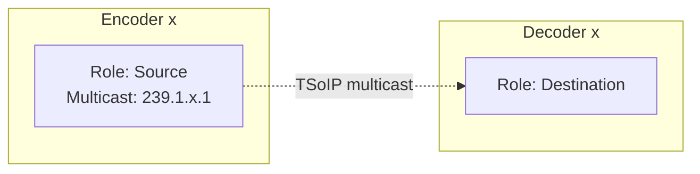

# Manually provisioning endpoints and virtual signal groups for an IP Matrix element

In this tutorial, you will learn how to provision endpoints and virtual signal groups (VSGs) for an **IP Matrix** solution. These endpoints and VSGs will be used to visualize and manage the connections in the MediaOps Live solution.

The mentioned IP Matrix solution is a setup where a set of devices generate streams with a fixed multicast (TSoIP). These multicast IPs are then routed to a set of receivers by dynamically configuring the multicast IPs on the receivers.

Expected duration: 30 minutes

> [!TIP]
> In this tutorial, the endpoints and virtual signal groups will be created manually using the Virtual Signal Groups app. Other ways to create endpoints and VSGs are [through an automation script using the MediaOps Live API](xref:Tutorial_MediaOpsLive_Tutorial_GenericMatrix_ProvisionEndpointsAndVirtualSignalGroups_Code) or by [using the CSV import functionality](xref:Tutorial_MediaOpsLive_Tutorial_GenericMatrix_ProvisionEndpointsAndVirtualSignalGroups_Import).

> [!NOTE]
> The content and screenshots of this tutorial were created using DataMiner 10.6.4 and MediaOps Live 1.0.0.

## Prerequisites

A DataMiner System [connected to dataminer.services](xref:Connecting_your_DataMiner_System_to_the_cloud), where [MediaOps Live](https://catalog.dataminer.services/details/213031b9-af0b-488c-be20-934912b967c0) is installed.

## Overview

- [Step 1: Deploy the IP matrix elements](#step-1-deploy-the-ip-matrix-elements)
- [Step 2: Create level and transport type](#step-2-create-level-and-transport-type)
- [Step 3: Create endpoints](#step-3-create-endpoints)
- [Step 4: Create virtual signal groups](#step-4-create-virtual-signal-groups)

## Step 1: Deploy the IP matrix elements

This tutorial will make use of the [Generic Dynamic Table](https://catalog.dataminer.services/details/73b79bb5-0fb2-41ee-ae5f-c6b6020f909e) connector to simulate the IP matrix functionality. To deploy this connector and create the necessary elements:

1. Look up the package [Tutorial - SLC-AS-MediaOps.LIVE - IP Matrix](https://catalog.dataminer.services/details/02f6e3be-4244-4eee-97da-6919958377ef) in the Catalog.

1. Deploy the latest version of the package to your DataMiner Agent by clicking the *Deploy* button.

   > [!TIP]
   > See also: [Deploying a Catalog item to your system](xref:Deploying_a_catalog_item)

This will automatically install the connector and create the following elements in your system:

- Four elements representing encoders (sources):

  - Name: `Encoder x` (x: 1 ... 4).
  - Each element has one row (*IP Out*) with multicast IP 239.1.x.1.

- Four elements representing decoders (destinations):

  - Name: `Decoder x` (x: 1 ... 4).
  - Each element has one row (*IP In*). The multicast IP will be configured dynamically.

## Step 2: Create level and transport type

Next, you need to create a level and transport type in MediaOps Live. In this tutorial, the *Video* level and *TSoIP* transport type will be used. If these already exist in your system, you can skip this step.

1. Open the Virtual Signal Groups app.

   

1. Go to the *Levels* page, and click the *Transport Types* button in the header bar.

   

1. If the `TSoIP` transport type does not exist yet, create it by clicking the *New* button and specifying the following information:

   - Name: `TSoIP`
   - Fields: `Source IP`, `Multicast IP`, and `Port`

   

1. Back on the *Levels* page, if the `Video` level does not exist yet, create it by clicking the *New* button and specifying the following information:

   - Name: `Video`
   - Number: `0` (or the next available number)
   - Transport Type: `TSoIP`

   

## Step 3: Create endpoints

Next, you need to create endpoints for the inputs and outputs of the encoders and decoders.
Let's start with the encoders. Each encoder element has one output (IP Out) that will be used as a source endpoint.
The endpoint should contain the multicast IP address that is configured in the element.
This multicast IP will be used later to configure the destination when creating a connection.

To do this, follow these steps:

1. Navigate to the `Endpoints` tab in the `Virtual Signal Groups` app.

1. Click the `New` button to create a new endpoint. A popup window will appear.

1. Fill in the following details:

    - Name: `Encoder 1` (needs to be unique)
    - Role: `Source`
    - Element: Select the `Encoder 1` element from the dropdown
    - Identifier: Can be left empty since there is only one endpoint for this element
    - Control Element: leave empty
    - Control Element Identifier: leave empty
    - Transport Type: `TSoIP`

1. In the `TSoIP` section, fill in the multicast details:

    - Source IP: `10.0.0.1` (can be any valid IP address, not important for this tutorial)
    - Multicast IP: `239.1.1.1`. This is the multicast IP configured in the element. The third octet should match the encoder number (1-4).
    - Port: `5000` (can be any valid port, not important for this tutorial)

1. Click `Save` to create the endpoint.

1. Repeat these steps to create endpoints for `Encoder 2`, `Encoder 3` and `Encoder 4`.

   Now you should see that the (source) endpoints have been created linked to the correct elements.
   Next, we will create the endpoints for the decoders.

1. Click the `New` button to create a new endpoint. A popup window will appear.

1. Fill in the following details:

    - Name: `Decoder 1` (needs to be unique)
    - Role: `Destination`
    - Element: Select the `Decoder 1` element from the dropdown
    - Identifier: Can be left empty since there is only one endpoint for this element
    - Control Element: leave empty
    - Control Element Identifier: leave empty
    - Transport Type: `TSoIP`

1. This time you don't need to provide details for the `TSoIP` section since this is a destination endpoint.

1. Click `Save` to create the endpoint.

1. Repeat these steps to create endpoints for `Decoder 2`, `Decoder 3` and `Decoder 4`.

Now you should see that the (destination) endpoints have been created linked to the correct elements.

## Step 4: Create virtual signal groups

Finally, you need to create virtual signal groups (VSGs). VSGs are logical groupings that allow creating connections between multiple endpoints at the same time.
In this case we will create a VSG for each endpoint that we created in the previous step.
The endpoints will be assigned to the VSG on the Video level, but this can be adjusted based on your needs.

To do this, follow these steps:

1. Navigate to the `Virtual Signal Groups` tab in the `Virtual Signal Groups` app.

1. Click the `New` button to create a new VSG. A popup window will appear.

1. Fill in the following details:

    - Name: `Encoder 1` (needs to be unique)
    - Description: a meaningful description (optional)
    - Role: `Source`

1. Click `Save` to create the VSG.

   Now you should see that the VSG has been created. Next, you need to assign an endpoint to the VSG.

1. Click on the edit endpoints icon on the row of the VSG you just created. A side panel will open.

1. In the table at the top, select the `Video` level.

1. In the table at the bottom, select the endpoint you created in the previous step (e.g., `Encoder 1`).

1. Press the `Assign` button to assign the endpoint to the VSG.

1. You should now see that the endpoint is assigned on the Video level.

Repeat these steps to create more VSGs for inputs and outputs as needed.
Use role `Source` for the encoders and role `Destination` for the decoders.

## Up next

In this tutorial, you learned how to manually create endpoints and virtual signal groups for an IP matrix solution using the Virtual Signal Groups low-code app.
You can now create a connection handler by following the steps in the tutorial [Creating a connection handler script for an IP Matrix element](xref:Tutorial_MediaOpsLive_IPMatrix_ConnectionHandlerScript). Once you have created the connection handler script, you can create connections between the encoders and decoders using the Control Surface low-code app.
