# MediaOps Job States

A job can have one of the following states:

| State | Description |
| -- | -- |
| 
Draft
 | Unless a job is created based on a specific resource, it starts off in the draft state. This allows you to create a provisionary job without actually booking any of the resources. |
| 
Tentative
 | When a job moves into the tentative state, the resources assigned to the job will be reserved to prevent other jobs from selecting the same resources. |
| 
Confirmed
 | When a job is fully configured and ready to be executed, it should be set to confirmed. |
| 
Running
 | When a job has been confirmed and its configured start time occurs, the job will move to the running state. This indicates that the job is live. |
| 
Completed
 | When a running job stops, it will go to the completed state, indicating that the job has ended. A completed job can be deleted via the ... icon for the job on any of the pages in the app.<!-- RN 43036 --> |
| 
Error
 | If there is an error on a job, it will be displayed with this color. However, underlying this, it will still have one of the above states, which will still be shown in the [edit panel](xref:SCH_Edit_Job). For more info, refer to [Validation of upcoming jobs](xref:Overview_MediaOps_Validation). |

> [!NOTE]
> When a job that has not started yet is no longer needed, it can be canceled via the [Edit job](xref:SCH_Edit_Job) panel, which will move it to a **canceled** state. However, canceled jobs are not displayed on most pages. You can only find them on the *Search Jobs* page.

<!--

Ready for invoice

Ready for invoice means that all changes are final and therefor it is no longer allowed to make any changes to the job.

Invoiced

Invoiced is the final state of a job, but it does not mean that all jobs will reach this state.

Canceled

-->

Here is an overview of how these different states are connected:

```mermaid
graph LR
    A[🖉 🗑 Draft] --> B[🖉 Tentative]
    B --> C[🖉 Confirmed]
    C --> B
    C --> D[🖉 Running]
    D --> E[🖉 🗑 Completed]
    C --> H[🗑 Canceled]
    B --> H

    style A fill:#9140D9,stroke:#000,stroke-width:2px,color:#ffffff
    style B fill:#F7EC15,stroke:#000,stroke-width:2px,color:#000000
    style C fill:#348D42,stroke:#000,stroke-width:2px,color:#ffffff
    style D fill:#4CEF8E,stroke:#000,stroke-width:2px,color:#000000
    style E fill:#4A41E6,stroke:#000,stroke-width:2px,color:#ffffff
    %% style F fill:#36F0F3,stroke:#000,stroke-width:2px,color:#000000 %%
    %% style G fill:#529495,stroke:#000,stroke-width:2px,color:#ffffff %%
    style H fill:#FC7D76,stroke:#000,stroke-width:2px,color:#000000
```

