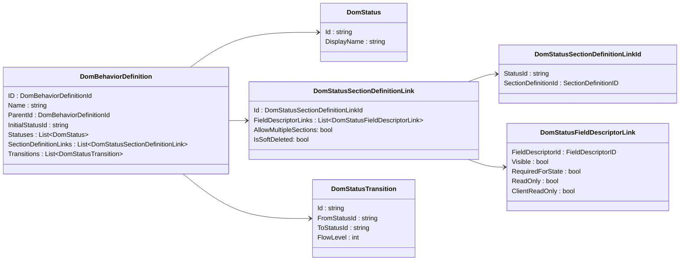

# DOM status system

In a DOM manager, you can configure the status system for a [DomDefinition](xref:DomDefinition). Each [DomInstance](xref:DomInstance) linked to that `DomDefinition` will then need to adhere to the rules defined for that status system.

This configuration is done using a [DomBehaviorDefinition](xref:DomBehaviorDefinition) object that the `DomDefinition` is linked to. This object contains properties to store the statuses, initial status, transitions, and links to the [SectionDefinitions](xref:DOM_SectionDefinition).



Using the status system is an alternative way of defining which data must be present in a `DomInstance`. That means that the `SectionDefinitionLinks` on the `DomDefinition` are not used in that case. Additionally, the following properties on the `FieldDescriptor` will be ignored:

- IsOptional
- IsHidden
- IsReadonly


> [!NOTE]
>
> - This feature is supported from DataMiner 10.1.11/10.2.0 onwards.
> - A DOM manager detects that the status system is used from the moment that a `DomDefinition` is linked to a `DomBehaviorDefinition` AND that `DomBehaviorDefinition` contains at least one status.

To set up a status system:

1. Create a new `DomBehaviorDefinition`.

   1. Add all statuses. (See [Configuring statuses](#configuring-statuses)).

   1. Define the initial status.

   1. Add all transitions. (See [Configuring transitions](#configuring-transitions)).

   1. Configure all fields. (See [Configuring fields](#configuring-fields)).

1. Link a `DomDefinition` to the `DomBehaviorDefinition`.

1. Create DOM instances using the appropriate statuses and fields.

> [!TIP]
> See also: [DOM status system example](xref:DOM_status_system_example)

## Configuring statuses

You can configure the possible statuses by adding a `DomStatus` object to the *Statuses* list property on the `DomBehaviorDefinition` object. A `DomStatus` has the following properties:

| Property | Type | Description |
|--|--|--|
| Id | string | The ID of this status. It must contain lowercase characters only (e.g. "initial_status"). |
| DisplayName | string | The display name of this status (e.g. "Initial"). |

> [!NOTE]
> Make sure that the *Statuses* collection does not contain `DomStatus` objects with the same ID. The *InitialStatusId* must also contain one of the statuses. When a `DomInstance` is created that does not have a status assigned, this initial status will automatically be filled in.

## Configuring transitions

You can configure what transitions are allowed by adding a `DomStatusTransition` object to the *Transitions* list property on the `DomBehaviorDefinition`. A `DomStatusTransition` has the following properties:

| Property | Type | Description |
|--|--|--|
| Id | string | The ID of this transition. It must contain lowercase characters only (e.g. "initial_to_accepted_status"). |
| FromStatusId | string | The ID that the `DomInstance` will transition from. |
| ToStatusId | string | The ID that the `DomInstance` will transition to. |
| FlowLevel | int | The level of flow between transitions. The main transition will have the highest priority (0 is highest). An alternate transition from the same status will then have the value 1 or more. |


> [!NOTE]
> Make sure that the *Transitions* collection does not contain `DomStatusTransition` objects with the same ID.

## Configuring fields

For each status, you can configure the requirements of a specific field. This is done with `DomStatusSectionDefinitionLink` objects that each include `DomStatusFieldDescriptorLink` objects. A `DomStatusSectionDefinitionLink` has the following properties:

| Property | Type | Description |
|--|--|--|
| Id | DomStatusSectionDefinitionLinkId | Contains the `SectionDefinitionID` and status ID. |
| FieldDescriptorLinks | `List<DomStatusFieldDescriptorLink>` | Contains the links to `FieldDescriptors` that are part of the `SectionDefinition`. |
| AllowMultipleSections | bool | Defines whether a `DomInstance` can have multiple `Sections` for this `SectionDefinition` in this specific status. |
| IsSoftDeleted | bool | Defines whether this `StatusSectionDefinitionLink` is soft-deleted or not. See [soft-deletable objects](xref:DOM_objects#soft-deletable-objects). Available from DataMiner 10.3.9/10.4.0 onwards. |

> [!NOTE]
>
> - From DataMiner version 10.3.0/10.3.3 onwards, the `DomStatusSectionDefinitionLink` also contains the *AllowMultipleSections* boolean, which can be used to define whether a `DomInstance` can have multiple `Sections` for that specific `SectionDefinition` and status. In earlier DataMiner versions, it is possible to add multiple `Sections` already, but these are not checked and cannot be used in the UI. When you upgrade to DataMiner 10.3.0/10.3.3, you will need to update any existing `DomBehaviorDefinitions` with multiple `Sections`.
> - Removing an existing `Section` is not allowed if that `Section` contains a field that is marked as *ReadOnly*, as you would otherwise remove a read-only value. If you want to allow this behavior, but you would like to avoid users assigning a new field value themselves, use the *ClientReadOnly* boolean, available from DataMiner 10.3.0/10.3.3 onwards (see below).

A `DomStatusFieldDescriptorLink` has the following properties:

| Property | Type | Description |
|--|--|--|
| FieldDescriptorId | FieldDescriptorID | Contains the ID of the linked `FieldDescriptor`. |
| Visible | bool | Determines whether this field should be visible in the UI for this status. This is only used by the UI; there is no logic for this property server-side. |
| RequiredForStatus | bool | Determines whether a value for this field must be present AND valid in this status. If a field is marked as required, at least one value for the `FieldDescriptor` must be present in a `DomInstance`, and all values for this `FieldDescriptor` are valid according to the validators of the `FieldDescriptor` (if any are defined). |
| ReadOnly | bool | Determines whether values of this field are read-only with this status. When a field is marked as read-only for a specified status, the values cannot be changed when the `DomInstance` has this status. This also means that if no values were present before transitioning to this status, no values can be added as long as the `DomInstance` continues to have this status. |
| ClientReadOnly | bool | Determines whether a user is allowed to assign a value to this field in the UI. Unlike the *ReadOnly* bool, this does allow users to assign a value to the field using the API, e.g. in a script. This property is available from DataMiner versions 10.3.0/10.3.3 onwards. If the *ReadOnly* bool is true, the value of *ClientReadOnly* is ignored. |

> [!NOTE]
>
> - If no `FieldDescriptorLink` is present for an existing `FieldDescriptor`, no values are allowed to be present for this `FieldDescriptor` when the `DomInstance` has that specific status.
> - To prevent performance issues, when a `DomBehaviorDefinition` is saved, there is no check whether the `SectionDefinitions` and `FieldDescriptors` exist.

Examples:

| Case | RequiredForStatus | ReadOnly | Description |
|--|--|--|--|
| No values allowed | N/A | N/A | If no values should be allowed for the status, do not add a `FieldDescriptorLink` to the list. |
| Optional and editable values | false | false | If it should be possible to optionally add, update or delete a value for the status, set both *RequiredForStatus* and *ReadOnly* to *false*. |
| Optional and non-editable values |false | true | If a value should be present, but it is not required, and it should not be possible to add, update or delete a value for the status, set *RequiredForStatus* to *false* and *ReadOnly* to *true*. |
| Required and editable values | true | false | If a valid value must be present when transitioning to this status, and it should be possible update it as long as there is at least one value and all values are valid, set *RequiredForStatus* to *true* and *ReadOnly* to *false*. |
| Required and non-editable values | true | true | If a valid value must be present when transitioning to this status, and it should not be possible to change it while the `DomInstance` continues to have this status, set both *RequiredForStatus* and *ReadOnly* to *true*. |

## Creating and transitioning DOM instances

If a `DomInstance` is created without a status, and the DOM manager detects that the instance is linked to a `DomDefinition` that uses the status system, it will automatically assign the initial status.

You can also create a `DomInstance` with any status you want by assigning the status ID to the *StatusId* property of the instance. In this case, make sure that the `DomInstance` object has the correct fields for the status it is created in.

Transitioning to another status can only be done using a specific transition request. The status cannot change based on a normal update. The transition request requires the ID of the `DomInstance` and the ID of the transition. These requests can be sent using the helper.

```csharp
domHelper.DomInstances.DoStatusTransition(domInstance.ID, "initial_to_acceptance");
```

When something goes wrong while transitioning, a *DomStatusTransitionError* will be returned in the *TraceData* of the request. This error can contain the following reasons:

| Reason | Description |
|--|--|
| StatusTransitionNotFound | The given transition ID does not match any of the IDs defined on the associated `DomBehaviorDefinition`. This error can also occur when there is no valid `DomBehaviorDefinition` linked in the first place. *StatusTransitionId* contains the ID of the transition that could not be found. |
| StatusTransitionIncompatibleWithCurrentStatus | The current status of the `DomInstance` does not match the "from" status defined by the transition. *StatusTransitionId* contains the ID of the transition that could not be completed. |
| DomInstanceContainsUnknownFieldsForNextStatus | There is at least one `FieldValue` defined in the `DomInstance` for which no link could be found in the `DomBehaviorDefinition` for the next status. *AssociatedFields* contains the `SectionDefinitionID` and `FieldDescriptorID` combinations of the unknown fields. |
| DomInstanceHasInvalidFieldsForNextStatus | The `DomInstance` contains fields that are required but are not valid according to at least one validator. If there are multiple values for the same `SectionDefinition` and `FieldDescriptor`, only one entry will be included. *AssociatedFields* contains the `SectionDefinitionID` and `FieldDescriptorID` combinations of the invalid fields |
| DomInstanceHasMissingRequiredFieldsForNextStatus | The `DomInstance` does not contain all fields that are required for the next status. *AssociatedFields* contains the `SectionDefinitionID` and `FieldDescriptorID` combinations of the missing fields |
| CrudFailedExceptionOccurred | When the `DomInstance` was saved, a `CrudFailedException` occurred. *InnerTraceData* contains the `TraceData` contained in the exception. |
| DomInstanceContainsInvalidAmountOfSectionsForNextStatus | The `DomInstance` contains too many `Sections` for one or more `SectionDefinitions` according to the configuration of the next status. *SectionDefinitionIds* contains the `SectionDefinitionID(s)` for which too many `Sections` are present. |

## ModuleDomBehaviorDefinition and inheritance

It is possible to mark a specific `DomBehaviorDefinition` as the main "Module" definition. This will force all other DOM behavior definitions to inherit from it, so that they all have the same status system. The inheriting definitions can only add extra `DomStatusSectionDefinitionLink` objects. For more information about inheritance, see [DomBehaviorDefinition](xref:DomBehaviorDefinition).
