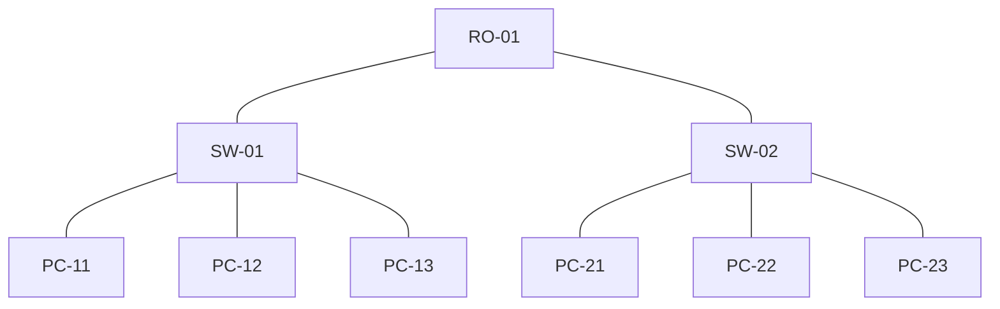

# Getting started with node edge graphs

This tutorial shows how you can get started with the node edge graph component based on a basic example. In this example, a node edge graph component will be used to build a basic network diagram using GQI queries. The example uses a dashboard, but this is also possible in a low-code app.

The content and screenshots of this tutorial were created in DataMiner version 10.4.3.

Expected duration: 20 minutes

> [!TIP]
> See also: [Kata #17: Node edge component](https://community.dataminer.services/courses/kata-17/) on DataMiner Dojo 

## Prerequisites

- A DataMiner System using DataMiner 10.1.5/10.2.0 or higher, which is [connected to dataminer.services](xref:Connecting_your_DataMiner_System_to_the_cloud).

> [!NOTE]
> Depending on your DataMiner version, you may need to activate the [ReportsAndDashboardsPTP](xref:Overview_of_Soft_Launch_Options#reportsanddashboardsgqimaps) soft-launch option to be able to use the node-edge graph component. See [Soft-launch options](xref:SoftLaunchOptions).

## Overview

- [Objective](#objective)
- [Step 1: Deploy the package from the catalog](#step-1-deploy-the-tutorial-package-from-the-catalog)
- [Step 2: Add the node edge graph component](#step-2-add-the-node-edge-graph-component)
- [Step 3: Configure the router and switch nodes](#step-3-configure-the-router-and-switch-nodes)
- [Step 4: Configure the edges between router and switch nodes](#step-4-configure-the-edges-between-router-and-switch-nodes)
- [Step 5: Add nodes representing PCs](#step-5-add-nodes-representing-pcs)
- [Step 6: Configure the edges connecting the PCs and switches](#step-6-configure-the-edges-connecting-the-pcs-and-switches)

## Objective

The objective of this tutorial is to build the following network connectivity diagram in a node edge graph:

Where:

- **RO-x**: Router
- **SW-x**: Switch
- **PC-x**: PC

## Step 1: Deploy the tutorial package from the catalog

Go to the catalog and deploy the package [Kata Node Edge](https://catalog.dataminer.services/details/package/5838).

The package contains the following components:

- Automation script [JSON Reader](https://catalog.dataminer.services/details/automation-script/5491): You will be able to find this in the Automation module, in the folder *Automation Scripts/GQI/Data sources*.

- Provisioning files: These will be available in the Documents module, in the folder *GQI data sources*.

  - *list_pc.json*: List of PCs.
  - *list_network_devices.json*: List of network devices (switch, router).
  - *list_connection_single.json*: List of connections between devices (single connection).
  - *list_connection_bidirectional.json*: List of connection between devices (double connection).

    This file contains two connections per physical connection, i.e. one connection from source to destination and another connection from destination to source.

  - *list_interface.json*: List of interfaces exposed by each device.
  - *list_router.json*: List of routers (included in list_network_devices).
  - *list_switch.json*: List of switches (included in list_network_devices).

- Dashboards: These will be located in the folder *KATA*.

  - *Node_Edge*: A blank dashboard containing all GQI queries required to create the node-edge diagram for this tutorial.
  - *Node_Edge_Extra*: A dashboard similar to the previous dashboard, with additional GQI queries for more complex diagrams. This will not be used for this tutorial.

The dashboard *Node_Edge* contains the following GQI queries:

- *Node_Network_Devices*: The nodes representing the switches and routers available in the network diagram.
- *Node_PC*: The nodes representing the PCs available in the network diagram.
- *Edges*: The connections displayed in the network diagram.
- *Interface*: The interfaces exposed by the devices in the network diagram (not used in this tutorial).
- *Edge_With_Interface*: The connections displayed in the network diagram, with extra information per connection. As the name suggest, this GQI query is built from the GQI queries *Edges* and *Interfaces*. This GQI query will not be used in this tutorial.

> [!NOTE]
> While the package is being deployed, you can follow the progress of the deployment in the [Admin app](xref:Accessing_the_Admin_app), on the *Deployments* page for your DMS. Make sure to use the *Refresh* button in the top-left corner.

## Step 2: Add the node edge graph component

1. When the package has been deployed, go to the [Dashboards app](xref:Accessing_the_Dashboards_app).

1. In the bar on the left, navigate to *KATA* > *NODE_EDGE* to open the *Node_Edge* dashboard.

1. Click the pencil icon in the dashboard header bar to start editing the dashboard.

1. Drag a *Node edge graph* visualization from the pane on the left onto the dashboard.

   

1. In the *Data pane* on the right, expand the *Queries* node, and drag the following queries to the visualization you have just added:

   - *Node_Network_Devices*

   - *Edges*

   

## Step 3: Configure the router and switch nodes

1. Click on the node edge graph component you have added to select it.

1. Select the *Settings* pane on the right.

   The queries you added earlier should be listed as *unassigned queries*.

1. Under the query *Node_Network_Devices*, select *Set as node*.

   

   The selected query will be moved to the bottom of the pane.

1. For the same query, set *Node ID column* to the column *Device ID*.

   This way, you indicate that the *Device ID* column contains the IDs representing the different entities that should be shown as nodes.

   

   Three nodes should now be displayed in the node edge graph component, representing a router and two switches. By default, the icon displayed for each node is a circle.

1. Add an override for the **router** node:

   1. Click *Add override*.

      

   1. In the *Filter* box, select *Type*.

      A text box will now be displayed to the right of the filter.

   1. In the text box, specify `Router`.

      

   1. In the *Weight* box, specify `2`.

      This will ensure that the node representing the router is positioned at the top of the component.

   1. In the *Shape* box, select *Hexagon*.

      The node representing the router will now have a hexagon shape. Optionally, you can also change the color of the shape by clicking the colored circle to the right of the *Shape* box.

   1. In the *Icon* box, change select *NetworkDeviceScanning*.

      > [!NOTE]
      > To quickly find a specific icon in the list, start typing the name of the icon in the box.

   1. In the *Label* box, select *Device Name*.

      The name of the device should now be displayed below the node representing the router.

      

1. Add an override for the **switch** nodes:

   1. Click *Add Override* again.

   1. In the *Filter* box, select *Type*, and enter the value `Switch` in the box on the right.

   1. Keep the *Weight* set to 1.

      This will ensure that the nodes representing the switches are positioned below the router node.

   1. In the *Shape* box, select *Decagon*.

      The node representing the router will now have a decagon shape. Optionally, you can also change the color of the shape by clicking the colored circle to the right of the *Shape* box.

   1. In the *Icon* box, select *Switch*.

   1. In the *Label* box, select *Device Name*.

      The nodes should now look like this:

      

## Step 4: Configure the edges between router and switch nodes

1. At the top of the list of *unassigned queries*, under the query *Edges*, select *Set as edge*.

   The query will be moved to the bottom of the pane.

1. In the *Source* box, select *Source Device ID*.

1. In the *Destination* box, select *Destination Device ID*.

   The edges connecting the router and switches should now be displayed in the node-edge graph visualization.

   

1. In the *Style* box, select *Dotted*.

1. Enable the toggle button *Visualize Directions*.

   An animation showing the direction of the connection between the switches and the router should now be displayed. The direction should be from switch to router.

   

## Step 5: Add nodes representing PCs

In this step, you will node extra nodes representing PCs to the component. The same *Edges* query will be used for this, as this query contains the connections between all devices.

1. From the *Data pane* on the right, drag the *Node_PC* query to the node edge graph component.

1. Configure the **nodes**:

   1. Click on the node edge graph component to select it, and select the *Settings* pane on the right.

   1. Under *unassigned queries*, set the query *Node_PC* as node.

      

      The selected query will be moved below the node query you configured earlier.

   1. For the same query, set *Node ID column* to the column *Device ID*.

      Six nodes should be displayed in the node edge graph component. By default, the icon displayed for each node is a circle.

   1. Expand the *Node_PC* base node by clicking the triangle icon next to it.

      This will display the list of settings for this node. Instead of overriding this node, you will now update the settings for the base node. This means that all the nodes for this GQI query will be updated in the same way.

   1. In the *Shape* box, select *Circle*.

   The node representing the PCs will now have this shape. Optionally, you can also change the color of the shape by clicking the colored circle to the right of the *Shape* box.

1. In the *Icon* box, select *ThisPC*.

1. In the *Label* box, select *Device Name*.

The resulting nodes should look like this:

## Step 6: Configure the edges connecting the PCs and switches

Since the GQI query *Edges* contains all the connections between devices in the network diagram, you will need to override the configuration for this query, first edges between router and switches, and then for the edges between PCs and switches.

1. Override the edges between router and switches:

    1. Extend the GQI Query *Edges* configured Step 2. The fields *Source* and *Destination* should be displayed. Next to these fields, different icons are displayed. These icons represent the nodes configured in previous steps.
    1. For the field *Source*, click in the icon highlighted by default. The icon will be greyed out (unselected).
    1. For the same field *Source*, click in the icon that represents the switches.
    1. For the field *Destination*, click in the icon highlighted by default. The icon will be greyed out (unselected).
    1. For the same field *Destination*, click in the icon that represents the router. As a result, the connections between switches and routers should be displayed.

1. Override the edges between PCs and switches:

    1. Click on the *Add Override* button. The following setting should be displayed *Between (empty) and (empty)*.
    1. In the setting *Between (empty)* select the icon that represents the PCs
    1. In the setting *And (empty)* select the icon the represents the switches
    1. For the field *Destination*, click in the icon that represents the router.
    1. In the field *Source* select *Source Device ID*.
    1. In the field *Destination* select *Destination Device ID*. The edges connecting the router and switches should be displayed in the node-edge graph visualization.
    1. Go the *Style* and select *Dotted*
    1. Go to the toggle button *Visualize Directions* and enable it. An animation showing the direction of the connection between the switches and the router should be displayed. The direction should be from switch to router. The connections between the PCs and the switches should be displayed.
