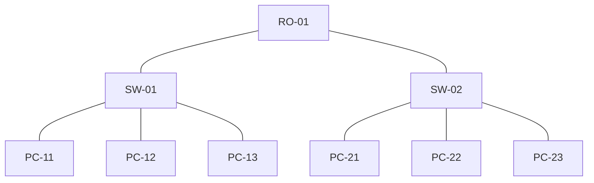

# Getting Started with Node Edge

This tutorial shows how to start using Node Edge by implementing a basic example. More information about Node Edge can be found here.
The content and screenshots of this tutorial were created in DataMiner version 10.4.1

Expected duration: 20 minutes

> [!TIP]
> See also:
> [Kata #17: Node Edge Component](https://community.dataminer.services/courses/kata-17/) on DataMiner Dojo 

## Prerequisites

- A DataMiner system running at least version 10.2/10.1.5

> [!Note]
> More information about the prerequisites can be found in [Node Edge graph](https://docs.dataminer.services/user-guide/Advanced_Modules/Dashboards_and_Low_Code_Apps/Visualizations/Available_visualizations/Other/Node_edge_graph.html)

## Objective

The objective of this tutorial will be to build the following network connectivity diagram in Node-Edge:

where:

- **RO-x**: Router
- **SW-x**: Switch
- **PC-x**: PC

## Overview

- [Step 1: Deploy the package from the catalog](#step-1-deploy-the-tutorial-package-from-the-catalog)
- [Step 2: Create a node edge diagram between switch and router](#step-2-create-a-node-edge-diagram-between-switch-and-router)
- [Step 3: Enhance the node edge diagram with PCs](#step-3-enhance-the-node-edge-diagram-with-pcs)

## Step 1: Deploy the tutorial package from the catalog

Go to the catalog and deploy the package [Kata Node Edge](https://catalog.dataminer.services/details/package/5838). The package contains the following components:

- Automation script [JSON Reader](https://catalog.dataminer.services/details/automation-script/5491) (available in the Automation module, folder Automation Scripts/GQI/Data sources)
- Provisioning files (available in the Documents Module, folder GQI data sources)
  - *list_pc.json*: List of PCs
  - *list_network_devices.json*: List of network devices (switch, router)
  - *list_connection_single.json*: List of connections between devices (single connection)
  - *list_connection_bidirectional.json*: List of connection between devices (double connection)
  - *list_interface.json*: List of interfaces exposed by each device
  - *list_router.json*: List of routers (included in list_network_devices)
  - *list_switch.json*: List of switches (included in list_network_devices)

- Dashboards:
  - *Node_Edge*: A blank dashboard containing all GQI queries required to create the Node-Edge diagram for this tutorial.
  - *Node_Edge_Extra*: Similar to the previous dashboard, with additional GQI queries for more complex diagrams. It will not be used for this tutorial.

The dashboard *Node_Edge* contains the following GQI queries:

- *Node_Network_Devices*: Contains the list of nodes that represents the switches and routers available in the network diagram
- *Node_PC*: Contains the list of nodes that represents the PCs available in the network diagram
- *Edges*: Contains all the connections displayed in the network diagram
- *Interface*: Contains all the interfaces exposed by the devices in the network diagram (not used in this tutorial)
- *Edge_With_Interface*: Contains all the connections displayed in the network diagram, including extra information per connection. As the name suggest, this GQI query is build from the GQI queries *Edges* and *Interfaces*. This GQI query will not be used in this tutorial

> [!NOTE]
> The provisioning file *list_connection_bidirectional.json* contains two connections per physical connection, i.e. one connection from source to destination and another connection from destination to source

## Step 2: Create a node edge diagram between switch and router

### Initial configuration

1. Go to the [dashboard app](https://docs.dataminer.services/user-guide/Advanced_Modules/Dashboards_legacy/Accessing_dashboards.html) and open the dashboard *Node_Edge*.
1. Drag a *node-edge graph* visualization from the pane on the left onto an empty section of the dashboard.
1. Drag the following GQI queries available in the *Data pane* to the *node-edge graph* visualization added in the previous step:
  - Node_Network_Devices
  - Edges

### Setting the nodes

1. Click on the *node-edge graph* visualization to select the component. Next, go to *Settings pane*. The queries added in the previous step should be listed as *unassigned queries*.
1. Select the query *Node_Network_Devices* and set it as a *node*. The selected query will be moved to the bottom of the pane.
1. Set as *Node ID column* the column *Device ID*. Three nodes should be displayed in the node-edge graph visualization. By default, the icon displayed for each node is a circle.

#### Override Router node

1. Click on the *Add Override* button.
1. Select as filter *Type*. A text box will be displayed on the right side of the filter. Set the filter value to *Router*.
1. Go to *Weight* and set the value to 2. The node that represents the router should be positioned on top side of the node-edge graph visualization.
1. In the *Shape* setting, change the shape of the node to *Hexagon*. The node that represents the router will be updated with the selected shape. Optionally, the color of the shape can be modified.
1. In *Icon* setting, change the icon of the node to *Network Device Scanning*.

> [!TIP]
> It is possible to filter down the list of icons by typing the name of the icon.

1. Go to *Label* and select *Device Name*. The name of the device should be available in the node that represents the router.

#### Override Switch Node

1. Click on the *Add Override* button.
1. Select as filter *Type*. A text box will be displayed on the right side of the filter. Set the filter value to *Switch*.
1. Go to *Weight* and set the value to 1. The nodes that represent the switches should be positioned on bottom side of the node-edge graph visualization.
1. In the *Shape* setting, change the shape of the node to *Decagon*. The nodes that represent the switches will be updated with the selected shape. Optionally, the color of the shape can be modified.
1. In the *Icon* setting, change the icon of the node to *Switch*.
1. Go to *Label* and select *Device Name*. The name of the device should be available in the nodes that represent the switches.

### Setting the edges

1. Go to the list of *unassigned queries* and set the query *Edges* as edge. The selected query will be moved to the bottom of the pane.
1. In the field *Source* select *Source Device ID*.
1. In the field *Destination* select *Destination Device ID*. The edges connecting the router and switches should be displayed in the node-edge graph visualization.
1. Go the *Style* and select *Dotted*
1. Go to the toggle button *Visualize Directions* and enable it. An animation showing the direction of the connection between the switches and the router should be displayed. The direction should be from switch to router.

## Step 3: Enhance the node edge diagram with PCs

Using the same node-edge graph visualization, an extra node (representing the PCs) will be added.

> [!Note]
> It is not required to use an extra edge GQI query since the query *Edges* contains already all the connection between devices

### Initial Configuration

1. Drag the GQI query *Node_PC* (available in the *Data pane*) to the *node-edge graph* visualization.

#### Setting the node

1. Click on the *node-edge graph* visualization to select the component. Next, go to *Settings pane*. The query recently added in the previous step should be listed as *unassigned queries*.
1. Select the query *Node_PC* and set it as a *node*. The selected query will be moved below the node configured in the previous step.
1. Set as *Node ID column* the column *Device ID*. Six nodes should be displayed in the node-edge graph visualization. By default, the icon displayed for each node is a circle.

> [!Note]
> This time, instead of overriding a node, the base node will be updated. This means that all the nodes available in this GQI query will be updated according to the steps described below.

1. Extend the base node *Node_PC* by clicking in the arrow next to the node name (pointing to the right). The list of settings should be displayed below the node.
1. In the *Shape* setting, change the shape of the node to *Circle*. The nodes that represent the switches will be updated with the selected shape. Optionally, the color of the shape can be modified.
1. In the *Icon* setting, change the icon of the node to *ThisPC*.
1. Go to *Label* and select *Device Name*. The name of the device should be available in the nodes that represent the PCs.

#### Setting the edges

Since the GQI query *Edges* contains all the connections between devices in the network diagram, it is required to override the existing GQI query to show the connection between PCs and switches.

#### Override the edges between switch and router

1. Extend the GQI Query *Edges* configured Step 2. The fields *Source* and *Destination* should be displayed. Next to these fields, different icons are displayed. These icons represent the nodes configured in previous steps.
1. For the field *Source*, click in the icon highlighted by default. The icon will be greyed out (unselected).
1. For the same field *Source*, click in the icon that represents the switches.
1. For the field *Destination*, click in the icon highlighted by default. The icon will be greyed out (unselected).
1. For the same field *Destination*, click in the icon that represents the router. As a result, the connections between switches and routers should be displayed.

#### Override the edges between PC and switch

1. Click on the *Add Override* button. The following setting should be displayed *Between (empty) and (empty)*.
1. In the setting *Between (empty)* select the icon that represents the PCs
1. In the setting *And (empty)* select the icon the represents the switches

1. For the field *Destination*, click in the icon that represents the router. 

In the field *Source* select *Source Device ID*.
1. In the field *Destination* select *Destination Device ID*. The edges connecting the router and switches should be displayed in the node-edge graph visualization.
1. Go the *Style* and select *Dotted*
1. Go to the toggle button *Visualize Directions* and enable it. An animation showing the direction of the connection between the switches and the router should be displayed. The direction should be from switch to router. The connections between the PCs and the switches should be displayed.