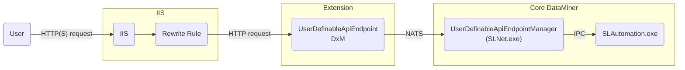

# Troubleshooting User-Defined APIs

## Logging

In case you get an error while triggering an API, defining an API, or installing the endpoint, you may find more info in the logging. These are the main log files:

- In the folder `C:\ProgramData\Skyline Communications\DataMiner UserDefinableApiEndpoint\Logs\`:
  - *UserDefinableApiEndpoint.txt* contains logs from the UserDefinableApiEndpoint DxM. This could include why it was unable to handle an HTTP request and forward it to the manager in SLNet. There may be multiple files with a number appended to them. The file with the highest number is the latest.
  - *UserDefinableApiEndpointInstaller.txt* contains logs from the installation of the DxM if it is installed by a DataMiner upgrade package or via the command line. This will not contain additional logs when you use the dedicated installer for the DxM. A small subset of these log lines will also be available in the *progress.log* DataMiner upgrade package log file and will be displayed during the upgrade.
- The file *SLUserDefinableApiManager.txt* in the `C:\Skyline DataMiner\Logging\` folder contains logging related to the manager in SLNet that manages the CRUD actions on API tokens/definitions and the API triggers.

> [!NOTE]
> When there are more than two Agents in a DMS, the API triggers arriving on an endpoint are forwarded randomly to one of the DataMiner Agents. Keep this in mind when checking the logging. If an HTTP request was sent to the endpoint running on a specific server, there is no guarantee that this trigger will be handled by the DataMiner Agent on that same server. The JSON error responses returned by the endpoint should include a *faultingNode* field that indicates the ID of the DMA that actually handled the request.

## Information events

An information event will be generated for every create, update, and delete action for an API token or definition. These information events include the following details:

- **API token**: The name, the token ID, and the user who executed the action.
- **API definition**: The URL route, the definition ID, and the user who executed the action.

## Request flow

Below, you can find the request flow when a trigger comes in. This may help you during troubleshooting.

## Installation issues

The errors in this section can be generated when the UserDefinableApiEndpoint DxM is installed via a DataMiner upgrade package. These will be visible in the upgrade log during the upgrade and also in the `UserDefinableApiEndpoint.txt` log file as mentioned above under [Logging](#logging).

- **Could not find AspNetCore installed on this system**

  DataMiner should install ASP.NET Core 5 automatically, but in case this failed or in case it has been removed, the installer can generate this error.

  To fix this:

  1. Go to the [.NET 5 download page](https://dotnet.microsoft.com/en-us/download/dotnet/5.0) and download the latest ASP.NET Core Runtime 5.

  1. On the DMA, got to the folder `C:\Skyline DataMiner\Tools\ModuleInstallers\` and run the installer `DataMiner UserDefinableApiEndpoint 1.X.X.X.msi`.

- **Found rewrite rule, but it has inconsistencies:**

  If you find this error in the logging, the log lines below it will contain the inconsistencies of the IIS rewrite rule. This rewrite rule forwards requests coming in on port 80 or 443 to the UserDefinableApiEndpoint DxM. It should contain the correct port that the DxM is using. The installer will always verify if the port mentioned in the rewrite rule matches the one configured in the [settings of the DxM](xref:UD_APIs_UserDefinableApiEndpoint#configuring-the-dxm).

- **Port X is in use, this will cause the IIS rewrite rule to be disabled and User Definable APIs to be unusable.**

  When no rewrite rule is found in IIS, a new one will be created. When the installer detects that a process is already using the port configured in the [settings of the DxM](xref:UD_APIs_UserDefinableApiEndpoint#configuring-the-dxm), it will create the rule in a disabled state and log this message. This is done to prevent opening up access to an unknown process. The UserDefinableApiEndpoint DxM will not be able to start as long as the port is not free.

  In this situation, you can either configure the current process to use another port, or configure the UserDefinableApiEndpoint DxM to use another port. For more information, see [Kestrel](xref:UD_APIs_UserDefinableApiEndpoint#kestrel). Make sure to enable the rewrite rule with the port reflecting the one configured in the DxM settings.

- **Files are still locked after 60 seconds. Continuing installation, but this may fail. Processes locking the files:**

  When the DxM is upgraded or automatically repaired during the execution of a DataMiner upgrade package, it can occur that the files in question are locked. This prevents the installer from continuing until they are unlocked. The installer will log a message if this is the case, and it will continuously check every 5 seconds for a maximum of 60 seconds until the files are unlocked. If they are still locked, this message is logged, and the installer will try to continue. This may result in files not being copied, and other errors may occur. The log lines mentioned should contain the names of the process or processes that are locking the files. You may need to terminate these and try the upgrade again.

## Issues when triggering user-defined APIs

- **Access to XXX at 'XXX' from origin 'XXX' has been blocked by CORS policy: No 'Access-Control-Allow-Origin' header is present on the requested resource.**

  For safety reasons, user-defined APIs do not set CORS headers<!-- RN 36727 -->. It is not safe to use a user-defined API from a web client. See [Triggering an API](xref:UD_APIs_Triggering_an_API#cors).

### General checks

If issues occur when you trigger a user-defined API, follow the steps below to resolve them.

1. Make sure the **IIS rewrite rule** is set correctly.

   Verify if the IIS rewrite rule that should redirect incoming HTTP requests to the UserDefinableEndpoint DxM contains the correct configuration. Make sure that the port in this rule matches the port used by the DxM. For more information, see [Kestrel](xref:UD_APIs_UserDefinableApiEndpoint#kestrel).

1. Make sure **bindings are created in IIS**.

   To be able to trigger a user-defined API, you need to make sure one or more bindings are defined in IIS alongside the rewrite rule:

   1. Open the *Internet Information Services (IIS) Manager* app in Windows.

   1. In the pane on the left, select *Sites* > *Default Web Site*.

   1. In the pane on the right, under *Edit Site*, click *Bindings*

   1. In the pop-up window, check the bindings. If necessary, create a binding for HTTP and/or HTTPS, and select the certificate, IP address, or hostname. For more information, see [Setting up HTTPs on a DMA](xref:Setting_up_HTTPS_on_a_DMA).

1. Make sure **proxy is enabled in IIS**.

   1. Open the *Internet Information Services (IIS) Manager* app in Windows.

   1. In the pane on the left, select the server. This should be the top item in the tree.

   1. In the center pane, double-click *Application Request Routing Cache*.

   1. In the pane on the right, under *Proxy*, click *Server Proxy Settings*.

   1. Make sure that the top checkbox *Enable proxy* is selected.

1. Make sure the **UserDefinableApiEndpoint DxM is running**.

   The UserDefinableApiEndpoint DxM should always be running. To check this, open Windows Task Manager and check whether the process called *DataMiner UserDefinableApiEndpoint* is running. You can also check the *Services* tab to see if the service with the same name has the *Running* status.

   If the DxM is not running, try to start the service by right-clicking it and selecting *Start*. If the service immediately stops again, this could be because the configured port is used by another process, or because the installation is corrupt. Check the logging to find out more. If the installation is corrupt, try to install the DxM again manually.

1. Make sure the **UserDefinableApiEndpoint DxM and the manager in SLNet are connected to NATS**.

   To allow communication between the DxM and the manager in SLNet, a connection to the NATS message bus is required.

   - For the DxM, open the [UserDefinableApiEndpoint.txt](#logging) log file and check whether the log line with message "Successfully initialized the MessageBrokerWrapper" is displayed after the most recent startup. There may be errors before this that indicate that the creation of the connection had to be retried. This is fine as long as the success message is logged at the end.

   - For the manager in SLNet, you can check the [SLUserDefinableApiManager.txt](#logging) log file and check for a log line with the exact same message. After that, you should also see a line stating that a subscription was made on a subject ending with "UserDefinableApiTriggerRequest".

   - If both log files are fine, communication should be possible between the DxM and the manager in SLNet. If you do not see the above-mentioned messages in the logging, something could be wrong with the NATS setup. For more information, see [investigating NATS issues](xref:Investigating_NATS_Issues).
