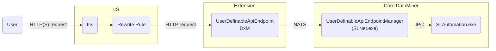

# Troubleshooting User-Defined APIs

This page can help you troubleshoot and resolve issues related to the User-Defined APIs feature. Check the table of contents below to quickly jump to a relevant section.

- [General](#general)
- [Installation issues](#installation-issues)
- [Issues triggering user-defined APIs](#issues-triggering-user-defined-apis)

## General

In case you get an error while triggering, defining an API or installing the endpoint, you may find more info in the logs. There are three main log files:

- `C:\ProgramData\Skyline Communications\DataMiner UserDefinableApiEndpoint\Logs\`
  - `UserDefinableApiEndpoint.txt` contains logs from the UserDefinableApiEndpoint DxM. This could include why it would not be able to handle an HTTP request and forward them to the manager in SLNet. There may be multiple files with a number appended to it. The file with the highest number is the latest.
  - `UserDefinableApiEndpointInstaller.txt` contains logs from the installation of the DxM if it is installed by a DataMiner upgrade package or via the command line. This will not contain additional logs when it is installed with its GUI. A small subset of these log lines will also be available in the `progress.log` DataMiner upgrade package log file and will be displayed during the upgrade.
- `C:\Skyline DataMiner\Logging\SLUserDefinableApiManager.txt` contains logging from the manager in SLNet that manages the CRUD actions on API tokens/definitions and the API triggers.

> [!TIP]
> The API triggers arriving on an endpoint are forwarded randomly to one of the DataMiner agents for load balancing when there are more than 2 agents in the DMS. Keep this in mind when checking the logging. If an HTTP request was sent to the endpoint running on a specific server, there is no guarantee that this trigger will be handled by the DataMiner agent on that same server. The JSON error responses returned by the endpoint should include a 'faultingNode' field which hints at the ID of the DMA that actually handled the request.

Below you can find the request flow when a trigger comes in. This may help you during your troubleshooting.

## Installation issues

The errors in this section can be generated when the UserDefinableApiEndpoint DxM is installed via a DataMiner upgrade package. These will be visible in the upgrade log during the upgrade and also in the `UserDefinableApiEndpoint.txt` log file as mentioned in the [General](#general) section.

### 'Could not find AspNetCore installed on this system'

DataMiner should install ASP.NET Core 5 automatically, but in case this failed or it has been removed, the installer could give this error. To fix this, go to the [download page](https://dotnet.microsoft.com/en-us/download/dotnet/5.0) of .NET 5 and download the latest ASP.NET Core Runtime 5. After that, you can manually rerun the installer which can be found in this  location: `C:\Skyline DataMiner\Tools\ModuleInstallers\DataMiner UserDefinableApiEndpoint 1.X.X.X.msi`.

### 'Found rewrite rule, but has inconsistencies:'

The log line(s) after it will contain the inconsistencies of the IIS rewrite rule. This rewrite rule forwards requests coming in on port 80 or 443 to the UserDefinableApiEndpoint DxM. It should contain the correct port where the DxM is currently running on. The installer will always verify if the port mentioned in the rewrite rule matches the one that is configured in the [app settings of the DxM](xref:UD_APIs_UserDefinableApiEndpoint#configuring-the-dxm).

### 'Port X is in use, this will cause the IIS rewrite rule to be disabled and User Definable APIs to be unusable.'

When no rewrite rule is found in IIS, a new one will be created. When the installer detects that a process is already using the port configured in the app settings of the UserDefinableApiEndpoint DxM, it will create the rule in a disabled state and log this message. This is done to prevent opening up access to an unknown process. The UserDefinableApiEndpoint DxM won't be able to start as long as the port is not free. In this situation you can either move the current process to another port using its configuration, or configure the UserDefinableApiEndpoint DxM to use another port. See the [Kestrel](xref:UD_APIs_UserDefinableApiEndpoint#kestrel) configuration section on the UserDefinableApiEndpoint page for more info. Either way, don't forget to enable the rewrite rule where the port reflects the one configured on the DxM.

### 'Files are still locked after 60 seconds. Continuing installation, but this may fail. Processes locking the files: '

When the DxM is being upgraded or automatically repaired during the execution of a DataMiner upgrade package, it could occur that the files in question are locked. This prevents the installer from continuing until they are unlocked. The installer will log a message if this is the case and it will continuously check every 5 seconds for a maximum of 60 until the files are unlocked. If they are still locked, this message is logged and the installer will try to continue. This may result in files not being copied and other errors may occur. The log lines mentioned should contain the names of the process(es) that is/are locking the files. It may be required to terminate these and try the upgrade again.

## Issues triggering user-defined APIs

When you are having issues with triggering a user-defined API, verify the actions detailed below.

### Make sure the IIS rewrite rule is set correctly

Verify if the IIS rewrite rule that should redirect incoming HTTP requests to the UserDefinableEndpoint DxM contains the correct configuration. Make sure that the port in this rule matches the port where the DxM is running on. See the [Kestrel](xref:UD_APIs_UserDefinableApiEndpoint#kestrel) configuration section on the UserDefinableApiEndpoint page for more info.

### Make sure bindings are created in IIS

In order to be able to trigger a user-defined API, (a) binding(s) need to be defined in IIS alongside the rewrite rule. You can find these in `Internet Information Services (IIS) Manager`. Select the `Default Web Site` in the left pane. There will be a button `Bindings` in the right pane under `Edit Site`. Here you can create a binding for http and/or https, select the certificate, IP address or a hostname. See the [Setting up HTTPs on a DMA](xref:Setting_up_HTTPS_on_a_DMA) page for more info.

### Make sure proxy is enabled in IIS

In the `Internet Information Services (IIS) Manager`, click the server name in the left pane (should be the top tree item). Click the `Application Request Routing Cache` in the middle pane. Click `Server Proxy Settings` in the right pane under `Proxy`. Make sure that the top checkbox `Enable proxy` is checked.

### Make sure the UserDefinableApiEndpoint DxM is running

Always make sure that the UserDefinableApiEndpoint DxM is running. This can be checked by opening `Task Manager` and checking whether the process called 'DataMiner UserDefinableApiEndpoint' is running. You can also check the `Services` tab to see if the service with the same name has the 'Running' status. If this would not be the case, try to start the service by right clicking it and selecting `Start`. If the service stops immediately again, this could be caused by the configured port being in use by another process. This can also happen if the installation is corrupt. In that case, try manually re-installing the DxM again.

### Make sure the UserDefinableApiEndpoint DxM and the manager in SLNet are connected to NATS

To allow communication between the DxM and the manager in SLNet, a connection to the NATS message bus is required.

For the DxM, you can open the [UserDefinableApiEndpointInstaller.txt](#general) log file and check whether the log line with message "Successfully initialized the MessageBrokerWrapper" can be seen after the most recent startup. There may be errors before this that indicate the creation of the connection had to be retried. This is fine as long as the success message is logged at the end.

For the manager in SLNet, you can check the [SLUserDefinableApiManager.txt](#general) log file and check for a log line with the exact same message. After that, you should also see a line stating that a subscription was made on a subject ending with "UserDefinableApiTriggerRequest".

If both log files are fine, communication should be possible between the DxM and the manager in SLNet. If you would not see these messages, there could be something wrong with the NATS setup. There is a DataMiner docs page on [investigating NATS issues](https://docs.dataminer.services/user-guide/Troubleshooting/Procedures/Investigating_NATS_Issues.html).