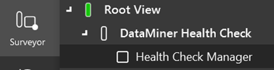

# Installation

## Prerequisites

- DataMiner web apps 10.4.1 or higher
- A DataMiner System [connected to dataminer.services](https://docs.dataminer.services/user-guide/Cloud_Platform/Connecting_to_cloud/Connecting_your_DataMiner_System_to_the_cloud.html)

## Deploying the DataMiner Health Check Tool

1. Look up the [*DataMiner Health Check* package](https://catalog.dataminer.services/details/56b1b9e0-ffe1-4bd2-b5d2-06c17d97c6b1) in the DataMiner Catalog
2. Click the Deploy button
3. Select the target DataMiner System and confirm the deployment. The package will be pushed to the DataMiner System
4. If this is the first time you install the tool, a new view named "DataMiner Health Check" and element named "Health Check Manager" will automatically be created when the package is installed. Optionally, you can rename the element and view, and you can change their location in the Surveyor
5. Once the package is installed, you can open the newly created element to begin the configuration as well as access the included dashboards by navigating to http(s)://[DMA name]/root in a web browser

By default, the Heath Check Manager element will include a series of tests related to the Dataminer Systems' health.

> [!NOTE]
> To **update** the DataMiner Health Check tool, redeploy the [*DataMiner Health Check* package](https://catalog.dataminer.services/details/56b1b9e0-ffe1-4bd2-b5d2-06c17d97c6b1). The tool will be updated, but a new Health Check Manager element will not be created, as one should already exist in your DMS.
