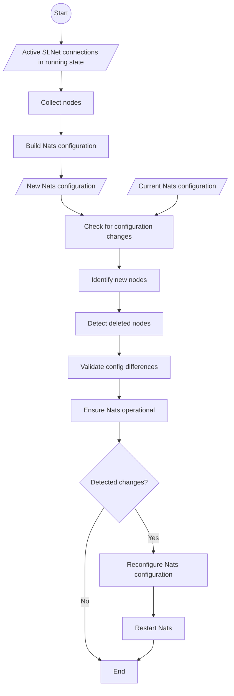
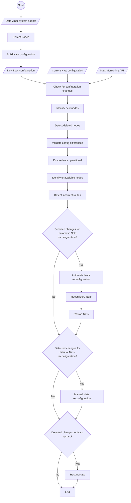

# NatsCustodian

## Automated NATS Configuration Monitoring with NatsCustodian

NatsCustodian is a dedicated manager in SLNet designed to monitor and manage NATS configuration in real-time. Performing checks every minute, NatsCustodian automates the process of identifying and addressing configuration anomalies. This ongoing oversight is critical to maintain uninterrupted messaging, system stability, and performance in cluster environments where configuration changes are frequent. As such, NatsCustodian plays an essential role in ensuring the efficient operation of the NATS server clusters.

## NatsCustodian workflow: Up to DataMiner 10.2.0-CU18 / 10.3.0-CU6 / 10.3.9

NatsCustodian operates by gathering the IP addresses of DataMiner agents that are active and connected to the local DataMiner. Using these IPs, it dynamically assembles a NATS configuration for comparison with the currently active NATS setup. This involves several checks: identification of new nodes, detection of deleted nodes, validation of configuration correctness, and ensuring the NATS process is operational. If any irregularities are detected during these checks, NatsCustodian initiates a reconfiguration of NATS. Please note that the functionality of this version is contingent upon the connection status of the DataMiner agents within the cluster which is maintained and verified by the SLNet process. See flowchart below for a more detailed explanation.

## NatsCustodian workflow: Starting from DataMiner 10.2.0-CU18 / 10.3.0-CU6 / 10.3.9

NatsCustodian acquires the IP addresses of DataMiner agents in the DataMiner system/cluster. It then creates a NATS configuration using these addresses, and cross-verifies this against the existing NATS Additionally, the NATS Monitoring API, which provides various endpoints for assessing the NATS server's status, is employed to check the current status of NATS nodes. This functionality is particularly advantageous as the NATS server and its Monitoring API operate independently of the DataMiner server, thus enhancing cluster stability and reducing potential downtime.
The system incorporates several checks, including the detection of new nodes, tracking of deleted nodes, identification of unavailable nodes, verification of configuration accuracy, validation of NATS process operations, and detection of incorrect routes.

If any inconsistencies are identified during these checks, a NATS reconfiguration or restart is triggered. A Nats reconfiguration can be either manual or automatic, depending on the type of anomaly detected. The appearance of new nodes or removal of existing ones triggers an automatic reconfiguration. 

Other detected inconsistencies are logged by a BPA. These are usually non-critical and do not trigger an automatic reconfiguration.

This approach is designed to give administrators the opportunity to explore and understand the root cause of issues before undertaking a reconfiguration, fostering a more educated approach to system adjustments and mitigating potential disruptions to active operations. The detection of incorrect routes will trigger a Nats restart to reestablish the correct routes to the local Nats server.

## Manual Nats Reconfiguration

TODO: Document the BPA

### Triggering Nats Reconfiguration

See: [Nats Reset](xref:Investigating_NATS_Issues#try-a-nats-reset)