```mermaid
graph LR
    A[🖉 Draft] --> B[🖉 Tentative]
    B --> C[🖉 Confirmed]
    C --> D[🖉 Running]
    D --> E[🖉 Completed]
    E --> F[Ready for Invoice]
    F --> G[Invoiced]
    C --> H[Canceled]
    B --> H[Canceled]
    H --> F[Ready for Invoice]

    style A fill:#a349a4,stroke:#000,stroke-width:2px,color:#ffffff
    style B fill:#ffff00,stroke:#000,stroke-width:2px,color:#000000
    style C fill:#00ff00,stroke:#000,stroke-width:2px,color:#000000
    style D fill:#00b050,stroke:#000,stroke-width:2px,color:#ffffff
    style E fill:#00b0f0,stroke:#000,stroke-width:2px,color:#ffffff
    style F fill:#00ffff,stroke:#000,stroke-width:2px,color:#000000
    style G fill:#92d050,stroke:#000,stroke-width:2px,color:#000000
    style H fill:#ff5050,stroke:#000,stroke-width:2px,color:#ffffff
```

# MediaOps Jobs

Using a job, users can easily schedule specific resources, request a resource for a given pool of resources, schedule an entire workflow, or a combination of each of the options. At start and at end of the job a job/workflow execution script can be triggered to allow you to do orchestration.

## Resources in Jobs

When a resource is added to a job it will be reserved for the time span of the job.

## Job States

A job can have one of the following states:

Draft

Tentative

Confirmed

Running

Completed

Ready for invoice

Invoiced

Canceled

Error

