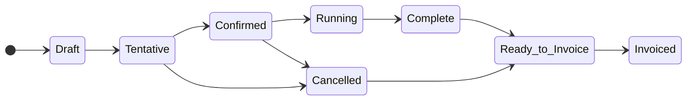

# Resource scheduling - Job lifecycle

## Job States Overview

### Default States

The Job serves as the primary entity for scheduling work. In addition to properties such as Job State, Start Time, End Time, and Name, Jobs also possess a State attribute that delineates their position within the lifecycle. Below is a graphical representation of the Job lifecycle.

## State definitions

<table style="width:75%">
    <thead>
        <tr>
            <th style="text-align: left;"><i>State</i></th>
            <th style="text-align: left;"><i>State Description</i></th>
            <th style="text-align: center;"><i>Resources Guaranteed</i></th>
            <th style="text-align: center;"><i>Allow Resource Pools</i></th>
            <th style="text-align: center;"><i>Can Delete Job</i></th>
            <th style="text-align: center;"><i>Cost & Billing Applied</i></th>
        </tr>
    </thead>
    <tbody>
        <tr style="border: 2px solid #dddddd;">
          <td style="text-align: left;"><b>DRAFT</b></td>
          <td style="text-align: left;">A Job in the Draft state is way users can being to build a Job without officially committing to it. In the Draft state resources assigned to the Job are not guarnateed.</td>
          <td style="text-align: center;">No</td>
          <td style="text-align: center;">Yes</td>
          <td style="text-align: center;">Yes</td>
          <td style="text-align: center;">No</td>
        </tr>
        <tr style="border: 2px solid #dddddd;">
          <td style="text-align: left;"><b>TENTATIVE</b></td>
          <td style="text-align: left;">Jobs in a Tentative state guarantee resources, however, are not yet committed to. As a result, they can be cancelled without penalty. Using Resource Pools is allowed at this state, however, until a specific resource is selected for a Pool, resource availability is not guaranteed.</td>
          <td style="text-align: center;">Yes</td>
          <td style="text-align: center;">Yes</td>
          <td style="text-align: center;">No</td>
          <td style="text-align: center;">No</td>
        </tr>
        <tr style="border: 2px solid #dddddd;">
          <td style="text-align: left;"><b>CONFIRMED</b></td>
          <td style="text-align: left;">A Confirmed Job has been agreed to by the customer. At this state all resources should be selected to guarantee resource availability.</td>
          <td style="text-align: center;">Yes</td>
          <td style="text-align: center;">No</td>
          <td style="text-align: center;">No</td>
          <td style="text-align: center;">Yes</td>
        </tr>
        <tr style="border: 2px solid #dddddd;">
          <td style="text-align: left;"><b>RUNNING</b></td>
          <td style="text-align: left;">Once a Job passes the Job Start time (or preroll time), a Job moves into a Running state to indicate it is live. Additionally, a user can manually start the Job before the Start Time also causing the Job to show Running.</td>
          <td style="text-align: center;">Yes</td>
          <td style="text-align: center;">No</td>
          <td style="text-align: center;">No</td>
          <td style="text-align: center;">Yes</td>
        </tr>
        <tr style="border: 2px solid #dddddd;">
          <td style="text-align: left;"><b>CANCELLED</b></td>
          <td style="text-align: left;">Once a Job hits the Tentative or Confirmed state, it can no longer be deleted. If the Job is no longer needed, it can be moved to a Cancelled state and may be subject to Cancellation Fees based on the configuration of the selected Contract.</td>
          <td style="text-align: center;">Yes</td>
          <td style="text-align: center;">No</td>
          <td style="text-align: center;">No</td>
          <td style="text-align: center;">Yes</td>
        </tr>
        <tr style="border: 2px solid #dddddd;">
          <td style="text-align: left;"><b>COMPLETE</b></td>
          <td style="text-align: left;">Upon surpassing the designated End Time and, if configured, the Approx Out duration, the Job will transition to the Complete state, signifying its completion. Most of the data for a Completed Job is locked down. Only modifications related to adjusting the Job for actual billing is allowed. If Cost and Billing activities are no followed, Completed will be the last state of the Job Lifecycle.</td>
          <td style="text-align: center;">n/a</td>
          <td style="text-align: center;">No</td>
          <td style="text-align: center;">No</td>
          <td style="text-align: center;">Yes</td>
        </tr>
        <tr style="border: 2px solid #dddddd;">
          <td style="text-align: left;"><b>READY TO INVOICE</b></td>
          <td style="text-align: left;">Once a Job has been actualized, it can be set to the Ready to Invoice state. This state completely locks the Job to protect data integrity until the Job is invoiced.</td>
          <td style="text-align: center;">n/a</td>
          <td style="text-align: center;">n/a</td>
          <td style="text-align: center;">No</td>
          <td style="text-align: center;">No</td>
        </tr>
        <tr style="border: 2px solid #dddddd;">
          <td style="text-align: left;"><b>INVOICED</b></td>
          <td style="text-align: left;">The final state in the Job Lifecycle, Invoiced indicates an Invoice for the Job has been sent to the client. While the Job can now be deleted, it is typically best practice to leave it as a historical record for other reporting and statistics.</td>
          <td style="text-align: center;">n/a</td>
          <td style="text-align: center;">n/a</td>
          <td style="text-align: center;">Yes</td>
          <td style="text-align: center;">No</td>
        </tr>
    </tbody>
</table>

### Error State

The Error state is a special state as it is not part of the normal flow of a Job's lifecycle and cannot be by a user. Rather it is a state used by the system whenever there is a problem with the Job that can't be auto resolved or when it is impractical to have a user resolve the error when it happens.

For example, if a resource is deprecated and no longer available to be booked, the system will remove it from future Jobs and then set the Job sate to Error. This is done so Jobs with an issue can easily be found using the search fields available in the [Job Search](xref:scheduling_job_search) or [Job Timeline](xref:scheduling_job_timeline) pages.

When a Job enters an Error state, the system will note the Type of Error encountered and also the state the Job was at or the transition that was happening when the error occurred. Once the user has resolved whatever condition generated the error, such as replacing the missing resource from the example above, the user can use the **Resolve Error** button to attempt to put the Job back to the original state prior to the error.
