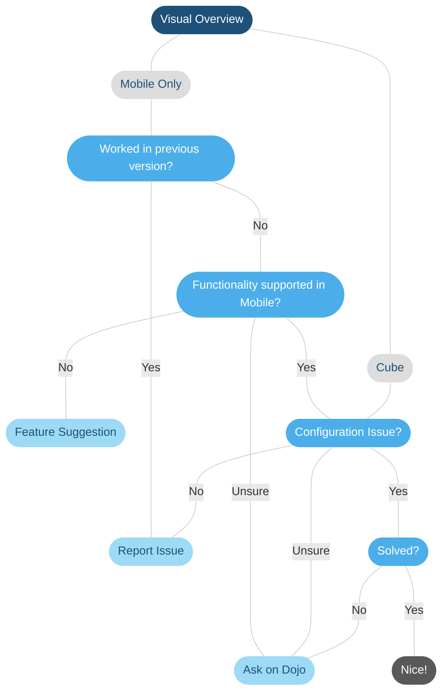

# Troubleshooting: Visual Overview

## Overview

| **Flow item** | **Meaning** |
|--|--|
| Cube | Issues you are encountering in DataMiner Cube or issues you found in mobile applications that also occur in DataMiner Cube. |
| Mobile Only | Issues that **only** occur in mobile applications. |
| Configuration Issue? | Try to verify if your configuration is correct. Try to isolate the problem by changing placeholders to static values, removing added complexity like shape grouping... For more tips, refer to the [Visual Overview Learning Course](https://community.dataminer.services/courses/visio/) or [DataMiner Dojo Questions](https://community.dataminer.services/questions/). |
| Functionality supported in Mobile? | For more information on what capabilities are supported in mobile Visual Overviews, please refer to the [Visual Overview Component](https://docs.dataminer.services/user-guide/Advanced_Modules/Dashboards_and_Low_Code_Apps/Visualizations/Available_visualizations/Other/Visual_Overview_component.html) documentation. |
| [Feature Suggestion](https://community.dataminer.services/feature-suggestions) | Visual Overview is still fully supported, but innovation on this functionality is limited. Posting a feature suggestion or upvoting an existing one can still be useful however to indicate your wishes as a user and maybe shift the priorities of our development.