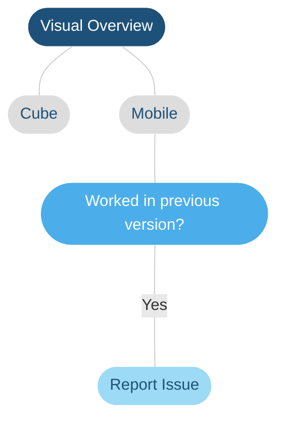

# Troubleshooting: Visual Overview

> [!NOTE]
> This page is currently still being developed. The content is not yet optimized and may not yet be fully accurate.

## Overview

| **Flow item** | **Meaning** |
|--|--|
| Cube | Issues you are encountering in DataMiner Cube or issues you found in mobile applications that also occur in DataMiner Cube. |
| Mobile | Issues that **only** occur in mobile applications. |
| Configuration Issue? | Try to verify if your configuration is correct. Try to isolate the problem by changing placeholders to static values, removing added complexity like shape grouping... For more tips, refer to visio course or dojo. |

## Plan Of Attack
| **Issue** | **Plan of attack** |
|--|--|
| Configuration | Refer to [SLElement Flowchart](xref:Troubleshooting_SLElement_exe) |
