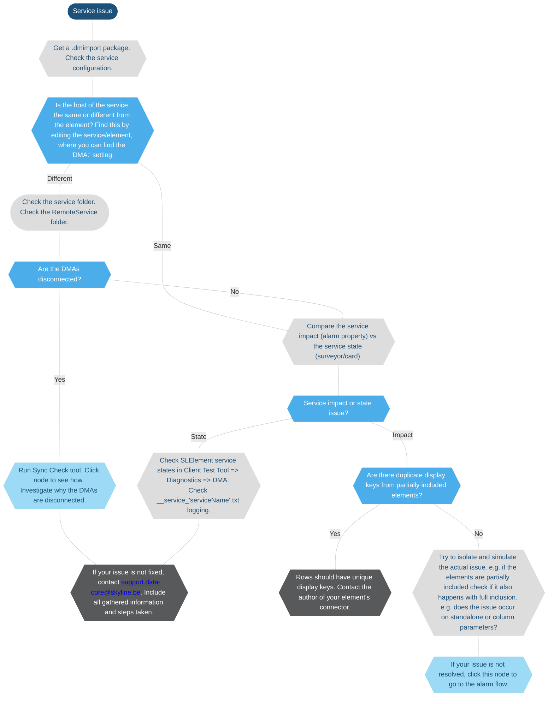

# Troubleshooting - services

> [!NOTE]
>
> - This page is currently still being developed. The content is not yet optimized and may not yet be fully accurate.
> - If you need more information on how to execute any of the steps below, feel free to reach out to [support.data-core@skyline.be](mailto:support.data-core@skyline.be).
> - You can leave feedback using the [*issues* feature](xref:CTB_Reporting_Issue), or [propose a change](xref:contributing).

> [!NOTE]
>
> At any step of this flowchart:
>
> - your investigation may be complete.
> - you may need to check the log information in *SLErrors.txt*, *SLWatchDog2.txt*, *SLDBConnection.txt*, the element logging, or the *\_\_service\_\<serviceName\>.txt* logging on each DMA.

> [!NOTE]
>
> For issues related to service alarms:
> In order for Data-Core to investigate further, we will need the logs and memory dumps from the DMAs involved. When the issue is active on the system, please collect memory dumps of the SLElement, SLDataMiner, and SLNet processes from both the agents hosting the affected element(s) and the agent hosting the affected service(s).
> When sharing these files, please also include the element ID and service ID to help us quickly locate the relevant information in the logs and dumps.
> It’s also important to provide a DELT export with alarms from the affected service(s) and element(s). If the service was generated from a template, please include the template as well.

