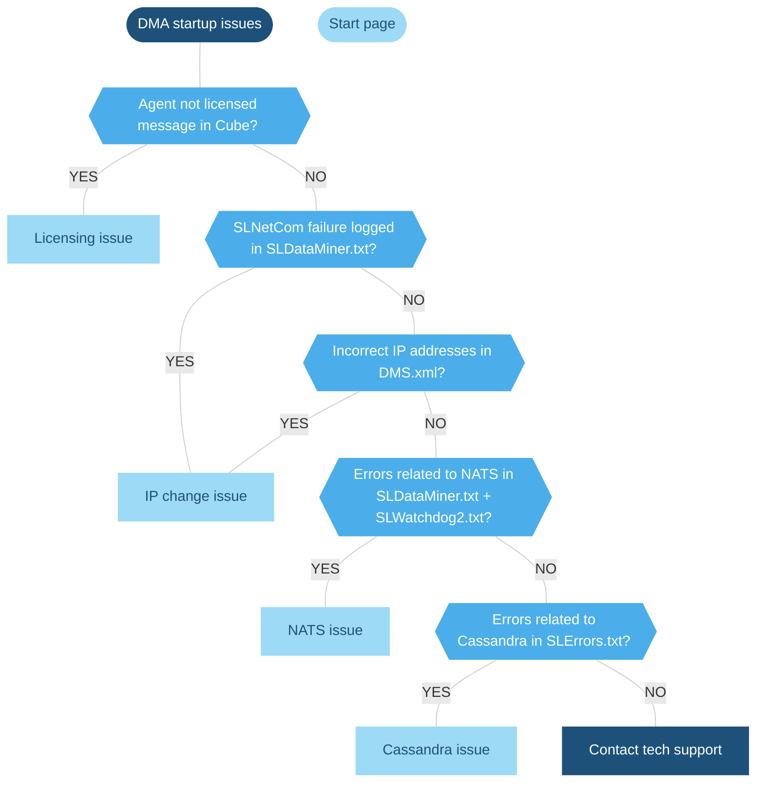

# Troubleshooting - DataMiner startup issues

## Overview



## Licensing issue

### Symptoms

- DataMiner fails to start, takes too long to start, or gets stuck at 99% during the startup process.

- DataMiner Cube displays the error message "This DataMiner Agent is not licensed", prompting you to contact the system administrator.

- Errors in the *SLDataMiner.txt* file, including:

  - No valid license file
  - Start DataMiner failed, 0x80040291

### Root cause

DataMiner cannot find a valid license to run the Agent. This issue may be caused by a **MAC address change**, which can have the following causes:

- Hardware changes (e.g. replacing network interface cards).

- NIC priority rearrangement (e.g. because of new VMs or network configurations).

- Randomized MAC addresses.

### Solution

1. Navigate to the folder `C:\Skyline DataMiner` on the DMA.

1. Copy the *Request.lic* file and send it to <dataminer.licensing@skyline.be>.

   After some time, you will receive an email with license files.

1. When you have received the license files, place them in the `C:\Skyline DataMiner` folder.

1. Restart the DataMiner Agent.

## IP change issue

Two different DataMiner startup issues are related to IP changes: DataMiner may be trying to [connect to an old IP address](#dataminer-is-trying-to-connect-to-an-old-ip-address), or there may be [incorrect IP addresses in *DMS.xml*](#incorrect-ip-addresses-in-dmsxml-cause-ip-conflicts).

### DataMiner is trying to connect to an old IP address

#### Symptoms

- DataMiner fails to start or gets stuck at 99%.

- Error messages in *SLDataMiner.txt* indicate a failure to initialize SLNetCom.

  For example:

  ```txt
  Initializing SLNetCom
  Initializing SLNetCom failed. - There's no connection available with this dataminer. (hr = 0x800402CD)
  ```

- Authentication timeouts are indicated in *SLNet.txt*.

  For example:

  - `Destroying connection (SLAnalytics): Authentication took too long.`
  - `Destroying connection (SLDataMiner.exe): Authentication took too long.`

- NATS logging:

  - The *nats-account-server.log* file in `C:\Skyline DataMiner\NATS\nats-account-server` mentions `connected to NATS for account and activation notifications`.
  - The *nats-server.log* file in `C:\Skyline DataMiner\NATS\nats-streaming-server` mentions `STREAM: Streaming Server is ready`.

#### Root cause

In a two-node setup, a DMA is trying to connect to a NATS instance on an old IP address.

#### Solution

1. Stop the DataMiner Agent.

1. Open the *SLCloud.xml* file.

1. In *SLCloud.xml*, change the old IP address to the new IP address.

1. Restart the DataMiner Agent.

### Incorrect IP addresses in DMS.xml cause IP conflicts

#### Symptoms

- DataMiner Agents fail to start up.

- There are IP conflicts within the cluster.

- There are discrepancies between the Failover configuration and the *DMS.xml* file: the IP addresses shown in Cube do not match those in *DMS.xml*.

#### Root cause

Incorrect IP addresses in *DMS.xml* cause IP conflicts within the DataMiner System.

> [!NOTE]
> If you check the previous *DMS.xml* versions from the `C:\Skyline DataMiner\Recycle Bin` folder, you may be able to pinpoint which change caused this issue.

#### Solution

1. Check the *DMS.xml* configuration:

   - If there are Agents in the cluster that do start up, connect to one of those Agents and compare the IP addresses in *DMS.xml* with the Failover configuration in DataMiner Cube to identify discrepancies and find the incorrect IP addresses.

   - If all Agents in the cluster fail to start up, manually inspect each *DMS.xml* file to check if the IP addresses in the file match the actual IPs assigned to each Agent.

1. Update the *DMS.xml* file with the correct IP addresses.

1. Reinstall NATS to ensure all Agents can come online without issues. See [NATS troubleshooting](xref:Investigating_NATS_Issues#remaining-steps) for details.

1. Check *DMS.xml* to ensure that each DMA retains its respective IP address.

1. Verify that no two PCs have similar hostnames that could be truncated to identical names in *DMS.xml*.

> [!TIP]
> See also: [Changing the IP of a DMA](xref:Changing_the_IP_of_a_DMA)

## NATS issue

### Symptoms

- DataMiner fails to start, takes too long to start, or gets stuck at 99% during the startup process.

- Errors in the *SLDataMiner.txt* file, including:

  - `Initializing Cloud Bridge`
  - "ERR" logs that include references to NATS.

- *SLWatchdog2.txt* contains logs referencing NATS.

### Root cause

NATS is not running as expected. As every DataMiner Agent must be able to reach every other DataMiner Agent in the cluster over NATS, this might impact an Agent's startup process. Most commonly, the issue will stem from one of the following causes:

- NATS/NAS services not running.

- Misconfiguration issue.

- Corrupt installation.

### Solution

1. Check in the Task Manager if NAS and NATS are running.

1. [Reinstall NAS and NATS](xref:Investigating_NATS_Issues#remaining-steps).

1. If this does not fix the issue, follow the steps under [NATS Troubleshooting](xref:Investigating_NATS_Issues).

## Cassandra issue

### Symptoms

- DataMiner fails to start up, takes too long to start up, or gets stuck at 99%.

- DataMiner starts up but all elements have errors and all nodes are down.

- *SLErrors.txt* contains errors related to the connection to the database, for example:

  `ConnectionComposing|ERR|0|1|System.Exception: Could not establish a connection to the Cassandra database (nodes=10.2.5.100, retries=60).`

  The 60 retries in the error above are the maximum number of attempts DataMiner will make to connect to the database before a DataMiner restart is required.

- *SLDBConnection.txt* contains errors similar to the following example:

  `2024/11/14 12:02:55.247|SLDBConnection|.ctor|INF|0|1|Failed connection attempt to 10.2.5.100:9042 because NoHostAvailableException: System.Net.Sockets.SocketException (0x80004005): A connection attempt failed because the connected party did not properly respond after a period of time, or established connection failed because connected host has failed to respond.`

### Root cause

DataMiner is unable to establish a connection to the database. This can be caused by any of the following reasons:

- The database is down.
- The database credentials are incorrect.
- The connection between DataMiner and the external database is blocked, for example by a firewall.

### Solution

1. Check if you can connect with Cassandra using the DevCenter tool.

   - You can find this tool in `C:\Program Files\Cassandra\DevCenter\Run DevCenter` (if storage per DMA is used instead of dedicated clustered storage), or it can be downloaded from the Apache or DataStax websites.
   - You can find the IP of the database in *DB.xml*, in the *DBServer* tag.

   If you can connect to Cassandra:

   - Check whether DataMiner is configured with the correct credentials to connect to the database.
   - Check the DMA server for possible port exhaustion issues and restart if necessary.
   - Check whether a firewall is blocking the communication.

1. Connect to the database server and verify whether the Cassandra service is running:

   - On **Linux**: `sudo systemctl status Cassandra`
   - On **Windows**: Look for the Cassandra service in the Task Manager.

   If the service is not running, restart it:

   - On **Linux**: `sudo systemctl restart Cassandra`
   - On **Windows**: Right-click the Cassandra service in the Task Manager and select *Restart*, or reboot the server if this restart fails.

1. Verify whether all nodes are running fine by checking their status in nodetool.

   - UN (or up/normal): The node is running fine.
   - DN: The node is down. In some cases, this can mean data loss is occurring.

1. Inspect the debug log to confirm whether the node has fully started or terminated unexpectedly:

   - On **Linux**: `/var/log/cassandra/debug.log`
   - On **Windows**: `C:\Program Files\Cassandra\logs\debug.log`

   Look for the log line indicating the service is listening for CQL clients: `DEBUG [main] 2024-XX-XX XX:XX:XX Server.java:XX - Starting listening for CQL clients on /<IP>:9042.`

   If the node is down because of the disk policy, other nodes in the cluster will report it as down. The affected node itself might still report its state as "UN" even when it is actually down, which is why it is important to check *debug.log*. Alternatively, you could also check the node status via nodetool on other nodes in the cluster, as these should report the correct state.

> [!TIP]
> See also: [Troubleshooting – Cassandra](xref:Troubleshooting_Cassandra)
