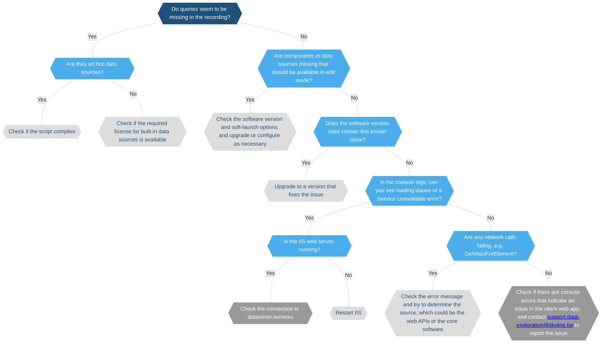

# Troubleshooting - web apps

When troubleshooting an issue in the DataMiner web apps, you should always [create a recording using the Web Support Assistant](xref:Web_Issues_Support_Assistant).

Once this has been done, you can then troubleshoot the issue as detailed below.

