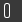
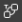
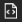
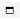

## Main Cube UI components from DataMiner 10.0.0/10.0.2 onwards

The DataMiner Cube UI consists of the following main components from DataMiner 10.0.0/10.0.2 onwards:

- [Header bar](#header-bar)

- [Sidebar](#sidebar)

- [Card pane](#card-pane)

- [Alarm Console](#alarm-console)

### Header bar

From DataMiner 10.0.0/10.0.2 onwards, you can find the following items in the header bar of DataMiner Cube:

- **Cube side indicators**: Four blue squares, each representing one of the four Cube sides. The largest square marks the Cube side that is currently displayed. These indicators may be hidden, depending on the user settings. (See “Quick menu icon” below.)

- **Cube search box**: See [Searching in DataMiner Cube](Searching_in_DataMiner_Cube.md).

- **DMS time**: Indicates the server time of the DMS, which may be useful in case the server is not in the same time zone as the client. This time indicator may be hidden, depending on the user settings. (See “Quick menu icon” below.)

- ** Quick menu icon**: This icon opens a quick menu where you can toggle the following options related to the header:

    - *Show Cube sides*: Determines whether the 4 squares indicating the Cube sides are displayed.

    - *Show server time*: Determines whether the DMS time is displayed.

    - *Show cluster name*: Determines whether the name of the cluster is displayed. (Available from DataMiner 10.0.12 onwards.)

- **User icon**: Click this icon to open a menu containing information on the user and the DMA, as well as the following options:

    - *Account details*: Opens your user card.

    - *X online contacts*: Displays the contacts that are currently online. Right-click a contact in the list to access a menu that allows you to exchange chat messages with them or to disconnect them (if you have the necessary permissions to do so).

        > [!TIP]
        > See also:
        > [Chat collaboration](../../part_2/chat/chat.md#chat-collaboration)

    - *Settings*: Opens the *Settings* window.

        > [!TIP]
        > See also:
        > - [User settings](User_settings.md)
        > - [Computer settings](Computer_settings.md)

    - *Change layout*: Allows you to select a different layout for the cards in the Cube workspace.

        > [!TIP]
        > See also:
        > [Changing the card layout](Working_with_cards_in_DataMiner_Cube.md#changing-the-card-layout)

    - *System Center*: Opens the System Center, where you can among others configure the DMS setup, backups, the database and DMS security, if you have the necessary permissions to do so. The System Center also provides access to all DataMiner log files.

        > [!TIP]
        > See also:
        > [Logging](../../part_6/logging/logging.md)

    - *Agents*: Opens the *Agents* page in System Center, where you can view information on the DMS and configure the DMS, if you have the necessary permissions to do so.

    - *Help*: Opens the DataMiner online help.

    - *About*: Opens the *About* box. This box consists of several tabs, and three buttons:

        - The *general* tab mentions the upgrade version of your DMA. It also contains contact information and a link to the Skyline license terms and to third-party notices.

        - The *assemblies* tab mentions the assemblies used by your DMA.

        - The *connection* tab contains information about the connection of client to server.

        - The *versions* tab shows the server and client version, as well as the version of the various DataMiner files and the DMA upgrade history.

        - The *license* tab contains license information as well as activated license counter information. For demo licenses, the expiration date is shown at the top.

            > [!NOTE]
            > To view license information regarding third-party software, go to *http(s)://**\[DMA name or IP\]**/Licenses*.

        - The buttons at the bottom of the box allow you to export, email or copy the information for troubleshooting purposes.

    - *Check for updates*: Opens the Update Center, where you can check for and download updates for DataMiner protocols or for the DataMiner software itself.

        > [!TIP]
        > See also:
        > [Updating protocols with the Update Center](../../part_2/protocols/Adding_a_protocol_or_protocol_version_to_your_DataMiner_System.md#updating-protocols-with-the-update-center)

    - *Open Cube Mobile*/*Open web apps*: Opens the DataMiner landing page, with access to the various DataMiner web apps. This option is renamed from DataMiner 10.0.0 \[CU16\] /10.1.0 \[CU5\]/10.1.8 onwards to better reflect the actual usage of these apps.

    - *Sign out*: Ends your current DataMiner Cube session and returns you to the logon screen. If you are using a desktop app, you can click then the arrow button next to the DMA name or IP to go back to the start window and select a different DMS to connect to.

### Sidebar

From DataMiner 10.0.0/10.0.2 onwards, on the left-hand side of the Cube UI, a sidebar is displayed. This sidebar contains the following buttons:

- *Surveyor*: Opens the Surveyor pane. See [Surveyor pane](#surveyor-pane).

- *Activity*: Opens a pane listing recent items. See [Activity pane](#activity-pane).

- *Apps*: Opens a pane listing the different apps available in Cube. See [Apps pane](#apps-pane).

- *Workspaces*: Opens a pane where you can select and manage different Cube workspaces. See [Working with workspaces](Working_with_workspaces.md).

- *Community*: This button is displayed from DataMiner 10.0.0 \[CU12\]/10.1.0 \[CU1\]/10.1.4 onwards. Clicking the button opens a menu with different links to the [DataMiner Dojo user community](https://community.dataminer.services/), including the blog, the learning hub, a library of resources, a page where you can ask questions about anything related to DataMiner, and a page that allows you to suggest new features.

From DataMiner 10.1.11/10.2.0 onwards, you can pin additional buttons to the sidebar using the “...” or “+” button. This button opens a menu where you can select the buttons you want to pin.

- *Overview*: Displays the root view page listing all items below the root view.

- *Search*: If an advanced search is done from the Cube header bar, an additional *Search* button is displayed, which displays the pane with the advanced search results. If this button is not pinned to the sidebar, it will no longer be displayed as soon as you click a different button. See [Searching in DataMiner Cube](Searching_in_DataMiner_Cube.md).

- A button representing any of the available modules, the “About” information, the Help, or the settings.

To unpin a button again, right-click the button and select *Unpin*. This is not possible for the buttons that are displayed by default.

> [!NOTE]
> - At most 4 items can be pinned to the sidebar. If the maximum number of items has been added, the button to pin more items is no longer displayed, until an item is unpinned again.
> - It is possible to move the position of the sidebar to the right-hand side. To do so, press *Ctrl+Alt+Shift+RightArrow*. To move the pane back to the left-hand side, press *Ctrl+Alt+Shift+LeftArrow*. The sidebar position can also be changed in the Cube settings. See [Cube settings](User_settings.md#cube-settings).

#### Surveyor pane

The Surveyor pane contains a hierarchical overview of all views, elements, services, etc. in your DataMiner System. It features alarm bubble-up, state indication, etc.

When you click an item in the tree, it opens in a card:

- If you click the item with the left mouse button, the new card replaces a card that is already open.

- If you click the item with the middle mouse button, the new card is opened next to any cards that are already open.

> [!NOTE]
> - For the right-click menu options in the Surveyor, see [Surveyor right-click menu](Main_Cube_UI_components_prior_to_DataMiner_10.md#surveyor-right-click-menu).
> - You can drag an element, service, view, or SLA from a card or from the Surveyor to another application, such as Microsoft Word or Outlook, to copy information about that DataMiner item to the application in question.

##### Icons

The icons that precede an item name in the tree show what kind of item it is and what state and alarm state it is in.

> [!NOTE]
> Depending on the user settings, the legacy icons may be displayed instead of the icons described below. For more information on the legacy icons, see [Icons](Main_Cube_UI_components_prior_to_DataMiner_10.md#icons).

- There are specific icons for different types of items:

    | Icon                                                                               | Item description                                                                                               |
    |--------------------------------------------------------------------------------------|----------------------------------------------------------------------------------------------------------------|
    |             | View                                                                                                           |
    |                | Element or default function DVE (prior to DataMiner 10.0.5 - requires DataMiner Service & Resource Management) |
    |                | Service                                                                                                        |
    |        | Service template                                                                                               |
    |    | Redundancy group                                                                                               |
    |               | SLA                                                                                                            |
    |              | Protocol                                                                                                       |
    |  | Parameter                                                                                                      |
    |                 | Script                                                                                                         |
    |      | Setting                                                                                                        |
    |              | Default function DVE (from DataMiner 10.0.5 onwards – requires DataMiner Service & Resource Management)        |

- View icons are filled with a different color, depending on their alarm state. On other icons, a colored circle is displayed when they are in a particular alarm state. In addition to the default colors indicating the alarm severity, the circle can also be displayed in purple to indicate that an item is masked.

    > [!NOTE]
    > The alarm state color is determined by the most severe of all the current alarms for the item.

    > [!TIP]
    > See also:
    > - [Alarm severity levels](../../part_2/alarms/Alarm_types.md#alarm-severity-levels)
    > - [Changing the default alarm colors](../../part_2/alarms/Changing_the_default_alarm_colors.md)

- There may be additional symbols on an icon to indicate a particular state:

    | Symbol                                                                                                                                             | Description                                                                                                                                                                                                                                                                                                                                                                                                                                                                  |
    |------------------------------------------------------------------------------------------------------------------------------------------------------|------------------------------------------------------------------------------------------------------------------------------------------------------------------------------------------------------------------------------------------------------------------------------------------------------------------------------------------------------------------------------------------------------------------------------------------------------------------------------|
    | Gray square                                                                                                                                          | Located in the corner of an icon to indicate that the item is stopped.                                                                                                                                                                                                                                                                                                                                                                                                       |
    | Two vertical bars                                                                                                                                    | Located in the corner of an icon to indicate that polling on the item is paused.                                                                                                                                                                                                                                                                                                                                                                                             |
    | Orange X                                                                                                                                             | Indicates that an element in a view or service is in timeout state.                                                                                                                                                                                                                                                                                                                                                                                                          |
    | White X on red background                                                                                                                            | Indicates that an element is in error state.                                                                                                                                                                                                                                                                                                                                                                                                                                 |
    | Upwards arrow                                                                                                                                        | Displayed next to a service child in case the capped severity of the service child is lower than the actual severity. The icon has the color of the severity that will bubble up to the parent service.                                                                                                                                                                                                                                                                      |
    | Circle containing a horizontal line, for example:   | Indicates that the DMA hosting the item is currently unavailable. Though the information on the item is still available in the cache, it is not possible to execute any actions on the item.   This icon is used from DataMiner 10.0.12 onwards. In this DataMiner version, it is only used for elements, and other items are not displayed when the DMA hosting them is unavailable. From DataMiner 10.0.13 onwards, it is also used for services and redundancy groups. |

##### Surveyor right-click menu

In the Surveyor right-click menu, the following options are available, depending on what type of item is right-clicked:

| Menu option               | Right-clicked item                               | Description                                                                                                                                                                                                                                                                                                                                                                                                                                                 |
|---------------------------|--------------------------------------------------|-------------------------------------------------------------------------------------------------------------------------------------------------------------------------------------------------------------------------------------------------------------------------------------------------------------------------------------------------------------------------------------------------------------------------------------------------------------|
| Expand all in alarm       | View only                                        | Expands all subviews with an active alarm.                                                                                                                                                                                                                                                                                                                                                                                                                  |
| Collapse level            | View only                                        | Collapses the level of the right-clicked view.                                                                                                                                                                                                                                                                                                                                                                                                              |
| Open                      | Any                                              | Opens the item in a card.                                                                                                                                                                                                                                                                                                                                                                                                                                   |
| Open in new card          | Any                                              | Opens the item in a new card.                                                                                                                                                                                                                                                                                                                                                                                                                               |
| Open in new undocked card | Any                                              | Opens the item in a new, undocked card.                                                                                                                                                                                                                                                                                                                                                                                                                     |
| Ticket                    | Element, service, view                           | Allows you to create a new ticket related to the right-clicked item. Only available on DMAs with a Ticketing license.  See [DMS Ticketing](../../part_4/ticketing/ticketing.md#dms-ticketing).                                                                                                                                                                                                                                                           |
| State                     | Element only                                     | Opens a shortcut that allows you to change the element state. See [Changing the state of an element](../../part_2/elements/Changing_the_state_of_an_element.md).                                                                                                                                                                                                                                                                                            |
| Mask                      | Element only                                     | Masks the element. See [Masking or unmasking an element](../../part_2/elements/Masking_or_unmasking_an_element.md)                                                                                                                                                                                                                                                      |
| Unmask                    | Element only                                     | Unmasks the element. This option is only available for masked elements.                                                                                                                                                                                                                                                                                                                                                                                     |
| Multiple set              | Element only                                     | Opens the *Multiple set* dialog box. See [Setting a parameter value in multiple elements](../../part_2/elements/Updating_elements.md#setting-a-parameter-value-in-multiple-elements).                                                                                                                                                                                                                                        |
| Protocols & Templates     | Element, enhanced service                        | Opens a submenu where you can:  -  View the used protocol or service protocol, alarm template, and trend template.  -  Assign alternative templates.  -  View all available templates.                                                                |
| View                      | Element, service generated by a service template | For an element, a shortcut menu opens that allows quick access to DataMiner logging or Stream Viewer.   For a service generated by a service template, this option opens a card with service creation data and an overview of the service’s child elements.  Note that from DataMiner 9.5.1 onwards, all options related to generated services, including this one, have been moved to the *Service template* submenu. |
| Edit                      | Element, service                                 | Opens a card where you can change the settings of the element or service.                                                                                                                                                                                                                                                                                                                                                                                   |
| Remove from parent        | Any view child item, except a child view         | Moves the item from the parent view to the root view.                                                                                                                                                                                                                                                                                                                                                                                                       |
| Delete                    | Any except root view                             | Removes the item.                                                                                                                                                                                                                                                                                                                                                                                                                                           |
| Duplicate                 | Element, service                                 | Duplicates the item.                                                                                                                                                                                                                                                                                                                                                                                                                                        |
| Rename                    | Element, service, view, redundancy group         | Allows the user to rename the item                                                                                                                                                                                                                                                                                                                                                                                                                          |
| New                       | Any                                              | Opens a submenu where you can select to create a new element, service, service template or SLA. If you right-clicked a view, you can also select to create a new view.                                                                                                                                                                                                                                                                                      |
| Actions                   | Element, service, view                           | Opens a shortcut menu with options to configure personal alerts, start Correlation analyzers, open a filtered alarm tab, and other options depending on the right-clicked item.                                                                                                                                                                                                                                                                             |
| Properties                | Element, service, view                           | Opens the item’s *Properties* window.                                                                                                                                                                                                                                                                                                                                                                                        |
| Drag and drop editing     | Any                                              | Enables drag-and-drop view editing mode. See [Editing a view](../../part_2/views/Managing_views.md#editing-a-view).                                                                                                                                                                                                                                                                                                                                         |

> [!NOTE]
> - For some special items, such as redundancy group templates or service templates, additional options are available.
> - The *View* option is also available for services using a protocol, with the options to view the protocol, alarm template or trend template of such a service.
> - When opening an item from the right-click menu, you can hold *Ctrl* while clicking the menu option to open the item in a new card, or hold *Shift* while clicking the option to open the item in a new undocked card.

#### Activity pane

The activity button displays a pane listing recently opened items, such as elements, services, views and apps.

The following actions are possible with this list:

- Click an item in the list to open it in a card. If you wish to open the item in a new card, use the middle mouse button.

- Pin an item so that it is placed in the *Pinned* section at the top of the list: hover over the item with the mouse pointer until a pin icon appears to the right of it, then click the pin icon.

> [!NOTE]
> - Regardless of how frequently you view them, pinned items remain in the top section of the list until you click the pin icon again to remove them.
> - The list of recent and pinned items is kept synchronized between DataMiner Cube client and the Monitoring app.
> - Recent items can be views, elements, services, redundancy groups, service templates and DataMiner modules.

#### Apps pane

The apps button displays a list of DataMiner applications.

Depending on the configuration of your DataMiner System, the list can contain up to four sections:

- **Applications**: Plug-in applications, e.g. IDP, PTP, etc.

- **Modules**: The different DataMiner modules, such as Trending, System Center, and add-on modules like Automation and Correlation.

- **General**: The Help, Settings, and About.

- **WFM**: Custom DataMiner WorkFlow Manager components.

Click any app in the list to open it. If you wish to open the app in a new card, use the middle mouse button.

### Card pane

When you open an item in Cube, e.g. an element or an app, it is opened in a so-called card in the large, central pane of the Cube UI.

For more information, see [Working with cards in DataMiner Cube](Working_with_cards_in_DataMiner_Cube.md).

#### Card header bar buttons

At the top of each card, there can be several buttons:

| Button                                                                                   | Description                                                                                                                                                                                                                                                                                    |
|------------------------------------------------------------------------------------------|------------------------------------------------------------------------------------------------------------------------------------------------------------------------------------------------------------------------------------------------------------------------------------------------|
|    | Hamburger button in the top-left corner of a card. Provides access to a shortcut menu with a number of commands. See [Card header bar menu](Working_with_cards_in_DataMiner_Cube.md#card-header-bar-menu). |
|        | Back button. When you have gone from one card to another, this button becomes available, allowing you to go back to a previous card. From DataMiner 10.0.10 onwards, this button goes to the previous open page, which can be on the same card.                                                |
|          | Maximize button. Click this button to expand a card to its maximal size. Only displayed if more than one card is opened in a layout other than the tab layout.                                                                                                                              |
|  | Restore button. If a card has been maximized, use this button to restore it to its previous size. Only displayed if more than one card is opened in a layout other than the tab layout.                                                                                                     |
|      | Close button. Shift-click the button to close all open cards.                                                                                                                                                                                                                                  |
|          | Fullscreen button. Displayed in the top-right corner of a data page, a visual page, or a trending page. Expands the page over the entire Cube UI. To exit this fullscreen mode, click the button again.                                                                                        |

> [!NOTE]
> To move back and forward between the Visual Overview pages of different cards, use the *Back* and *Forward* options in the right-click menu.

### Alarm Console

The Alarm Console is the section of the DataMiner Cube user interface that allows you to view and manipulate active alarms, historical alarms and information events.

For more information on how to use the Alarm Console, see [Working with the Alarm Console](../../part_2/alarms/Working_with_the_Alarm_Console.md).
