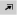

## Working with the Alarm Console

The Alarm Console is displayed at the bottom of the Cube workspace. It can contain various lists of alarms, such as the active alarms, masked alarms and information events. However, it is highly customizable, so you can adapt both what it displays and how this is displayed.

This section consists of the following topics:

- [Manipulating the Alarm Console](#manipulating-the-alarm-console)

- [Changing the layout of the Alarm Console](#changing-the-layout-of-the-alarm-console)

- [Using the collapsible side panel of the Alarm Console](#using-the-collapsible-side-panel-of-the-alarm-console)

- [Working with the Alarm Console history slider](#working-with-the-alarm-console-history-slider)

- [Applying alarm filters in the Alarm Console](#applying-alarm-filters-in-the-alarm-console)

- [Using the RCA slider](#using-the-rca-slider)

- [Configuring a custom alert sound for an alarm tab](#configuring-a-custom-alert-sound-for-an-alarm-tab)

- [Alarm Console columns](#alarm-console-columns)

- [Alarm Console settings](#alarm-console-settings)

- [Alarm Console right-click menu](#alarm-console-right-click-menu)

> [!NOTE]
> The Alarm Console is limited to never show more than 100,000 alarms. If there are more alarms in the DMS, they will no longer be forwarded to Cube.

> [!TIP]
> See also:
> <https://community.dataminer.services/video/ruis-rapid-recap-alarm-console-introduction/>

### Manipulating the Alarm Console

- To collapse the Alarm Console, click the downward arrow button in the top-right corner: 

    Only the alarm bar will be displayed, which displays the total number of active alarms, the total number of unread alarms and the number of active alarms per severity in the currently selected alarm tab. In addition, the alarm bar also displays a number of buttons that can also be used in the expanded Alarm Console.

- To return the Alarm Console to its original size again, click the upward arrow button: 

    > [!NOTE]
    > You can also single-click the alarm bar to temporarily open it on top of the open cards. As soon as you click anywhere else, the console will collapse again.

- To maximize the Alarm Console over the entire window, click the maximize button: 

- To undock the Alarm Console into a separate window, click the undock button: 

- If the Alarm Console is undocked in a separate window, close that window to dock the Alarm Console to its original position at the bottom of the main DataMiner Cube window.

- To undock one tab of the Alarm Console, drag the tab header out of the Alarm Console.

- To dock an alarm tab page as a separate card in the workspace, first drag the tab header out of the Alarm Console, and then click *Dock to workspace* in the top right corner of the window.

    > [!TIP]
    > See also:
    > <https://community.dataminer.services/video/alarm-console-creating-a-workspace-with-a-filtered-alarm-tab-page/>

### Changing the layout of the Alarm Console

In this section:

- [Three default alarm tabs](#three-default-alarm-tabs)

- [Adding and removing alarm tabs in the Alarm Console](#adding-and-removing-alarm-tabs-in-the-alarm-console)

- [Changing the column layout in an alarm tab](#changing-the-column-layout-in-an-alarm-tab)

- [Setting the default alarm tabs and columns in the Cube settings](#setting-the-default-alarm-tabs-and-columns-in-the-cube-settings)

- [Using the statistical view](#using-the-statistical-view)

- [Using the reports view](#using-the-reports-view)

#### Three default alarm tabs

By default, the Alarm Console contains the following tabs:

- **Active alarms**: All active alarm records, except information messages and masked alarms.

    > [!NOTE]
    > If the *Active alarms* tab is selected, a history slider button is available in the alarm bar that can be used to show alarms active at a certain time in the past. See [Working with the Alarm Console history slider](#working-with-the-alarm-console-history-slider).

- **Information events**: All information messages, such as a user logging in, changing an alarm template or deleting an element, a script being executed, etc.

- **Masked alarms**: Masked alarms are automatically moved from the active alarms tab to the masked alarms tab. When unmasked, the alarms move back to the active alarms tab. See [Masking and unmasking alarms](Masking_and_unmasking_alarms.md).

> [!NOTE]
> It is possible to set different default tabs in the user settings and group settings. See [Setting the default alarm tabs and columns in the Cube settings](#setting-the-default-alarm-tabs-and-columns-in-the-cube-settings).

#### Adding and removing alarm tabs in the Alarm Console

In the Alarm Console, you can add and remove tabs as you see fit. However, this custom layout is only saved across sessions for tabs displaying active alarms or alarms in a sliding window, not for alarm history tabs.

> [!NOTE]
> - If the Alarm Console contains more tabs than can be displayed on the screen, a “...” icon will be displayed. To open one of the tabs that are not displayed, click this icon, and select the tab from the drop-down list.
> - For embedded Alarm Consoles displayed on the ALARMS page of cards, custom tabs are only saved if you select to *Apply filters*, and then select the *Show this tabpage* checkbox before clicking *Show alarms*.

**To change the name of a tab:**

1. Right-click the tab header and select *Change tab name*.

2. Fill in the new name and press Enter.

**To add a tab:**

1. Click the *+* symbol in the header of the Alarm Console.

2. Choose which alarms should be shown in the tab.

    There are many options to choose from, such as:

    - **Reopen closed alarm lists**: Lists any alarm tabs you have recently closed. Note that it is possible to pin items in this list using the pin icons, so that these are then always displayed at the top of the list.

    - **Show current** >**Active alarms**: Displays the default *Active alarms* tab.

    - **Show current** > **Active alarms linked to cards**: With this option, if you select an item in the Surveyor or on a card, the tab will automatically switch to the alarms for this item.

    - **Show current** > **My active alarms**: Shows active alarms of which you are the owner.

    - **Show current** > **Unassigned active alarms**: Show active alarms that do not have an owner yet.

    - **Show current** > **Information events**: Displays the *Information events* tab.

    - **Show current** > **Suggestion events**: Displays the *Suggestion events* tab. Only available from DataMiner 10.0.0/10.0.2 onwards, on DMAs using a Cassandra database. See [Working with behavioral anomaly detection](xref:Working_with_behavioral_anomaly_detection).

    - **Show current** > **Masked alarms**: Displays the *Masked alarms* tab.

    - **Show history**: Lists history tabs for the past hour, day, week or month.

    - **Show alarms in a sliding window**: Displays the alarms that have occurred in a certain time frame that moves along with the present time. You can set the size of the sliding window to a minimum of one minute and a maximum of 1440 minutes.

        > [!NOTE]
        > - In tabs set to a sliding window, only alarms raised within this window are shown. As a consequence, if you turn off history tracking or correlation tracking, history alarms and correlation source alarms will only be shown if they were raised within the sliding window.
        > - Refresh rate and delay cannot be set in sliding window alarm tabs.
        > - From DataMiner 9.6.11 onwards, you can select the option *Keep active alarms* along with the option to show alarms in a sliding window. When you do so, active alarms will remain displayed in the tab even if they no longer fall in the sliding window.

    - **Include alarms / Include masked alarms / Include information events / Include suggestion events**: Select or clear these checkboxes to determine the type of alarms that will be displayed in the new tab. This allows you to for example display a tab with information events only.

        > [!NOTE]
        > The *Include suggestion events* checkbox is only available from DataMiner 10.0.0/10.0.2 onwards, on DMAs using a Cassandra database. See [Working with behavioral anomaly detection](xref:Working_with_behavioral_anomaly_detection).

    - **Apply filters** or **Apply filter and window size**: Shows alarms filtered by a custom filter.

        > [!NOTE]
        > For more information on filtering alarms, see [Manually applying an alarm filter in an Alarm Console tab](#manually-applying-an-alarm-filter-in-an-alarm-console-tab).

**To remove a tab:**

1. Click the tab header to select the tab.

2. Click the *X* to the right of the name of the tab.

> [!NOTE]
> When you have created a history alarms tab, you can edit it afterwards, e.g. to change the applied filter and time range, by clicking the pencil icon next to the tab name.

#### Changing the column layout in an alarm tab

The list of alarms in an Alarm Console tab can be manipulated in several ways.

> [!TIP]
> See also:
> <https://community.dataminer.services/video/alarm-console-adding-columns-to-the-alarm-console/>

##### Sorting and grouping columns

To sort the alarms by a particular field:

- Click a column header. Click it again to reverse the sort order.

    > [!NOTE]
    > - By default, alarms are sorted by timestamp (with the most recent alarm on top).
    > - If you are using the keyboard to navigate the Cube interface, to sort by a particular field, press Enter when the keyboard focus is on the header of that column. See [Using keyboard navigation](xref:Using_keyboard_navigation).

By default, the Alarm Console is set to group alarms automatically according to whatever column is selected. However, it is also possible to group by a particular field, and then do further changes to the sort order or further grouping on other fields. To do so:

1. Click the hamburger button in the top-left corner and clear the selection from *Automatically group according to arrangement*.

2. Right-click the header you want to group by and select *Group by this field*.

3. Optionally, click other headers to change the sort order, or apply further grouping by repeating step 2 for different columns.

> [!NOTE]
> When alarms have been grouped, you can select all alarms in a group by clicking the group header.

##### Moving and adjusting columns

To change the width of a column:

- Drag the edges of the column header to the left or to the right.

- Double-click an edge of a column header to adjust the column width to the contents of the column.

To move a column to another position:

- Click the column header and drag it to the new position.

##### Adding or removing columns

To add or remove columns:

- Right-click in the table header, choose *Add/Remove column*, and select the columns you want to add or remove.

> [!NOTE]
> It is possible to add action buttons in the Alarm Console with this functionality, by selecting the required actions under *Add/Remove column \> Actions*.

> [!TIP]
> See also:
> [Alarm Console columns](#alarm-console-columns)

##### Renaming a column

To rename a column:

- Right-click in the table header, and choose *Change column name*.

##### Changing the column alignment

To change the alignment of a column:

- Right-click in the table header, choose *Alignment*, and select *Left*, *Right*, or *Center*.

##### Restoring the default column layout

To return the columns to the default layout:

- Right-click in the table header, choose *Add/Remove column*, and select the option *Set default columns* (at the bottom of the list of columns in the context menu).

> [!NOTE]
> User preferences such as column order and grouping are automatically saved in the DMS. So no matter where you log on to the DMS, your personal preferences will always be applied.

#### Setting the default alarm tabs and columns in the Cube settings

It is possible to create a different default layout for the Alarm Console, which is saved across sessions. This can be done both at group level and at user level.

> [!TIP]
> See also:
> <https://community.dataminer.services/video/ruis-rapid-recap-configuring-the-alarm-console-at-group-level/>

To do so:

1. Go to the user settings or group settings.

    For more information on how to access these settings, see [User settings](xref:User_settings) or [Configuring a set of user group settings](xref:Configuring_a_set_of_user_group_settings).

2. Go to the *Alarm Console* page.

3. At the bottom of the page, in the *Configure Alarm Console* section, adapt the settings according to preference:

    1. In the first column, select the Cube side for which you wish to configure the settings.

    2. In the second column, use the right-click menu to add or remove tab pages for the Cube side selected in the first column. You can also change the tab names, or change the tab order by dragging and dropping a tab.

    3. For each tab, in the third column, use the right-click menu to add or remove columns to be displayed in the Alarm Console.

    4. At the bottom of the third column, set the default Alarm Console settings for the selected tab.

        The same options are available as under the Alarm Console settings button, with the exception of the *Freeze*, *Show in banner* and *Statistical view* options. You can also set the RCA filter for the tab.

        > [!TIP]
        > See also:
        > [Alarm Console settings](#alarm-console-settings)

    5. In the fourth column, for each column selected in the third column, change the column alignment and width if necessary.

> [!NOTE]
> - Settings that are enforced at group level cannot be changed at user level.
> - If you create new settings for a group, these will not by default contain the tabs *Active Alarms*, *Information Events* and *Masked alarms*.

#### Using the statistical view

To view the alarms in an alarm tab as statistics instead of in a regular list view, click the statistical view button in the alarm bar: 

To return to the regular list view again, click the list view button: 

The statistical view has three tab pages, each offering a different drill-down approach:

| Tab page   | Drill-down sequence                  |
|------------|--------------------------------------|
| Severities | Severities \> Elements \> Parameters |
| Elements   | Elements \> Parameters \> Severities |
| Parameters | Parameters \> Elements \> Severities |

Each list item is shown as a horizontal bar. The length of the bar indicates how many alarms the item represents.

If you double-click an item or right-click it and select *Show alarms*, the alarm tab shows the regular list view again, but with the appropriate filter applied.

> [!NOTE]
> This settings is not remembered across user sessions. If you reconnect to DataMiner Cube, the alarm tab will show a regular list view again.

#### Using the reports view

To view severity timelines per element or per parameter:

1. Click the reports view button in the alarm bar: 

2. Depending on whether you wish to see these so-called “heat maps” for elements or for parameters, either stay in the *elements* tab, or go to the *parameters* tab.

    The tabs respectively list all elements and all parameters in the DMS for which an alarm has occurred, and for each item in the list, a timeline is displayed that shows the evolution of the alarm severity over time.     Double-clicking a heat map will open a card with more information:

    - For an element heat map, the relevant element card is opened.

    - For a parameter heat map, the parameter card is opened. If it is a trended parameter, the trending tab is displayed, otherwise the details tab is displayed.

3. To return to the regular list view again, click the list view button: 

> [!NOTE]
> This feature is only available in a DataMiner System using a Cassandra database.

### Using the collapsible side panel of the Alarm Console

For each alarm tab, you can open a side panel in the Alarm Console showing the real-time value and history of a selected alarm.

You can open the side panel of an alarm tab in three ways:

- Right-click an alarm, and select *Show side panel*.

- Select *Show side panel* in the Alarm Console settings menu. See [Alarm Console settings](#alarm-console-settings).

- Double-click an alarm in an alarm tab, if the *Alarm double-click action* user setting is set to *Open side panel*. See [Alarm Console settings](xref:User_settings#alarm-console-settings).

In the side panel:

- The top section contains the name of the element in alarm and an overview of its alarm state in the last twenty-four hours. Click this section to open the element card.

- Below this is the parameter section, which contains the current value of the parameter and an overview of the parameter state in the last twenty-four hours. If the parameter in alarm is trended, click this section to see the trend graph.

- The bottom section displays more information about the alarms in the alarm tree.

You can hide the side panel in three ways:

- Right-click an alarm, and select *Hide side panel*.

- Clear the selection from *Show side panel* in the Alarm Console settings menu. See [Alarm Console settings](#alarm-console-settings).

- Double-click an alarm in the alarm tab, if the *Alarm double-click action* user setting is set to *Open side panel*. See [Alarm Console settings](xref:User_settings#alarm-console-settings).

> [!NOTE]
> The setting that controls whether the side panel is shown or hidden is a tab setting. This means that you can show the side panel in one tab and hide it in another. It is also a user setting that is remembered across sessions.

### Working with the Alarm Console history slider

In the Alarm Console, you can display a timeline at the bottom of the *Active alarms* tab. To do so, click the *History slider* button in the alarm bar: 

> [!TIP]
> See also:
> <https://community.dataminer.services/video/alarm-console-alarm-history/>

#### Active alarms tab timeline

The timeline in the *Active alarms* tab shows the alarms that were active at a particular point in time.

There are two ways to move the slider to a specific time in the past on the timeline:

- By dragging the slider across the timeline. The date and time where the slider is located are displayed to the right of it.

- By clicking the clock icon and specifying a date and time.

#### Advanced timeline settings

- With the SLNetClientTest tool, you can configure some advanced settings for the timeline configuration. See [Configuring how long alarm statistics are kept in memory](xref:SLNetClientTest_tool_advanced_procedures#configuring-how-long-alarm-statistics-are-kept-in-memory).

    > [!WARNING]
    > The DataMiner SLNetClientTest program is an advanced system administration tool that should be used with extreme care (C:\\Skyline DataMiner\\Files\\SLNetClientTest.exe).

    The following settings are available:

    | Setting                      | Description                                                                                                                       |
    |--------------------------------|-----------------------------------------------------------------------------------------------------------------------------------|
    | ActiveAlarmStatsTimeToKeep     | Time range of most recent active alarm statistics to keep in memory. Default: 2 days                                              |
    | ActiveAlarmStatsExpirationTime | The amount of time that requested time ranges other than the most recent one will stay in memory (if unused). Default: 10 minutes |

- How long alarm data remain available to be displayed in the history slider depends on the database configuration. For more information, see [Configuring how long alarm history slider data are kept in Cassandra](xref:Configuring_how_long_alarm_history_slider_data_are_kept_in_Cassandra).

### Applying alarm filters in the Alarm Console

The contents of the Alarm Console can be filtered in several ways:

- [Using the Alarm Console quick filter box](#using-the-alarm-console-quick-filter-box)

- [Using the Alarm Console quick filter buttons](#using-the-alarm-console-quick-filter-buttons)

- [Manually applying an alarm filter in an Alarm Console tab](#manually-applying-an-alarm-filter-in-an-alarm-console-tab)

- [Creating a search tab in the Alarm Console](#creating-a-search-tab-in-the-alarm-console)

- [Filtering alarms on alarm focus](#filtering-alarms-on-alarm-focus)

- [Applying an alarm filter by dragging an item onto the Alarm Console](#applying-an-alarm-filter-by-dragging-an-item-onto-the-alarm-console)

- [Alarm filters using wildcard expressions](#alarm-filters-using-wildcard-expressions)

- [Alarm filters using regular expressions](#alarm-filters-using-regular-expressions)

- [Working with saved alarm filters](#working-with-saved-alarm-filters)

#### Using the Alarm Console quick filter box

In the lower right corner of the Alarm Console, a quick filter box is displayed.

This filter box can be used in different ways:

- Like any other quick filter in Cube, by adding text in the filter box. While you are typing, suggestions will be displayed above the box. When you empty the filter box, or return the focus to the filter box after it had been elsewhere, history items will also be displayed. To search for a suggested word or history item, select it in the list.

- Alternatively, it is also possible to add items to the quick filter box, or remove items from the quick filter box, by highlighting them in the Alarm Console. To do so, while pressing the key configured for this in the user settings (by default the left Ctrl key), click on the words you wish to add. You can also press this key and right-click a word to open a context menu with the following options:

    - *Add \[highlighted text\] to filter*

    - *Remove \[highlighted text\] from filter*: Only available if you have already added items to the filter.

    - *Exclude \[highlighted text\] in filter*: This option can only be used on an item that is not yet in the filter, and adds a negative filter for this item. This is the equivalent to adding an exclamation mark in front of an item when you type text in the filter.

    - *Search for \[selected text\] in new tab*: This option opens a new *Search alarms* tab in the Alarm Console, in which you can search through alarms using this filter. This option is only available on a DMA using at least DataMiner 10.0.0/10.0.2 with DataMiner Indexing.


        > [!NOTE]
        > Prior to DataMiner 10.0.7, to have access to this feature, you need to have the *System configuration* > *Indexing Engine* > *UI available* user permission. This user permission is only displayed if *?EnableFeature=Indexing* is added to the Cube URL. From DataMiner 10.0.7 onwards, this user permission is no longer needed.


    - *Copy \[highlighted text\]*

    - *Clear filter*: Only available if you have already added items to the filter.

    > [!TIP]
    > See also:
    > [Cube settings](xref:User_settings#cube-settings)

When the filter is applied, the alarm tab is displayed with a blue background to indicate that it is being filtered. The total number of alarms is still indicated in the alarm bar, but the number of filtered alarms that are being displayed is added in parentheses.

#### Using the Alarm Console quick filter buttons

It is possible to quickly filter an Alarm Console tab so that only alarms of a certain severity are shown.

To do so, click the button indicating the relevant severity in the alarm bar.

When the filter is applied, the alarm tab is displayed with a blue background to indicate that it is being filtered. The total number of alarms is still indicated in the alarm bar, but the number of filtered alarms that are being displayed is added in parentheses.

To quickly clear the filter again, click the leftmost field of the alarm bar, indicating the total number of alarms in the tab.

> [!NOTE]
> The UI of the Alarm Console adapts to the available space on the screen. If there is sufficient room, the different severity levels shown on the alarm tab will be written in full, with an indication of how many alarms have this severity level. If there is less space, only the severity color and the number of alarms with this severity will be displayed. In very narrow windows, a single button will be displayed, which opens a menu with the different severity levels that can be used for filtering.

#### Manually applying an alarm filter in an Alarm Console tab

In the Alarm Console, you can add extra tab pages where you can specify a custom alarm filter.

> [!TIP]
> See also:
> - <https://community.dataminer.services/video/alarm-console-advanced-filtering/>
> - <https://community.dataminer.services/video/alarm-console-alarm-history/>

To do so:

1. Click the *+* symbol in the header of the Alarm Console.

2. Choose *Apply filters* or *Apply filter and window size*, depending on whether you want to see current alarms or history alarms, or alarms in a sliding window.

3. Specify the time for which alarms need to be retrieved:

    - For active alarms, skip this step.

    - For a history alarms, in the *From* and *To* boxes, specify the range for which alarms need to be displayed.

    - For alarms in a sliding window, specify the window size (between 1 minute and 1 day). The default window size is 60 minutes.

4. Click *Select a filter* to create or select a filter, then select the field you want to filter on.

    > [!NOTE]
    > If any filters have been saved on your DMS, you will be able to choose them in this step. See [Working with saved alarm filters](#working-with-saved-alarm-filters).

5. If you create a new filter, you will then need to specify it further, possibly using a wildcard expression or regular expressions.

    > [!NOTE]
    > - For more information on wildcards, see [Searching with wildcard characters](xref:Searching_in_DataMiner_Cube#searching-with-wildcard-characters).
    > - For more information on using regular expressions in filters, see [Alarm filters using regular expressions](#alarm-filters-using-regular-expressions).
    > - From DataMiner 9.0.5 onwards, it is possible to filter the Alarm Console based on a Visual Overview session variable. To do so, create a new filtered tab displaying current alarms, and create a filter using *Matches wildcard expression*, *Does not match wildcard expression*, *Matches regular expression*, or *Does not match regular expression*. In the second part of the filter, specify the variable, in the same way as in Visio, e.g. *\[var:LoadTime\]*. For more information, see [\[var:VariableName\]](xref:Placeholders_for_variables_in_shape_data_values#varvariablename).
    > - If you create a *Services* filter in a history tab, and you want to include services that have been deleted, at the bottom of the box where you can select services to filter on, select the *Load deleted services* checkbox (available from DataMiner 10.2.0/10.1.4 onwards).

6. If you want, you can also combine several filters, using logical operators (AND, OR).

7. Optionally, limit the types of alarms displayed in the new tab by selecting or clearing the *Alarms*, *Masked alarms* and/or *Information events* checkboxes. These allow you to for example only display information events in the new tab.

8. Optionally, click *Count alarms* to check how many alarms will be shown when the tab configuration is applied.

    > [!NOTE]
    > - If you chose to display history alarms, the *Count alarms* option will only work with certain filter combinations. If you configure a filter combination for which the option is not available, a notification message will appear.
    > - From DataMiner 9.6.0 \[CU25\], 10.0.0 \[CU19\], 10.1.0 \[CU8\] and 10.1.11 onwards, when you create a tab to display history alarms or alarms in a sliding window, for filters on element type, interface impact, parameter description, protocol, service impact, view ID/impact/name, or virtual function ID/impact/name, the *Count alarms* option is no longer available.

9. To see the filtered alarms in the Alarm Console tab, click *Show alarms*.

10. If you still want to change some of the filter settings once the filter has been applied, click the pencil icon next to the alarm tab name.

#### Creating a search tab in the Alarm Console

When you are connected to a DMA using at least DataMiner version 10.0.0/10.0.2 with DataMiner Indexing, the Alarm Console provides an additional option to create a dynamic search tab.


> [!NOTE]
> Prior to DataMiner 10.0.7, to have access to this feature, you need to have the *System configuration* > *Indexing Engine* > *UI available* user permission. This user permission is only displayed if *?EnableFeature=Indexing* is added to the Cube URL. From DataMiner 10.0.7 onwards, this user permission is no longer needed.


To create such a tab:

1. Click the *+* symbol in the header of the Alarm Console to open a new tab.

2. At the top of the tab, next to *Search* *for alarms*, do the following:

    - Add one or more search terms in the search box. As soon as you start typing, suggestions will be displayed below the box.

    - Next to the search box, indicate the time span in which the alarms should occur. By default, this is set to *Last 24 hours*.

    - By default, different instances of the same alarm will be combined in a single alarm tree in the results. If you want them to be displayed separately instead, disable the *History tracking* checkbox.

    Press Enter or select a suggestion to begin the search. The alarms matching your search phrase will then be retrieved in batches of 50. If there are more than 50 alarms matching the search phrase, a *More results* button will be displayed at the bottom of the list.

Once the first 50 alarms have been retrieved, a graphical representation of the alarm distribution will be displayed at the bottom of the tab.

##### Special keywords in the search tab

In the search box, you can use the following special keywords, followed by a colon (“:”) and a search phrase:

- Severity

- Description

- Parameter_description

- Owner

- Value

- Time of arrival

- Status

- Elementname

- Viewnames

- Parentviews

- Protocolname

- ElementProperty\_\<propertyName>

- Viewproperty\_\<PropertyName>

- ServiceProperty\_\<PropertyName>

For example, if you want to search alarms associated with elements of which the name resembles “probe”, then you can enter “Elementname:probe”.

#### Filtering alarms on alarm focus

From DataMiner 10.0.0/10.0.2 onwards, the DataMiner Analytics software assigns an estimated likelihood or “alarm focus score” to each alarm, after analyzing the short-term history and current behavior of incoming alarms in real time. The alarm focus score is based on a combination of likelihood, frequency and severity.

- Likelihood scores are used to spot daily patterns. If an alarm occurs at the same time every day, it will be assigned a high likelihood value at that time.

- Frequency scores are used to detect parameters that frequently go into and out of alarm, or alarms that persist over a long time.

Depending on the focus score, an alarm can be considered unexpected. In that case, this is indicated with the following icon in the *Focus* column: 

To filter the alarm list to only show such unexpected alarms, click the following button in the alarm bar: 

Please note the following regarding the alarm focus feature:

- This feature is only available if a Cassandra database is used. See [General database](xref:General_database).

- The focus icon in the alarm bar is only displayed on tabs displaying active alarms.

- Likelihood values are based on UTC time. As a result, when daylight saving time goes into or out of effect, patterns following local time might be off for approximately one week.

- Currently, no focus score is assigned to the following types of alarms: Correlation alarms, external alarms and information events.

- If an alarm template changes, all alarms of the parameters for which a change was implemented in the alarm template will be treated as unexpected.

- In case of an alarm storm, the update of focus scores of persistent alarms is postponed until after the alarm storm ends.

> [!NOTE]
> You can enable or disable the alarm focus feature via *System Center* > *System settings* > *analytics config.*

#### Applying an alarm filter by dragging an item onto the Alarm Console

Instead of manually applying a filter in a tab, you can also drag an item from the Cube UI onto the Alarm Console to create a tab filtered specifically for that item.

> [!TIP]
> See also:
> <https://community.dataminer.services/video/alarm-console-alarm-history/>

To do so:

1. Drag an element, protocol, parameter, etc. onto the Alarm Console. A new tab will automatically be created.

    > [!NOTE]
    > - With a redundancy group, this way of creating a filtered tab is not possible.
    > - To open a filtered tab for an element, service or view, you can also right-click the item in the Surveyor or on a card and select *Actions* > *Add tab to global Alarm Console*.

2. In the new tab, indicate the time frame for the alarms you want to display: active alarms, or a past time range.

3. In the *What* column, select whether to show non-masked alarms, information events and/or masked alarms.

4. In the next column, select the items to filter on.

    The options in this step differ depending on the type of item you dragged onto the Alarm Console. E.g. for a parameter, you may be able to click *Load more elements*, so that you can select several elements that have this parameter.

5. Click *Show alarms*.

> [!NOTE]
> - Alarm filters based on views also include alarm events based on aggregation rules.
> - If you want to open a filtered tab containing only alarms related to a particular DMA, this is possible from the *System Center* module. Go to the *Agents* page of System Center and select the DMA in question in the *manage* tab. Then click the *Show agent alarms* link at the top of the pane on the right. The filtered tab will then be opened in the Alarm Console.

#### Alarm filters using wildcard expressions

The example below shows a filter for elements matching a particular wildcard expression.


#### Alarm filters using regular expressions

If you want to filter alarms using a regular expression:

1. When creating a filter, select the *Matches Regular Expression* operator.

2. Specify a regular expression.


##### Syntax

You can use any regular expression.

For more information on how to construct regular expressions, here are a few interesting links:

- [Regular Expression Language - Quick Reference](http://msdn.microsoft.com/en-us/library/az24scfc.aspx)

- [RegExLib.com Regular Expression Cheat Sheet](http://regexlib.com/CheatSheet.aspx)

> [!NOTE]
> - DataMiner always wraps a regular expression in ^( and )$. This means that the expression must match the entire string.
> - The checks are executed using the invariant culture and ignoring case.

##### Examples

```txt
London.*
```

- Matches ...

    - London-Amplifier-1

    - London-Amplifier-2

- Does not match ...

    - NewYork-Amplifier-1

    - East-London-Amplifier

    - Paris-Amplifier

```txt
(London|NewYork)-Amplifier-[0-9]+
```

- Matches ...

    - London-Amplifier-1

    - NewYork-Amplifier-5

- Does not match ...

    - Paris-Amplifier-7

    - London-Amplifier-XYZ

```txt
MAC-^([0-9A-F]{2}[-]){5}([0-9A-F]{2})
```

- Matches ...

    - MAC-A0-12-EF-DE-A1-C3

- Does not match ...

    - MAC-99-99-99-99-99

#### Working with saved alarm filters

When you create a filter in the Alarm Console, you can save it in order to use it again later or in other DataMiner applications.

> [!NOTE]
> Up to DataMiner 9.0.4, if an alarm filter containing a service is saved, this service is stored by name. This means that if the service name changes, you will need to manually update the filter accordingly. From DataMiner 9.0.5 onwards, services in an alarm filter are stored by ID when possible. This means that a manual update is then only necessary if a filter contains wildcard expressions or regular expressions.

##### To save an alarm filter:

1. Create a filter as described in [Manually applying an alarm filter in an Alarm Console tab](#manually-applying-an-alarm-filter-in-an-alarm-console-tab).

2. Before clicking *Show alarms* to apply the filter in the tab, click *Save the current filter combination*.

    > [!NOTE]
    > If the current filter combination contains a private alarm filter, it will not be possible to save the filter combination as a public or protected filter.

3. Enter a name for the alarm filter.

    > [!NOTE]
    > Alarm filters may not start or end with a space.

4. Indicate whether the filter should be private, public, or protected. See [Alarm filters](Alarm_filters.md)

5. Optionally, add a description.

6. Click *Save*.

##### To use a saved alarm filter:

1. Create a filtered tab as described in steps 1 and 2 in [Manually applying an alarm filter in an Alarm Console tab](#manually-applying-an-alarm-filter-in-an-alarm-console-tab).

2. When you select a filter, as described in step 3 of the same procedure, scroll to the bottom of the list and select *Saved filters*.

3. To the right of *Saved filters*, click *\<Click to select>* and select the filter you want.

    > [!NOTE]
    > - If you have selected a saved filter, but you do not have the user permission *Edit / delete protected filters*, an eye icon will be displayed next to the filter. Click this icon to view the contents of the filter.

4. Proceed as in [Manually applying an alarm filter in an Alarm Console tab](#manually-applying-an-alarm-filter-in-an-alarm-console-tab).

##### To edit or delete a saved alarm filter:

1. Select the filter from the *Saved filters* as if you were going to use it.

2. Click the pencil icon to the right of the filter.

3. In the edit window, the following actions are possible:

    - Click the *Delete* button to delete the alarm filter. You will receive a warning message mentioning where the filter may be used.

        > [!NOTE]
        > It is not possible to delete an alarm filter that is currently in use.

    - Enter a description for the filter in the *Description* field.

    - Change the fields of the filter itself, or delete parts of a combined filter, in the same way as when creating a new filter.

4. To save any changes, click *OK*.

### Using the RCA slider

Alarms on elements, parameters or services included in a connectivity chain have an RCA level. This indicates how far the element, parameter or service is away from the most probable cause of the alarm. In the Alarm Console, it is possible to filter alarms based on Root Cause Analysis (RCA). This way, you can for instance filter out alarms with high RCA levels to get an overview of the root problems only.

The levels are indicated as three values, separated by commas. The values represent, in sequence, the RCA level for services, elements, and parameters. Each value has the following meaning:

- none: not part of a connectivity chain.

- 0: there are no services/elements/parameters higher up in the chain that are in alarm state.

- 1: there is one service/element/parameters higher up in the chain that is in alarm state.

- 2: there are two services/elements/parameters higher up in the chain that are in alarm state.

- etc.

To filter alarms based on their RCA level:

1. Click the RCA slider in the alarm bar, indicated by the following icon: 

2. Select the RCA level.

    To indicate that the RCA filter is applied, the alarm tab will be displayed with a blue background. The total number of alarms will still be indicated in the alarm bar, with the number of displayed filtered alarms in parentheses.

> [!NOTE]
> - Alarms without an RCA level will always be shown, regardless of the level of the RCA slider.
> - The setting of the RCA slider is a user setting per alarm tab that is remembered across sessions.
> - To have a look at the connectivity chain for a particular alarm, right-click the alarm and select *View connectivity*.

> [!TIP]
> See also:
> [Working with the Connectivity Editor](xref:Working_with_the_Connectivity_Editor)

### Configuring a custom alert sound for an alarm tab

From DataMiner 9.5.1 onwards, it is possible to make Cube display a custom alert sound when an alarm enters an alarm tab or increases in severity while it is not yet acknowledged or read (depending on the settings). This is possible for all alarm tabs except tabs showing history alarms or alarms in a sliding window.

> [!NOTE]
> If you open Cube on a client machine that does not have Windows Media Player installed, it will not be possible to use this feature.

To do so:

1. While the alarm tab is selected, click the hamburger button in the top-left corner of the Alarm Console and select the option *Audible alert*.

2. In the *Audible alert* window, select the checkbox *Enable audible alert.*

3. Next to *Audio file*, select the audio file that should be used. If the file is not yet available, select *\<Add audio file>* and browse to the desired file.

    > [!NOTE]
    > - When you add a sound file, it is placed in the folder *C:\\Skyline DataMiner\\Sounds*.
    > - The following file extensions are supported: ".asf", ".wmv", ".wm", ".asx", ".wax", ".wvx", ".wmx", ".wpl", ".wmd", ".mpg", ".m1v", ".mp2", ".mp3", ".mpa", ".mpe", ".m3u", ".mid", ".midi", ".rmi", ".aif", ".aifc", ".aiff", ".au", ".snd", ".wav", ".cda", ".ivf", ".wmz", ".wms".
    > - You can also delete an audio file in the drop-down list, by hovering the mouse pointer over the file and then clicking the *X*.
    > - If you add, update or delete a sound file, an information event is generated. If a sound is updated or deleted, a recycle bin entry is generated.

4. When you have selected a sound file, optionally check what it sounds like by clicking the button to the right of the *Audio file* drop-down list. The same button can then be used to stop the sound again.

5. Below the *Audio file* drop-down list, you can select the following options:

    - *Repeat*: If you select this option, the audio file will be repeated.

    - *Stop playing after ... seconds*: If you select this option, the audio file will stop playing after the specified number of seconds.

6. At the bottom of the window, select whether the sound should stop playing when *all alarms are acknowledged* or *when all alarms are read*.

    > [!NOTE]
    > The user setting *Condition to set an alarm unread* determines whether alarms are set to unread again after any update or only after an increase in severity. To further fine-tune audible alerts, it can be useful to adjust this setting. See [Alarm Console settings](xref:User_settings#alarm-console-settings).

7. Click *OK*.

    An icon in the header of the alarm tab will now indicate that audible alerts have been configured for this tab.

> [!NOTE]
> - The following permissions are required to configure custom alert sounds:
>     - *General* > *Alarms* > *Audible Alert* > *Add audio files*.
>     - *General* > *Alarms* > *Audible Alert* > *Edit audio files*.
>     - *General* > *Alarms* > *Audible Alert* > *Delete audio files*.
> - If you do not have the right to add audio files, you will not be able to select the *Audible alert* option as long as no audio files have been added yet. Cube checks for the availability of these files when you connect, so if another user adds a file, the *Audible alert* option becomes available after a reconnect.

### Alarm Console columns

The table below contains all the columns available in the Alarm Console. By default, not all columns are shown in Cube.

The names mentioned in the table below are the default column names. However, these column names can be customized in Cube.

For more information on changing the column layout, see [Changing the column layout in an alarm tab](#changing-the-column-layout-in-an-alarm-tab).

> [!TIP]
> See also:
> <https://community.dataminer.services/video/alarm-console-adding-columns-to-the-alarm-console/>

| Column name                     | Description                                                                                                                                                                                                                                                                                                                                                                                                                                                                                                                                                                                                                                                                                                                                                                                                                                                                                                                                                                                                                                                                                                                                                                                                                                                                                                                                                                                                                                                                                                                                                                                                                                                                                                                                                                                                                                                                                                                                                                                                                                                                                                                                                                                                                                                                                                                                                                                                                                                                                                                                                                                                                                                                                                                                                                                                                                                                                                             |
|---------------------------------|-------------------------------------------------------------------------------------------------------------------------------------------------------------------------------------------------------------------------------------------------------------------------------------------------------------------------------------------------------------------------------------------------------------------------------------------------------------------------------------------------------------------------------------------------------------------------------------------------------------------------------------------------------------------------------------------------------------------------------------------------------------------------------------------------------------------------------------------------------------------------------------------------------------------------------------------------------------------------------------------------------------------------------------------------------------------------------------------------------------------------------------------------------------------------------------------------------------------------------------------------------------------------------------------------------------------------------------------------------------------------------------------------------------------------------------------------------------------------------------------------------------------------------------------------------------------------------------------------------------------------------------------------------------------------------------------------------------------------------------------------------------------------------------------------------------------------------------------------------------------------------------------------------------------------------------------------------------------------------------------------------------------------------------------------------------------------------------------------------------------------------------------------------------------------------------------------------------------------------------------------------------------------------------------------------------------------------------------------------------------------------------------------------------------------------------------------------------------------------------------------------------------------------------------------------------------------------------------------------------------------------------------------------------------------------------------------------------------------------------------------------------------------------------------------------------------------------------------------------------------------------------------------------------------------|
| Icon                            | Alarm icon colored according to the alarm severity.<br> -  For new alarms, the icon is a single vertical line.<br> -  For correlated alarms, it is a vertical dashed line.<br> -  For updated alarm records, a second, thinner vertical line is added next to the first.                                                                                                                                                                                                                                                                                                                                                                                                                                                                                                                                                                                                                                                                                                                                                                                                                                                                                                                                                                                                                                                                                                                                                                                                                                                                                                                                                                                                                                                                                                                                                                                                                                                                                                                                                                                                                                                                                                                                                                                                                                                                                                                                                                                                                                                                                                                                                                                                                                                   |
| Focus                           | Available from DataMiner 10.0.0/10.0.2 onwards on systems with a Cassandra database. This column displays a focus icon if an alarm is unexpected. See [Filtering alarms on alarm focus](#filtering-alarms-on-alarm-focus).                                                                                                                                                                                                                                                                                                                                                                                                                                                                                                                                                                                                                                                                                                                                                                                                                                                                                                                                                                                                                                                                                                                                                                                                                                                                                                                                                                                                                                                                                                                                                                                                                                                                                                                                                                                                                                                                                                                                                                                                                                                                                                                                                                                                                                                                                                                                                                                                                                                                                                                                                                                                                                                                                              |
| Element \> Element name         | The name of the element.                                                                                                                                                                                                                                                                                                                                                                                                                                                                                                                                                                                                                                                                                                                                                                                                                                                                                                                                                                                                                                                                                                                                                                                                                                                                                                                                                                                                                                                                                                                                                                                                                                                                                                                                                                                                                                                                                                                                                                                                                                                                                                                                                                                                                                                                                                                                                                                                                                                                                                                                                                                                                                                                                                                                                                                                                                                                                                |
| Element \> Element description  | The description of the element.                                                                                                                                                                                                                                                                                                                                                                                                                                                                                                                                                                                                                                                                                                                                                                                                                                                                                                                                                                                                                                                                                                                                                                                                                                                                                                                                                                                                                                                                                                                                                                                                                                                                                                                                                                                                                                                                                                                                                                                                                                                                                                                                                                                                                                                                                                                                                                                                                                                                                                                                                                                                                                                                                                                                                                                                                                                                                         |
| Element \> Element type         | The element type, as defined in the protocol.                                                                                                                                                                                                                                                                                                                                                                                                                                                                                                                                                                                                                                                                                                                                                                                                                                                                                                                                                                                                                                                                                                                                                                                                                                                                                                                                                                                                                                                                                                                                                                                                                                                                                                                                                                                                                                                                                                                                                                                                                                                                                                                                                                                                                                                                                                                                                                                                                                                                                                                                                                                                                                                                                                                                                                                                                                                                           |
| Element \> Polling IP           | The IP address that is used to communicate with the element.                                                                                                                                                                                                                                                                                                                                                                                                                                                                                                                                                                                                                                                                                                                                                                                                                                                                                                                                                                                                                                                                                                                                                                                                                                                                                                                                                                                                                                                                                                                                                                                                                                                                                                                                                                                                                                                                                                                                                                                                                                                                                                                                                                                                                                                                                                                                                                                                                                                                                                                                                                                                                                                                                                                                                                                                                                                            |
| Element \> Protocol             | The name of the protocol that the DMA uses to communicate with the element.                                                                                                                                                                                                                                                                                                                                                                                                                                                                                                                                                                                                                                                                                                                                                                                                                                                                                                                                                                                                                                                                                                                                                                                                                                                                                                                                                                                                                                                                                                                                                                                                                                                                                                                                                                                                                                                                                                                                                                                                                                                                                                                                                                                                                                                                                                                                                                                                                                                                                                                                                                                                                                                                                                                                                                                                                                             |
| Parameter description           | User-friendly name of the parameter that triggered the alarm.                                                                                                                                                                                                                                                                                                                                                                                                                                                                                                                                                                                                                                                                                                                                                                                                                                                                                                                                                                                                                                                                                                                                                                                                                                                                                                                                                                                                                                                                                                                                                                                                                                                                                                                                                                                                                                                                                                                                                                                                                                                                                                                                                                                                                                                                                                                                                                                                                                                                                                                                                                                                                                                                                                                                                                                                                                                           |
| Parameter                       | Name of the parameter that triggered the alarm.                                                                                                                                                                                                                                                                                                                                                                                                                                                                                                                                                                                                                                                                                                                                                                                                                                                                                                                                                                                                                                                                                                                                                                                                                                                                                                                                                                                                                                                                                                                                                                                                                                                                                                                                                                                                                                                                                                                                                                                                                                                                                                                                                                                                                                                                                                                                                                                                                                                                                                                                                                                                                                                                                                                                                                                                                                                                         |
| Value                           | The value of the parameter that triggered the alarm.                                                                                                                                                                                                                                                                                                                                                                                                                                                                                                                                                                                                                                                                                                                                                                                                                                                                                                                                                                                                                                                                                                                                                                                                                                                                                                                                                                                                                                                                                                                                                                                                                                                                                                                                                                                                                                                                                                                                                                                                                                                                                                                                                                                                                                                                                                                                                                                                                                                                                                                                                                                                                                                                                                                                                                                                                                                                    |
| Time                            | The date and time when the alarm event occurred on the device. This can also be the time when the alarm was escalated from a different alarm level.                                                                                                                                                                                                                                                                                                                                                                                                                                                                                                                                                                                                                                                                                                                                                                                                                                                                                                                                                                                                                                                                                                                                                                                                                                                                                                                                                                                                                                                                                                                                                                                                                                                                                                                                                                                                                                                                                                                                                                                                                                                                                                                                                                                                                                                                                                                                                                                                                                                                                                                                                                                                                                                                                                                                                                     |
| Root time                       | The date and time when the first of a series of related alarms occurred on the device.                                                                                                                                                                                                                                                                                                                                                                                                                                                                                                                                                                                                                                                                                                                                                                                                                                                                                                                                                                                                                                                                                                                                                                                                                                                                                                                                                                                                                                                                                                                                                                                                                                                                                                                                                                                                                                                                                                                                                                                                                                                                                                                                                                                                                                                                                                                                                                                                                                                                                                                                                                                                                                                                                                                                                                                                                                  |
| Severity                        | The severity level of the alarm, e.g. Warning, Major, Critical, etc.                                                                                                                                                                                                                                                                                                                                                                                                                                                                                                                                                                                                                                                                                                                                                                                                                                                                                                                                                                                                                                                                                                                                                                                                                                                                                                                                                                                                                                                                                                                                                                                                                                                                                                                                                                                                                                                                                                                                                                                                                                                                                                                                                                                                                                                                                                                                                                                                                                                                                                                                                                                                                                                                                                                                                                                                                                                    |
| Parameter key                   | The display key of the parameter that triggered the alarm, in case of a table parameter.                                                                                                                                                                                                                                                                                                                                                                                                                                                                                                                                                                                                                                                                                                                                                                                                                                                                                                                                                                                                                                                                                                                                                                                                                                                                                                                                                                                                                                                                                                                                                                                                                                                                                                                                                                                                                                                                                                                                                                                                                                                                                                                                                                                                                                                                                                                                                                                                                                                                                                                                                                                                                                                                                                                                                                                                                                |
| Service impact                  | The number of services the alarm has an impact on.                                                                                                                                                                                                                                                                                                                                                                                                                                                                                                                                                                                                                                                                                                                                                                                                                                                                                                                                                                                                                                                                                                                                                                                                                                                                                                                                                                                                                                                                                                                                                                                                                                                                                                                                                                                                                                                                                                                                                                                                                                                                                                                                                                                                                                                                                                                                                                                                                                                                                                                                                                                                                                                                                                                                                                                                                                                                      |
| Services                        | The services the alarm has an impact on.                                                                                                                                                                                                                                                                                                                                                                                                                                                                                                                                                                                                                                                                                                                                                                                                                                                                                                                                                                                                                                                                                                                                                                                                                                                                                                                                                                                                                                                                                                                                                                                                                                                                                                                                                                                                                                                                                                                                                                                                                                                                                                                                                                                                                                                                                                                                                                                                                                                                                                                                                                                                                                                                                                                                                                                                                                                                                |
| RCA level                       | Three values representing the distance to the most probable cause of the alarm for services, elements, and parameters respectively.                                                                                                                                                                                                                                                                                                                                                                                                                                                                                                                                                                                                                                                                                                                                                                                                                                                                                                                                                                                                                                                                                                                                                                                                                                                                                                                                                                                                                                                                                                                                                                                                                                                                                                                                                                                                                                                                                                                                                                                                                                                                                                                                                                                                                                                                                                                                                                                                                                                                                                                                                                                                                                                                                                                                                                                     |
| Alarm type                      | One of the following alarm types:<br> -  **New alarm**: A new alarm event. This means that before this alarm event, the parameter was in normal state.<br> -  **Dropped from** ... : An alarm of which the severity level has dropped from a higher level.<br> -  **Escalated from** ... : An alarm of which the severity level has increase from a lower level.<br> -  **Flipped**: An alarm of which the severity level has gone from “low” (e.g. “critical low”) to “high” (e.g. “critical high”) or vice versa.<br> -  **Acknowledged**: An alarm of which a DataMiner user has taken ownership.<br> -  **Unresolved**: An alarm of which a DataMiner user has released ownership.<br> -  **Mask**: An alarm that has been masked by a DataMiner user.<br> -  **Unmask**: An alarm that has been unmasked by a DataMiner user.<br> -  **Comment** added: An alarm to which a comment has been added.<br> -  **Name** changed: An alarm caused by a parameter of which the name has been changed.<br> -  **Service** impact changed: An alarm for which the number of affected services has changed.<br> -  **View impact changed**: An alarm for which the affected views have changed. |
| Severity duration               | The length of time that the alarm has had its current severity.<br> Note that if history tracking is disabled, prior to DataMiner 10.0.5, no severity duration is displayed.<br> This column is only available in history tabs from DataMiner 10.0.5 onwards, and only in case no filter is applied or the filter is related to the element ID, DMA ID, element type, parameter ID, protocol ID or source ID. If the duration cannot be calculated, for example because the next alarm is not within the time span of the history tab, "N/A" will be displayed.                                                                                                                                                                                                                                                                                                                                                                                                                                                                                                                                                                                                                                                                                                                                                                                                                                                                                                                                                                                                                                                                                                                                                                                                                                                                                                                                                                                                                                                                                                                                                                                                                                                                                                                                                                                                                                                                                                                                                                                                                                                                                                                                                                                                                                                                                                                                                         |
| Owner                           | The name of the DataMiner user who has taken ownership of the alarm. If no one has taken ownership of the alarm yet, the field remains empty.                                                                                                                                                                                                                                                                                                                                                                                                                                                                                                                                                                                                                                                                                                                                                                                                                                                                                                                                                                                                                                                                                                                                                                                                                                                                                                                                                                                                                                                                                                                                                                                                                                                                                                                                                                                                                                                                                                                                                                                                                                                                                                                                                                                                                                                                                                                                                                                                                                                                                                                                                                                                                                                                                                                                                                           |
| Status                          | The current status of the alarm:<br> -  **Open**: The alarm is active, and the parameter that caused the alarm is currently in an alarm state.<br> -  **Cleared**: The alarm is no longer active; the parameter that caused the alarm has returned to a normal state.<br> -  **Masked**: The alarm is active, but is currently masked; the parameter that caused the alarm is currently in an alarm state.                                                                                                                                                                                                                                                                                                                                                                                                                                                                                                                                                                                                                                                                                                                                                                                                                                                                                                                                                                                                                                                                                                                                                                                                                                                                                                                                                                                                                                                                                                                                                                                                                                                                                                                                                                                                                                                                                                                                                                                                                                                                                                                                                                                                                                      |
| Extra status                    | The masking status of the alarm. This column is available from DataMiner 10.2.0/10.1.4 onwards. It indicates whether an alarm is masked or not.                                                                                                                                                                                                                                                                                                                                                                                                                                                                                                                                                                                                                                                                                                                                                                                                                                                                                                                                                                                                                                                                                                                                                                                                                                                                                                                                                                                                                                                                                                                                                                                                                                                                                                                                                                                                                                                                                                                                                                                                                                                                                                                                                                                                                                                                                                                                                                                                                                                                                                                                                                                                                                                                                                                                                                         |
| User status                     | The ownership status of the alarm:<br> -  **Not Assigned**: None of the DataMiner users have taken ownership of the alarm yet.<br> -  **Acknowledged**: A DataMiner user has taken ownership of the alarm.<br> -  **Unresolved**: A DataMiner user took ownership of the alarm, but has already released that ownership.                                                                                                                                                                                                                                                                                                                                                                                                                                                                                                                                                                                                                                                                                                                                                                                                                                                                                                                                                                                                                                                                                                                                                                                                                                                                                                                                                                                                                                                                                                                                                                                                                                                                                                                                                                                                                                                                                                                                                                                                                                                                                                                                                                                                                                                                                                                        |
| Comment                         | This column can contain both comments added by DataMiner users and extra information generated by the system.                                                                                                                                                                                                                                                                                                                                                                                                                                                                                                                                                                                                                                                                                                                                                                                                                                                                                                                                                                                                                                                                                                                                                                                                                                                                                                                                                                                                                                                                                                                                                                                                                                                                                                                                                                                                                                                                                                                                                                                                                                                                                                                                                                                                                                                                                                                                                                                                                                                                                                                                                                                                                                                                                                                                                                                                           |
| Source                          | The creator of the alarm. Usually, this is the DataMiner System, but it can for instance also be the Correlation Engine.                                                                                                                                                                                                                                                                                                                                                                                                                                                                                                                                                                                                                                                                                                                                                                                                                                                                                                                                                                                                                                                                                                                                                                                                                                                                                                                                                                                                                                                                                                                                                                                                                                                                                                                                                                                                                                                                                                                                                                                                                                                                                                                                                                                                                                                                                                                                                                                                                                                                                                                                                                                                                                                                                                                                                                                                |
| Alarm ID                        | The unique ID that identifies the alarm record. This ID is for instance used to link alarms to trouble tickets.                                                                                                                                                                                                                                                                                                                                                                                                                                                                                                                                                                                                                                                                                                                                                                                                                                                                                                                                                                                                                                                                                                                                                                                                                                                                                                                                                                                                                                                                                                                                                                                                                                                                                                                                                                                                                                                                                                                                                                                                                                                                                                                                                                                                                                                                                                                                                                                                                                                                                                                                                                                                                                                                                                                                                                                                         |
| Root alarm ID                   | The ID of the root alarm.                                                                                                                                                                                                                                                                                                                                                                                                                                                                                                                                                                                                                                                                                                                                                                                                                                                                                                                                                                                                                                                                                                                                                                                                                                                                                                                                                                                                                                                                                                                                                                                                                                                                                                                                                                                                                                                                                                                                                                                                                                                                                                                                                                                                                                                                                                                                                                                                                                                                                                                                                                                                                                                                                                                                                                                                                                                                                               |
| Creation time                   | The time when the alarm was created in DataMiner.                                                                                                                                                                                                                                                                                                                                                                                                                                                                                                                                                                                                                                                                                                                                                                                                                                                                                                                                                                                                                                                                                                                                                                                                                                                                                                                                                                                                                                                                                                                                                                                                                                                                                                                                                                                                                                                                                                                                                                                                                                                                                                                                                                                                                                                                                                                                                                                                                                                                                                                                                                                                                                                                                                                                                                                                                                                                       |
| Root creation time              | The time when the first of a series of related alarms was created in DataMiner.                                                                                                                                                                                                                                                                                                                                                                                                                                                                                                                                                                                                                                                                                                                                                                                                                                                                                                                                                                                                                                                                                                                                                                                                                                                                                                                                                                                                                                                                                                                                                                                                                                                                                                                                                                                                                                                                                                                                                                                                                                                                                                                                                                                                                                                                                                                                                                                                                                                                                                                                                                                                                                                                                                                                                                                                                                         |
| Category                        | Custom category that can be assigned to a parameter using the information template.                                                                                                                                                                                                                                                                                                                                                                                                                                                                                                                                                                                                                                                                                                                                                                                                                                                                                                                                                                                                                                                                                                                                                                                                                                                                                                                                                                                                                                                                                                                                                                                                                                                                                                                                                                                                                                                                                                                                                                                                                                                                                                                                                                                                                                                                                                                                                                                                                                                                                                                                                                                                                                                                                                                                                                                                                                     |
| Alarm description               | User-friendly description of the alarm, which can be customized with the information template.                                                                                                                                                                                                                                                                                                                                                                                                                                                                                                                                                                                                                                                                                                                                                                                                                                                                                                                                                                                                                                                                                                                                                                                                                                                                                                                                                                                                                                                                                                                                                                                                                                                                                                                                                                                                                                                                                                                                                                                                                                                                                                                                                                                                                                                                                                                                                                                                                                                                                                                                                                                                                                                                                                                                                                                                                          |
| Corrective action               | Description of corrective actions that should be taken, which can be customized with the information template.                                                                                                                                                                                                                                                                                                                                                                                                                                                                                                                                                                                                                                                                                                                                                                                                                                                                                                                                                                                                                                                                                                                                                                                                                                                                                                                                                                                                                                                                                                                                                                                                                                                                                                                                                                                                                                                                                                                                                                                                                                                                                                                                                                                                                                                                                                                                                                                                                                                                                                                                                                                                                                                                                                                                                                                                          |
| Component info                  | Contains more information about the nature of the alarm. Used in DMS Business Intelligence.                                                                                                                                                                                                                                                                                                                                                                                                                                                                                                                                                                                                                                                                                                                                                                                                                                                                                                                                                                                                                                                                                                                                                                                                                                                                                                                                                                                                                                                                                                                                                                                                                                                                                                                                                                                                                                                                                                                                                                                                                                                                                                                                                                                                                                                                                                                                                                                                                                                                                                                                                                                                                                                                                                                                                                                                                             |
| Key point                       | The exact location in the signal chain where the error has occurred. Used in DMS Business Intelligence.                                                                                                                                                                                                                                                                                                                                                                                                                                                                                                                                                                                                                                                                                                                                                                                                                                                                                                                                                                                                                                                                                                                                                                                                                                                                                                                                                                                                                                                                                                                                                                                                                                                                                                                                                                                                                                                                                                                                                                                                                                                                                                                                                                                                                                                                                                                                                                                                                                                                                                                                                                                                                                                                                                                                                                                                                 |
| Offline impact                  | Indicates whether the alarm has an impact during the offline window of an SLA. Used in DMS Business Intelligence.                                                                                                                                                                                                                                                                                                                                                                                                                                                                                                                                                                                                                                                                                                                                                                                                                                                                                                                                                                                                                                                                                                                                                                                                                                                                                                                                                                                                                                                                                                                                                                                                                                                                                                                                                                                                                                                                                                                                                                                                                                                                                                                                                                                                                                                                                                                                                                                                                                                                                                                                                                                                                                                                                                                                                                                                       |
| Interface impact                | The number of interfaces on which the alarm has an impact.                                                                                                                                                                                                                                                                                                                                                                                                                                                                                                                                                                                                                                                                                                                                                                                                                                                                                                                                                                                                                                                                                                                                                                                                                                                                                                                                                                                                                                                                                                                                                                                                                                                                                                                                                                                                                                                                                                                                                                                                                                                                                                                                                                                                                                                                                                                                                                                                                                                                                                                                                                                                                                                                                                                                                                                                                                                              |
| Interfaces                      | The interfaces on which the alarm has an impact.                                                                                                                                                                                                                                                                                                                                                                                                                                                                                                                                                                                                                                                                                                                                                                                                                                                                                                                                                                                                                                                                                                                                                                                                                                                                                                                                                                                                                                                                                                                                                                                                                                                                                                                                                                                                                                                                                                                                                                                                                                                                                                                                                                                                                                                                                                                                                                                                                                                                                                                                                                                                                                                                                                                                                                                                                                                                        |
| View impact                     | The number of views affected by the alarm.                                                                                                                                                                                                                                                                                                                                                                                                                                                                                                                                                                                                                                                                                                                                                                                                                                                                                                                                                                                                                                                                                                                                                                                                                                                                                                                                                                                                                                                                                                                                                                                                                                                                                                                                                                                                                                                                                                                                                                                                                                                                                                                                                                                                                                                                                                                                                                                                                                                                                                                                                                                                                                                                                                                                                                                                                                                                              |
| Views                           | The views affected by the alarm.                                                                                                                                                                                                                                                                                                                                                                                                                                                                                                                                                                                                                                                                                                                                                                                                                                                                                                                                                                                                                                                                                                                                                                                                                                                                                                                                                                                                                                                                                                                                                                                                                                                                                                                                                                                                                                                                                                                                                                                                                                                                                                                                                                                                                                                                                                                                                                                                                                                                                                                                                                                                                                                                                                                                                                                                                                                                                        |
| Custom icons                    | The custom icon of the element or service.<br> This column is only available in case custom icons have been configured in the system. See [Icons](xref:Icons).                                                                                                                                                                                                                                                                                                                                                                                                                                                                                                                                                                                                                                                                                                                                                                                                                                                                                                                                                                                                                                                                                                                                                                                                                                                                                                                                                                                                                                                                                                                                                                                                                                                                                                                                                                                                                                                                                                                                                                                                                                                                                                                                                                                                                                                                                                                                                                                                                                                                                                                                                                                                                                                                                                                        |
| Trend                           | If average trending is activated on the parameter in alarm, this column displays the trend graph for the last 24 hours.                                                                                                                                                                                                                                                                                                                                                                                                                                                                                                                                                                                                                                                                                                                                                                                                                                                                                                                                                                                                                                                                                                                                                                                                                                                                                                                                                                                                                                                                                                                                                                                                                                                                                                                                                                                                                                                                                                                                                                                                                                                                                                                                                                                                                                                                                                                                                                                                                                                                                                                                                                                                                                                                                                                                                                                                 |
| Function impact                 | The number of functions the alarm has an impact on. <br> This functionality is part of the Service & Resource Management module. See [Service and Resource Management](xref:SRM#service-and-resource-management).                                                                                                                                                                                                                                                                                                                                                                                                                                                                                                                                                                                                                                                                                                                                                                                                                                                                                                                                                                                                                                                                                                                                                                                                                                                                                                                                                                                                                                                                                                                                                                                                                                                                                                                                                                                                                                                                                                                                                                                                                                                                                                                                                                                                                                                                                                                                                                                                                                                                                                                                                                                                                                                                                        |
| Functions                       | The functions the alarm has an impact on. <br> This functionality is part of the Service & Resource Management module. See [Service and Resource Management](xref:SRM#service-and-resource-management).                                                                                                                                                                                                                                                                                                                                                                                                                                                                                                                                                                                                                                                                                                                                                                                                                                                                                                                                                                                                                                                                                                                                                                                                                                                                                                                                                                                                                                                                                                                                                                                                                                                                                                                                                                                                                                                                                                                                                                                                                                                                                                                                                                                                                                                                                                                                                                                                                                                                                                                                                                                                                                                                                                  |
| Heatlines \> Element heatline   | This column displays a heatline depicting the element alarm state over the last 24 hours. <br> Only displayed on systems using a Cassandra database.                                                                                                                                                                                                                                                                                                                                                                                                                                                                                                                                                                                                                                                                                                                                                                                                                                                                                                                                                                                                                                                                                                                                                                                                                                                                                                                                                                                                                                                                                                                                                                                                                                                                                                                                                                                                                                                                                                                                                                                                                                                                                                                                                                                                                                                                                                                                                                                                                                                                                                                                                                                                                                                                                                                                                                    |
| Heatlines \> Parameter heatline | This column displays a heatline depicting the parameter alarm state over the last 24 hours.<br> Only displayed on systems using a Cassandra database.                                                                                                                                                                                                                                                                                                                                                                                                                                                                                                                                                                                                                                                                                                                                                                                                                                                                                                                                                                                                                                                                                                                                                                                                                                                                                                                                                                                                                                                                                                                                                                                                                                                                                                                                                                                                                                                                                                                                                                                                                                                                                                                                                                                                                                                                                                                                                                                                                                                                                                                                                                                                                                                                                                                                                                   |
| Actions \> Ownership            | Action button that allows the user to take or release ownership of an alarm.                                                                                                                                                                                                                                                                                                                                                                                                                                                                                                                                                                                                                                                                                                                                                                                                                                                                                                                                                                                                                                                                                                                                                                                                                                                                                                                                                                                                                                                                                                                                                                                                                                                                                                                                                                                                                                                                                                                                                                                                                                                                                                                                                                                                                                                                                                                                                                                                                                                                                                                                                                                                                                                                                                                                                                                                                                            |
| Actions \> Masking              | Action button that allows the user to mask or unmask an alarm.                                                                                                                                                                                                                                                                                                                                                                                                                                                                                                                                                                                                                                                                                                                                                                                                                                                                                                                                                                                                                                                                                                                                                                                                                                                                                                                                                                                                                                                                                                                                                                                                                                                                                                                                                                                                                                                                                                                                                                                                                                                                                                                                                                                                                                                                                                                                                                                                                                                                                                                                                                                                                                                                                                                                                                                                                                                          |
| Actions \> Clear alarm          | Action button that allows the user to clear clearable alarms.                                                                                                                                                                                                                                                                                                                                                                                                                                                                                                                                                                                                                                                                                                                                                                                                                                                                                                                                                                                                                                                                                                                                                                                                                                                                                                                                                                                                                                                                                                                                                                                                                                                                                                                                                                                                                                                                                                                                                                                                                                                                                                                                                                                                                                                                                                                                                                                                                                                                                                                                                                                                                                                                                                                                                                                                                                                           |
| Actions \> Copy full alarm      | Action button that allows the user to copy all information regarding an alarm in one click.                                                                                                                                                                                                                                                                                                                                                                                                                                                                                                                                                                                                                                                                                                                                                                                                                                                                                                                                                                                                                                                                                                                                                                                                                                                                                                                                                                                                                                                                                                                                                                                                                                                                                                                                                                                                                                                                                                                                                                                                                                                                                                                                                                                                                                                                                                                                                                                                                                                                                                                                                                                                                                                                                                                                                                                                                             |
| Actions \> Adding comment       | Action button that allows the user to add a comment.                                                                                                                                                                                                                                                                                                                                                                                                                                                                                                                                                                                                                                                                                                                                                                                                                                                                                                                                                                                                                                                                                                                                                                                                                                                                                                                                                                                                                                                                                                                                                                                                                                                                                                                                                                                                                                                                                                                                                                                                                                                                                                                                                                                                                                                                                                                                                                                                                                                                                                                                                                                                                                                                                                                                                                                                                                                                    |
| Actions \> SMS                  | Action button that allows the user to send a text message to a DataMiner user.                                                                                                                                                                                                                                                                                                                                                                                                                                                                                                                                                                                                                                                                                                                                                                                                                                                                                                                                                                                                                                                                                                                                                                                                                                                                                                                                                                                                                                                                                                                                                                                                                                                                                                                                                                                                                                                                                                                                                                                                                                                                                                                                                                                                                                                                                                                                                                                                                                                                                                                                                                                                                                                                                                                                                                                                                                          |
| Actions \> View connectivity    | Action button that allows the user to view the connectivity chain for the parameter, element or service in alarm state.                                                                                                                                                                                                                                                                                                                                                                                                                                                                                                                                                                                                                                                                                                                                                                                                                                                                                                                                                                                                                                                                                                                                                                                                                                                                                                                                                                                                                                                                                                                                                                                                                                                                                                                                                                                                                                                                                                                                                                                                                                                                                                                                                                                                                                                                                                                                                                                                                                                                                                                                                                                                                                                                                                                                                                                                 |
| Alarm properties                | Any available custom alarm properties.                                                                                                                                                                                                                                                                                                                                                                                                                                                                                                                                                                                                                                                                                                                                                                                                                                                                                                                                                                                                                                                                                                                                                                                                                                                                                                                                                                                                                                                                                                                                                                                                                                                                                                                                                                                                                                                                                                                                                                                                                                                                                                                                                                                                                                                                                                                                                                                                                                                                                                                                                                                                                                                                                                                                                                                                                                                                                  |
| Element properties              | Any available custom element properties.                                                                                                                                                                                                                                                                                                                                                                                                                                                                                                                                                                                                                                                                                                                                                                                                                                                                                                                                                                                                                                                                                                                                                                                                                                                                                                                                                                                                                                                                                                                                                                                                                                                                                                                                                                                                                                                                                                                                                                                                                                                                                                                                                                                                                                                                                                                                                                                                                                                                                                                                                                                                                                                                                                                                                                                                                                                                                |
| Service properties              | Any available custom service properties.                                                                                                                                                                                                                                                                                                                                                                                                                                                                                                                                                                                                                                                                                                                                                                                                                                                                                                                                                                                                                                                                                                                                                                                                                                                                                                                                                                                                                                                                                                                                                                                                                                                                                                                                                                                                                                                                                                                                                                                                                                                                                                                                                                                                                                                                                                                                                                                                                                                                                                                                                                                                                                                                                                                                                                                                                                                                                |
| View properties                 | Any available custom view properties.                                                                                                                                                                                                                                                                                                                                                                                                                                                                                                                                                                                                                                                                                                                                                                                                                                                                                                                                                                                                                                                                                                                                                                                                                                                                                                                                                                                                                                                                                                                                                                                                                                                                                                                                                                                                                                                                                                                                                                                                                                                                                                                                                                                                                                                                                                                                                                                                                                                                                                                                                                                                                                                                                                                                                                                                                                                                                   |

### Alarm Console settings

To access specific settings for the Alarm Console, click the hamburger button in the top-left corner of the console.

The following settings are available:

- **Automatically remove cleared alarms**: Select to remove alarms from the console automatically as soon as their severity returns to normal. To ensure alarms stay in the console until cleared by the user, clear the selection.

- **History tracking**: Select to attach the life cycle of an alarm to the alarm. To show the alarm history as separate alarm records in the list instead, clear the selection. If this option is selected, you can expand an alarm in the Alarm Console to view all attached alarm records.

    > [!NOTE]
    > When you create a filtered history tab, in a fixed or sliding window, history tracking is off by default. However, if you explicitly enable history tracking in a history tab, a dialog box appears asking if you want to load the full history:
    > - Click *All* to include all alarms in the specified time range in the alarm trees, regardless of the filter.
    > - Click *Filtered* to only include alarms matching the current filter settings.
    >
    > For more information on creating filtered tabs, see [Manually applying an alarm filter in an Alarm Console tab](#manually-applying-an-alarm-filter-in-an-alarm-console-tab).

- **Correlation tracking**: Select to hide raw alarms of a correlated alarm. To show the raw alarms as separate alarm records in the list, clear the selection. If this option is selected, you can expand an alarm in the Alarm Console to view all attached alarm records.

    > [!NOTE]
    > In case a filter is applied in the alarm tab, the behavior of this feature is different depending on the type of filter:
    > - If a filtered alarm tab is created (e.g. by dragging an item onto the Alarm Console or by selecting *Apply filter* in a new tab):
    >     - If only the base alarm matches the filter, only that alarm is displayed.
    >     - If only the correlated alarm matches the filter, only that alarm is displayed.
    >     - If both base and correlated alarm match the filter, only the correlated alarm is displayed.
    >     - If neither base nor correlated alarm match the filter, neither are displayed.
    > - If a quick filter is applied with the filter box in the lower right corner, the behavior is similar, except in case both base alarm and correlated alarm match the filter, as then both alarms will be displayed.

- **Text to speech**: Select to enable Text to speech, so that new alarm events are read out loud.

- **Freeze**: Select to stop displaying new incoming events in the currently selected alarm tab. Other open alarm tabs will not be frozen.

    > [!NOTE]
    > While the alarm tab is frozen, any incoming alarms are kept in a buffer. However, if the buffer should reach more than 10,000 alarms, the Alarm Console will automatically no longer be frozen.

- **Show alarm duration indicator**: Select to show a progress bar in the alarm severity color, indicating how long the alarm has been active in the DMS.

- **Automatically group according to arrangement**: Select to enable automatic grouping by the column header used to sort the alarm list.

- **Full alarm coloring**: Select to give all alarm records a background color indicating the current alarm severity.

- **Show in banner**: Select to display a banner at the top of the Cube window when new alarms enter the tab. The banner shows the number of new alarms, the color of the most severe among them, and service impact information. When you click the banner, the Alarm Console tab will open and the new alarm(s) will be selected.

    > [!NOTE]
    > It is possible to set a delay timer on when the alarm banner hides. For more information, see [User settings](xref:User_settings).

- **Statistical view**: Select to view the alarms in the alarm tab as statistics. For more information, see [Using the statistical view](#using-the-statistical-view).

- **Show side panel**: Select to show the collapsible side panel in the Alarm Console.

- **Audible alert**: Select to specify a custom alert sound that should be used when a new alarm enters the alarm tab. See [Configuring a custom alert sound for an alarm tab](#configuring-a-custom-alert-sound-for-an-alarm-tab).

- **Delay**: Select to specify a delay between the creation of a new alarm and its appearance in the selected alarm tab.

    E.g. if you set the delay to 30 seconds, when an alarm enters the Alarm Console, it will only be added to the list 30 seconds later. If in this interval the alarm has already been cleared, it will not be added to the list at all.

    > [!TIP]
    > See also:
    > <https://community.dataminer.services/video/alarm-console-delay-refresh-rate-of-alarms/>

- **Refresh rate**: Select to specify how frequently the selected tab will be refreshed. This rate will be applied from the moment this setting is set.

    E.g. if you set the refresh rate to 30 seconds at 11:48:00, the Alarm Console will be updated every 30 seconds with all the alarms that entered in those 30 seconds. The first refresh will take place at 11:48:30, the next at 11:49:00, etc.

    > [!TIP]
    > See also:
    > <https://community.dataminer.services/video/alarm-console-delay-refresh-rate-of-alarms/>

- **Merge alarm trees**: This setting is only available if *History tracking* is enabled and *Automatically remove cleared alarms* and *Freeze* are disabled in the alarm tab (from DataMiner 9.6.13 onwards). When these settings are used, by default, when an alarm is cleared and then reappears, this results in a separate alarm tree. Activating *Merge alarm trees* combines these alarm trees, which can result in a better overview, e.g. in a sliding window tab. If you activate the option, you can also select an additional option to only merge alarm trees in case the time between the alarm trees is less than a particular time span (between 1 second and 1 day).

- **Default alarm list**: Select to make the currently selected tab the default tab, i.e. the tab that will be shown when you open DataMiner Cube. If the selected tab is already the default tab, this option will be unavailable.

> [!NOTE]
> To display Alarm Console group statistics, to display a horizontal scrollbar in the alarm list, or to configure the Alarm Console, refer to the general settings in Cube instead. See [User settings](xref:User_settings).

### Alarm Console right-click menu

When you right-click an alarm in the Alarm Console, depending on the configuration, the following options can be available:

| Option                        | Description                                                                                                                                                                                                                                                                                                                                                                                                                                                                                                                                                                                                                                                                                                                                       |
|-------------------------------|---------------------------------------------------------------------------------------------------------------------------------------------------------------------------------------------------------------------------------------------------------------------------------------------------------------------------------------------------------------------------------------------------------------------------------------------------------------------------------------------------------------------------------------------------------------------------------------------------------------------------------------------------------------------------------------------------------------------------------------------------|
| Open                          | Displays a shortcut menu that allows you to open the alarm card or to open the view, element or service cards of the views, elements or services affected by the alarm.                                                                                                                                                                                                                                                                                                                                                                                                                                                                                                                                                                           |
| Set element state             | Allows you to set the element state to *Activate*, *Pause*, *Stop* or *Restart*.                                                                                                                                                                                                                                                                                                                                                                                                                                                                                                                                      |
| Ticket                        | Allows you to create a new ticket linked to the alarm you right-clicked. From DataMiner 9.5.7 onwards, you can also view existing tickets related to the alarm via this submenu. (Requires DMS Ticketing.)                                                                                                                                                                                                                                                                                                                                                                                                                                                                                                                                        |
| Change                        | Allows you to quickly modify the alarm template, trend template or information template for the parameter on which the alarm occurs.<br> See also:<br> -  [Editing the information template for one parameter](xref:Editing_the_information_template_for_one_parameter)<br> -  [Changing the alarm range for one parameter](xref:Changing_the_alarm_range_for_one_parameter)<br> -  [Changing the trend template for one parameter](xref:Configuring_trend_templates#changing-the-trend-template-for-one-parameter) |
| Mask alarm                    | Allows you to mask the alarm or the element on which it occurred. See [Masking and unmasking alarms](Masking_and_unmasking_alarms.md).                                                                                                                                                                                                                                                                                                                                                                                                                                                                                                                                                                                                            |
| Unmask alarm                  | Allows you to unmask the alarm. See [Masking and unmasking alarms](Masking_and_unmasking_alarms.md).                                                                                                                                                                                                                                                                                                                                                                                                                                                                                                                                                                                                                                              |
| Unmask element                | Allows you to unmask a masked element from the Alarm Console instead of from the Surveyor. See [Masking or unmasking an element](xref:Masking_or_unmasking_an_element).                                                                                                                                                                                                                                                                                                                                                                                                                                                                                                                                                                 |
| Remove all cleared alarms     | Removes all cleared alarms, in case cleared alarms are not removed automatically. See [Alarm Console settings](#alarm-console-settings).                                                                                                                                                                                                                                                                                                                                                                                                                                                                                                                                                                                                          |
| Remove selected cleared alarm | Removes the selected cleared alarm, in case cleared alarms are not removed automatically. See [Alarm Console settings](#alarm-console-settings).                                                                                                                                                                                                                                                                                                                                                                                                                                                                                                                                                                                                  |
| Copy \> Cell                  | Copies the value of the cell you right-clicked, without the column name.<br> This option is not available on any of the Action columns.                                                                                                                                                                                                                                                                                                                                                                                                                                                                                                                                                                                                           |
| Copy \> Visible columns       | Copies the column names and values of the selected rows for the columns that are displayed in the Alarm Console.                                                                                                                                                                                                                                                                                                                                                                                                                                                                                                                                                                                                                                  |
| Copy \> All columns           | Copies all column names along with the values of the selected rows.                                                                                                                                                                                                                                                                                                                                                                                                                                                                                                                                                                                                                                                                               |
| Copy \> Custom                | Opens a pop-up window where you can first select which alarm fields should be copied and in which order, and then copy them.<br> The selected configuration will be saved in your user settings, so that the next time you select this option, your previous selection will be displayed.                                                                                                                                                                                                                                                                                                                                                                                                                                                         |
| Take ownership                | Allows you to take ownership of the alarm. See [Changing ownership of alarms](Changing_ownership_of_alarms.md).                                                                                                                                                                                                                                                                                                                                                                                                                                                                                                                                                                                                                                   |
| Release ownership             | Allows you to release ownership of the alarm. See [Changing ownership of alarms](Changing_ownership_of_alarms.md).                                                                                                                                                                                                                                                                                                                                                                                                                                                                                                                                                                                                                                |
| Forced release ownership      | Allows you to force another user to release ownership of the alarm. See [Changing ownership of alarms](Changing_ownership_of_alarms.md).                                                                                                                                                                                                                                                                                                                                                                                                                                                                                                                                                                                                          |
| Add comment                   | Allows you to add a comment to the alarm.                                                                                                                                                                                                                                                                                                                                                                                                                                                                                                                                                                                                                                                                                                         |
| Send by SMS                   | Allows you to forward the selected alarm to other users by text message (requires DMS Mobile Gateway).                                                                                                                                                                                                                                                                                                                                                                                                                                                                                                                                                                                                                                            |
| Set alarm as unread           | Allows you to set an alarm as “unread”.                                                                                                                                                                                                                                                                                                                                                                                                                                                                                                                                                                                                                                                                                                           |
| View comments                 | Allows you to view all comments added to the selected alarm.                                                                                                                                                                                                                                                                                                                                                                                                                                                                                                                                                                                                                                                                                      |
| View connectivity             | Allows you to view the RCA connectivity chains that the associated element is part of.                                                                                                                                                                                                                                                                                                                                                                                                                                                                                                                                                                                                                                                            |
| Hyperlinks                    | Custom hyperlinks associated with the alarm. See [Adding a custom command to the Alarm Console shortcut menu](Adding_a_custom_command_to_the_Alarm_Console_shortcut_menu.md).                                                                                                                                                                                                                                                                                                                                                                                                                                                                                                                                                                     |
| Actions                       | Allows you to set an alarm filter in order to be alerted when certain alarms occur.                                                                                                                                                                                                                                                                                                                                                                                                                                                                                                                                                                                                                                                               |
| Select all                    | Selects all the alarms in the alarm tab.                                                                                                                                                                                                                                                                                                                                                                                                                                                                                                                                                                                                                                                                                                          |
| Show side panel               | Opens the Alarm Console side panel. See [Using the collapsible side panel of the Alarm Console](#using-the-collapsible-side-panel-of-the-alarm-console).                                                                                                                                                                                                                                                                                                                                                                                                                                                                                                                                                                                          |
| Hide side panel               | Closes the Alarm Console side panel. See [Using the collapsible side panel of the Alarm Console](#using-the-collapsible-side-panel-of-the-alarm-console).                                                                                                                                                                                                                                                                                                                                                                                                                                                                                                                                                                                         |
| Properties                    | Opens the alarm properties window. See [Changing custom alarm properties](Changing_custom_alarm_properties.md).                                                                                                                                                                                                                                                                                                                                                                                                                                                                                                                                                                                                                                   |

> [!NOTE]
> The columns *Trend*, *Element heatline* and *Parameter heatline* cannot be copied. If you select to copy visible columns or all columns, these columns will never be included.
>
