## Working with behavioral anomaly detection

> [!NOTE]
> - This feature requires a general database of type "Cassandra".
> - Anomaly detection is only available for numeric parameters that are not part of partial tables. It is also limited to at most 100,000 parameters per DMA.
> - You can enable or disable this feature via *System Center* > *System settings* > *analytics config*.

From DataMiner 10.0.0/10.0.2 onwards, the DataMiner Analytics software can detect the following kinds of changes in the behavior of a trend, also known as "change points":

- **Outlier**: A value suddenly spikes upwards or downwards, but returns to its previous, normal behavior after a few points.

- **Level shift**: A value shifts upwards or downwards and then stays at that level, e.g. a value fluctuating around 0 that starts to fluctuate around 10.

- **Variance change**: The variance of a value either increases or decreases. For example, a series like 0.5, 0.6, -0.5, -0.2, 1, …, 5, 8, 9, -5, -6, -2.1, … indicates a variance increase. The value is first fluctuating around 0 between 1 and -1 and then starts fluctuating around 0 between 10 and -10.

- **Trend change**: A value suddenly starts to increase or decrease at an unusual rate. For example, a value fluctuating around 10 (i.e. a trend slope of 0) that suddenly starts to increase by 1 unit per second (i.e. a trend slope of 1).

- **Unlabeled change**: If a change point cannot be classified as one of the above-mentioned change points, it is considered an unlabeled change.

If a trend change, variance change or level shift is unexpected, it will be considered anomalous. Level shifts that have a different direction than previous recent jumps or that jump to a previously unseen level will typically be labeled “anomalous”. Similarly, trend or variance changes will be labeled “anomalous” when no earlier trend or variance changes in the same direction were detected during the last weeks.

> [!NOTE]
> - Whenever an anomalous level shift, trend change or variance change is detected, a “suggestion event” is generated, which is cleared again two hours after its creation time or its last update time. You can view these suggestion events by creating a suggestion event tab in the Alarm Console. See [Adding and removing alarm tabs in the Alarm Console](../alarms/Working_with_the_Alarm_Console.md#adding-and-removing-alarm-tabs-in-the-alarm-console).
> - You can configure alarm templates to have alarms generated instead of suggestion events, depending on the parameter and the type of anomaly See [Configuring anomaly detection alarms for specific parameters](../protocols/Configuring_alarm_templates.md#configuring-anomaly-detection-alarms-for-specific-parameters).

#### Trend icons on data pages

Based on the behavioral anomaly detection, the following icons can be displayed next to a trended parameter on a data page:

| Icon                                                                                                                                                                                                                | Description               |
|---------------------------------------------------------------------------------------------------------------------------------------------------------------------------------------------------------------------|---------------------------|
| 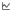                                                                                                                | Standard trend graph icon |
| 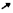                                                                                                                                    | Upward arrow              |
| 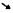                                                                                                                                  | Downward arrow            |
| 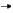                                                                                                                                        | Flat arrow                |
| 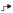 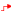                       | Upward level shift        |
| 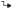 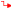                      | Downward level shift      |
| 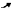 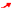                     | Upward trend change       |
| 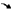 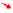             | Downward trend change     |
| 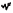 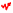         | Variance increase         |
| 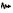 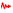 | Variance decrease         |
| 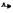 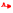                                     | Upward outlier            |
| 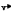 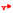                             | Downward outlier          |

Please note the following regarding these icons:

- If you hover the mouse pointer over these icons, a tooltip will display additional information.

- If a change point is considered anomalous, the icon is displayed in red.

- The selection of a particular icon is based on the change points that have occurred within a time interval specified in the *arrowWindowLength* parameter in the file *C:\\Skyline DataMiner\\Files\\SLAnalytics.config*. By default, this is set to 3600 seconds.

#### Change points in trend graphs

On a trend graph, a change point is indicated by a bar below the graph. The length of the bar indicates the approximate time frame in which the change started, the height of the bar indicates the importance of the change, and the color of the bar indicates the severity.

When you hover the mouse pointer over a change point bar, a semi-transparent ribbon will be displayed over the entire height of the trend graph, showing more information about the change point.

Labels of change points of type “trend change” will indicate the level of increase or decrease in seconds, minutes, hours or days depending on the value. If, for example, the value increases by 0.01 per second (i.e. 0.6 per minute, 36 per hour or 864 per day), the label will show an increase of 36 per hour as it is the smallest amount greater than 1.
