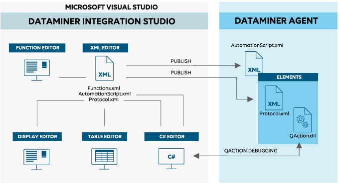

## Overall concept of the DataMiner Integration Studio

DataMiner Integration Studio has many interesting features that facilitate the development of DataMiner protocols.

### DataMiner IDE

After installation of the DataMiner Integration Studio extension, Microsoft Visual Studio turns into a full-blown DataMiner IDE with five separate editors:

- An XML editor, which features on-the-fly XML Schema validation and Intellisense.

- A C# editor, which features full C# editing and debugging capabilities.

- A display editor, which allows you to design Data Display pages using simple drag-and-drop operations.

- A function editor, which allows you to manage the functions defined in a function XML file and design function pages using simple drag-and-drop operations.

- A table editor, which allows you to design parameter tables using simple drag-and-drop operations.

> [!NOTE]
> DIS will set the language version of the C# projects of 4.0, 6.0 or 7.3 depending on the DMA version specified in the *Protocol.Compliancies.MinimumRequired* tag of the protocol XML file:
> - If the DMA version is lower than “9.6.11” (or if no *Protocol.Compliancies.MinimumRequired* tag could be found), the language version of the C# projects will be set to 4.0.
> - If the DMA version is equal to or higher than “9.6.11”, the language version of the C# projects will be set to one of the following versions:
>     - C# 6.0 (when using Visual Studio 2015)
>     - C# 7.3 (when using Visual Studio 2017 or above)

### Two ways of developing DataMiner protocols and Automation scripts

DIS offers two distinct ways of developing DataMiner protocols and Automation scripts:

- As ready-to-use XML files containing all necessary information.

- As Visual Studio solutions.

For more information on how to develop DataMiner protocols as Visual Studio solutions, see [Developing DataMiner protocols and Automation scripts as Visual Studio solutions](Developing_DataMiner_protocols_and_Automation_scripts_as_Visual_Studio_solutions.md).

### Graphical representation of the overall concept

