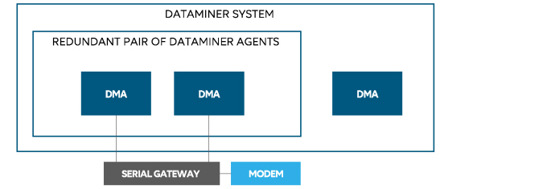

# Using Mobile Gateway in a Failover setup

To use Mobile Gateway in a Failover setup, we advise you to install your cell phone modem(s) in one of the following ways.

1. One serial cell phone modem, connected to both the primary DMA and the backup DMA by means of a Mobile Gateway server.

    

    > [!NOTE]
    > In this scenario:
    > -  The two Failover DMAs have identical Mobile Gateway configuration files.
    > -  The IP ports of the serial gateway should be mapped to serial ports on the Failover DMAs.
    > -  In DataMiner Cube, *Cellphone location* has to be set to the IP address of the Failover pair.
    > -  The DMA that is offline will close the connection, and the DMA that is online will open the connection.

2. Two serial cell phone modems, one connected to the primary DMA and the other connected to the backup DMA.

    

    > [!NOTE]
    > In this scenario:
    > -  The two Failover DMAs each have their own Mobile Gateway configuration file.
    > -  In DataMiner Cube, *Cellphone location* has to be set to the IP address of the Failover pair.
    > -  The DMA that is offline will close the connection, and the DMA that is online will open the connection.
    > -  Users cannot send text messages to the Mobile Gateway as there is no way to find out which of the two telephone numbers has to be dialed.

3. One serial cell phone modem, connected to another DMA in the DMS cluster.

    
