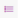

# Overview of the Job Manager app UI

You can access the Jobs Manager app via the link https://\[MyDataMiner\]/Jobs or http://\[MyDataMiner\]/Jobs, depending on your setup. The app is also available via a link on the DataMiner landing page.

> [!CAUTION]
> If you use a DataMiner version prior to DataMiner 10.1.7, we strongly advise to use HTTPS when you use DataMiner client applications over public internet. If you do not do so, all information – including logon credentials – is sent as plain, unencrypted text over the internet. From DataMiner 10.1.7 onwards, client-server communication is encrypted by default. See also: [Setting up HTTPS on a DMA](xref:General_DMA_configuration#setting-up-https-on-a-dma).

The main page of the app consists of a header bar, a side panel and an overview panel. In DataMiner 10.0.0/10.0.2, some changes are implemented in the UI.

##### From DataMiner 10.0.0/10.0.2 onwards:

- The header bar contains, from left to right:

    - The apps button: Click this button to access other DataMiner web apps, such as the Monitoring app.

    - The *Jobs* button: Click this button to return to the homepage of the app.

    - The search box: Enter text in this box to search for matching jobs.

    - User icon: Click this icon in the top-right corner to open a menu with the following options:

        - *Configuration*: Select this option to access the configuration of the job fields. See [Configuring jobs in the Job Manager app](Configuring_jobs_in_the_Job_Manager_app.md).

        - *About*: Select this option to view version information on the app.

        - *Sign out*: Select this option to log out and return to the logon screen.

- The filter panel on the left side of the app can be collapsed and expanded. This panel can be used to filter the overview panel on the right. The layout of this panel is different depending on the DataMiner version.

    **From DataMiner 10.2.0/10.1.5 onwards: **     First select the type of time filter in the box at the top:

    - *Occur* means that the filter time should be within the job lifespan

    - *Start* means that the filter time should contain the start time of the job.

    - *End* means that the filter time should contain the end time of the job.

    When you have selected this, you can then select a time filter. To do so, select one of the default filters in the *During* drop-down box, or select *Custom* and specify a custom start and end time for the filter.      If drop-down fields have been configured to allow filtering on these fields, the different drop-down options will be displayed in the *Field filters* section below this, allowing you to quickly filter on particular options by selecting them there. If you have selected multiple options for one field, you can clear the selection for all options at the same time by clicking the “x” next to the field name. To clear the selection for all options of all fields, click the “x” icon next to *Field filters*.       **In earlier DataMiner versions: **     At the top of the panel, a time filter can be specified. To do so, select one of the default filters in the time filter drop-down box, or select *Custom* and specify a custom start and end time for the filter.      If drop-down fields have been configured to allow filtering on these fields, the different drop-down options will be displayed in the *Field filters* section below this, allowing you to quickly filter on particular options by selecting them there. If you have selected multiple options for one field, you can clear the selection for all options at the same time by clicking the “x” next to the field name. To clear the selection for all options of all fields, click the “x” icon next to *Field filters*.

- The overview panel on the right side of the app has a gray header containing several buttons:

    | Button                                                                              | Description                                                                                                                                                                                                                                                                                                                                                                                        |
    |---------------------------------------------------------------------------------------|----------------------------------------------------------------------------------------------------------------------------------------------------------------------------------------------------------------------------------------------------------------------------------------------------------------------------------------------------------------------------------------------------|
    | \<domain name>                                                                        | The drop-down box on the left allows you to select a different job domain. Only the jobs belonging to the selected domain will be displayed.                                                                                                                                                                                                                                                       |
    | New                                                                                   | Click this button to open a form to manually add a new job. See [Manually adding a job](Manually_adding_a_job.md).                                                                                                                                                                                                                                                                                 |
    | View                                                                                  | Only displayed if a job is selected. Click this button to view the details of the job in a pop-up window.   From DataMiner 10.0.11 onwards, a bar is displayed on the right side of this pop-up window, which will show history information for the job when clicked.                                                                                                                           |
    | Edit                                                                                  | Only displayed if a job is selected. Opens a pop-up window where you can modify the job, in the same way as when you add a job.                                                                                                                                                                                                                                                                    |
    | Delete                                                                                | Only displayed if a job is selected. Removes the selected job.                                                                                                                                                                                                                                                                                                                                     |
    | Export / PDF                                                                          | Only displayed if a job is selected. Exports the selected job to PDF. From DataMiner 10.1.0 \[CU1\]/10.1.4 onwards, this will open a pop-up window where you can view a preview of the PDF and configure its settings. You can specify the PDF title and subject, select whether your company information, your company logo, and/or page numbers should be included, and customize the PDF width. |
    |          | Displays the list view, which displays the jobs that have been planned within the time span specified in the filter. When a job is selected in the list, more buttons become available, allowing you to view, edit, export or delete the job.                                                                                                                                                   |
    |  | Displays a timeline that contains all jobs within the time specified in the filter panel on the left. See [Working with the jobs timeline](Working_with_the_jobs_timeline.md).                                                                                                                                                                                                                     |

    > [!NOTE]
    > The timeline view is not available on small screens.

##### Prior to DataMiner 10.0.0/10.0.2:

- The header bar contains, from left to right:

    - The *Job Manager* button: Click this button to return to the main page of the app.

    - The *New* button: Click this button to open a form to manually add a new job. See [Manually adding a job](Manually_adding_a_job.md).

    - If a job is selected, a number of additional buttons are displayed next to the *New* button, allowing you to check out the details of the job, edit it, export it to PDF or delete it, respectively.

    - A *Configuration* button: Click this button to access the configuration of the job fields. See [Configuring jobs in the Job Manager app](Configuring_jobs_in_the_Job_Manager_app.md).

    - The name of the current user: Click the user name and select *Log out* to log out of the app.

- The filter panel on the left side of the app can be collapsed like any card side panel in Cube. This panel can be used to filter the overview panel on the right.

    At the top of the panel, a general filter allows you to limit which jobs are displayed depending on the values in the job fields. In this filter, you can either simply specify a value to filter on all job fields, or specify a job field and a value, separated by a colon (e.g. *Name:Satellite*), to filter on the value of a specific job field.     Below this, a time filter can be specified. To do so, select one of the default filters in the time filter drop-down list, or select *Custom* and specify a custom start and end time for the filter.     If drop-down fields have been configured to allow filtering on these fields, the different drop-down options will be displayed in the *Field filters* section below this, allowing you to quickly filter on particular options by selecting them there. If you have selected multiple options for one field, you can clear the selection for all options at the same time by clicking the “x” next to the field name. To clear the selection for all options of all fields, click the “x” icon next to *Field filters*.

- The overview panel on the right side of the app has two buttons in the top-right corner, allowing you to switch between a list view and a timeline view.

    - The list view displays a table listing the jobs that have been planned within the time span specified in the filter. When a job is selected in the list, more buttons become available in the header bar, allowing you to view, edit, export or delete the job.

    - The timeline view displays all jobs within the time specified in the filter panel on the left. See [Working with the jobs timeline](Working_with_the_jobs_timeline.md).

        > [!NOTE]
        > The timeline view is not available on small screens.
        >
